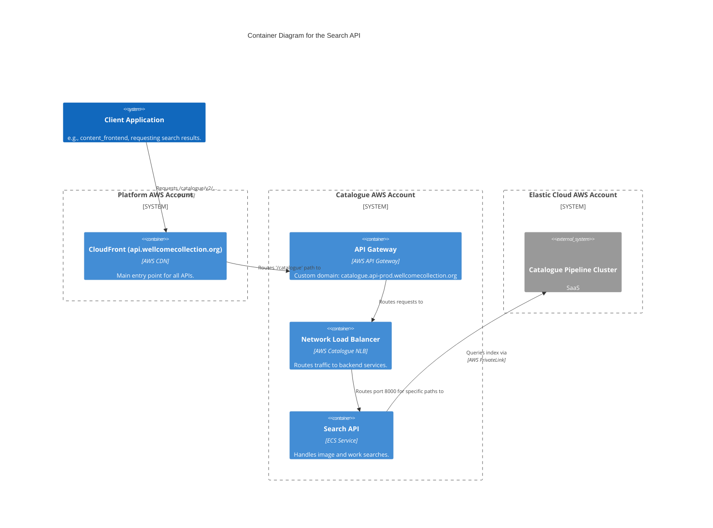
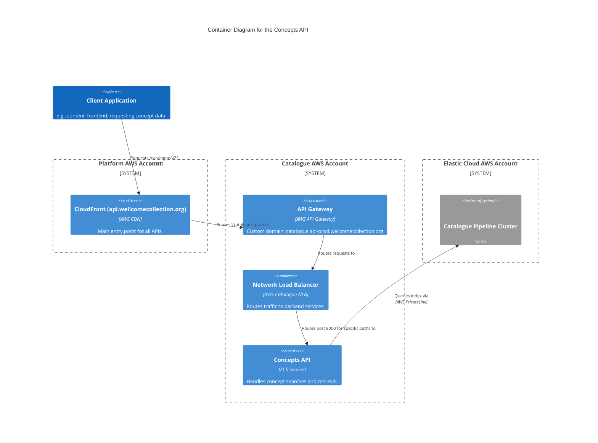
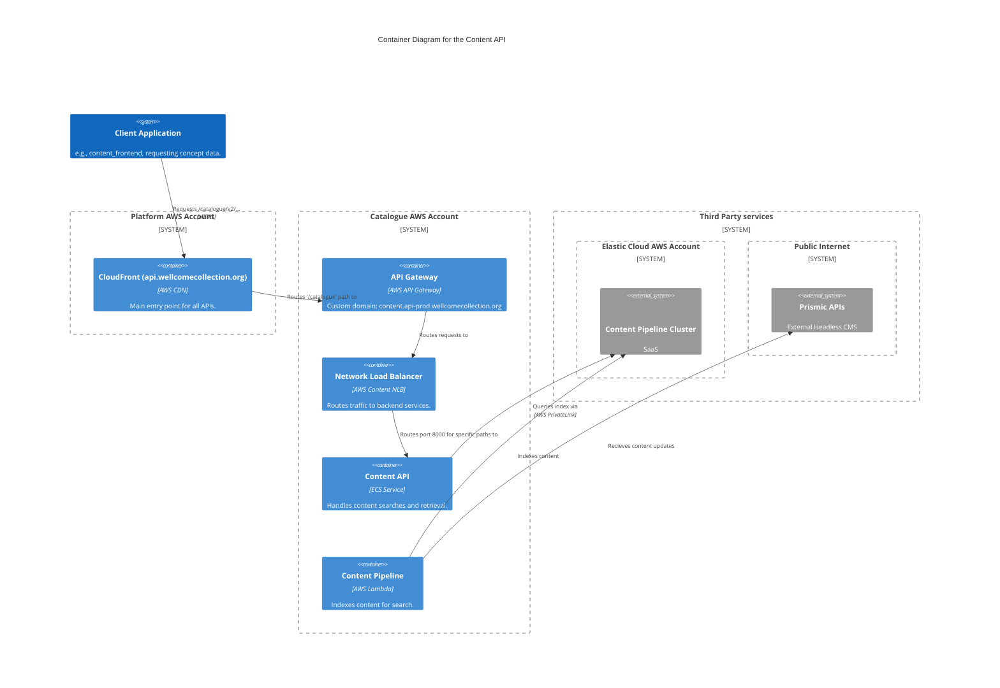
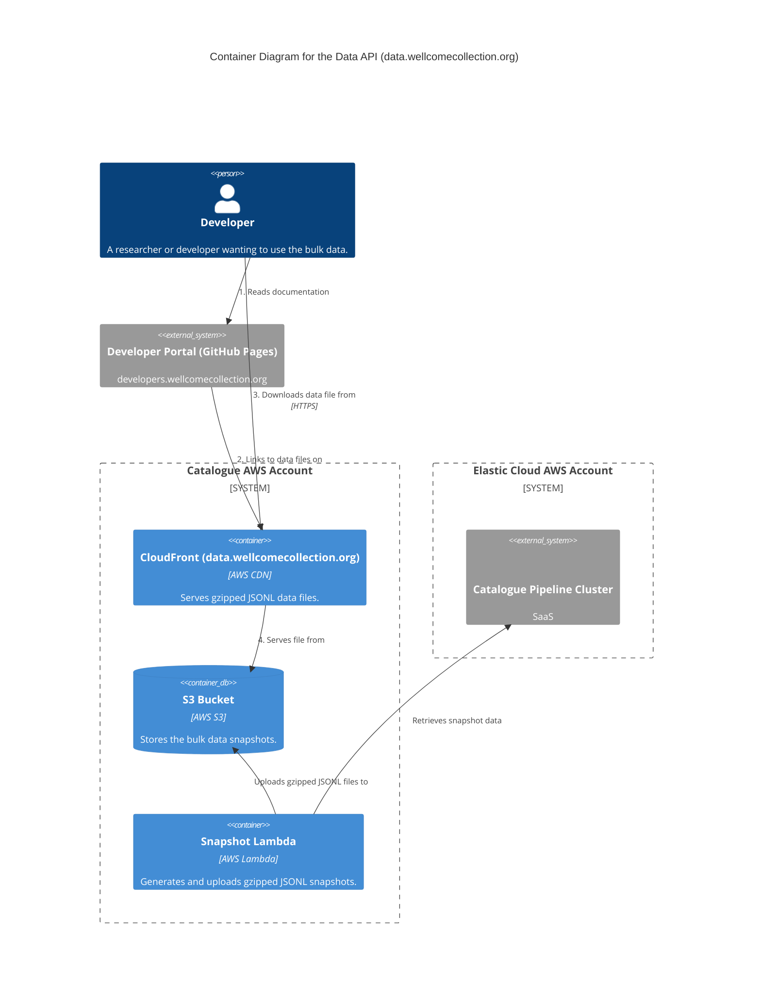
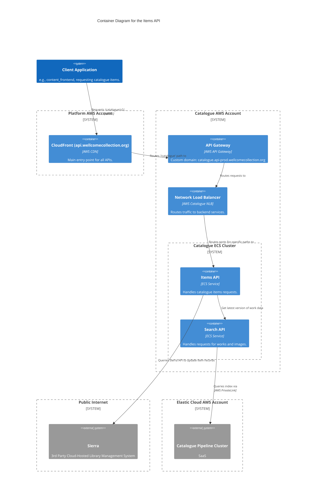
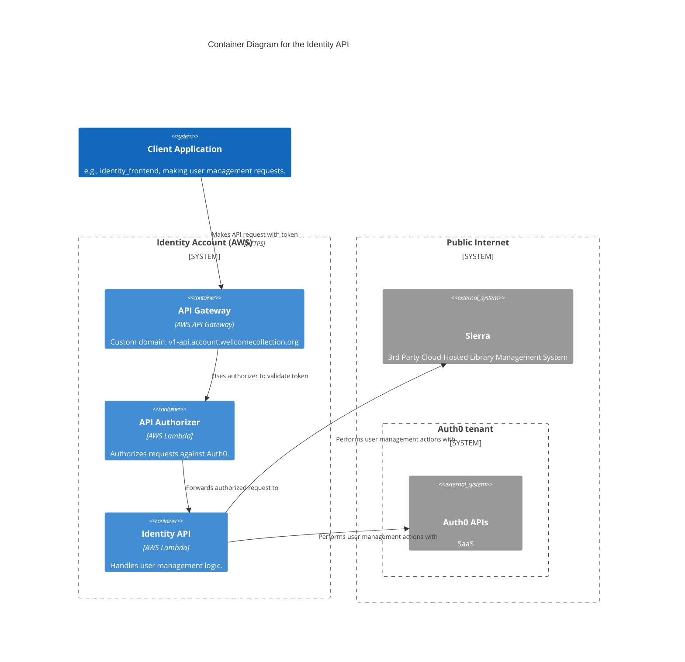

# Wellcome Collection API Services

- [search_api](#search_api)
- [content_api](#content_api)
- [concepts_api](#concepts_api)
- [data_api](#data_api)
- [items_api](#items_api)
- [identity_api](#identity_api)
- [requesting_api](#requesting_api)
- [iiif.wellcomecollection.org](#iiifwellcomecollectionorg)

## search_api

The Catalogue search API is responsible for handling search requests across the Wellcome Collection's digital catalogue. It provides endpoints for searching images and works

See the following repositories for more details on the services described above:

- [wellcomecollection/catalogue-api](https://github.com/wellcomecollection/catalogue-api)
- [wellcomecollection/catalogue-pipeline](https://github.com/wellcomecollection/catalogue-pipeline)

## concepts_api

The Concepts API is responsible for managing and retrieving information about concepts within the Wellcome Collection's digital catalogue. It provides endpoints for retrieving concept data.

See the following repositories for more details on the services described above:

- [wellcomecollection/catalogue-api](https://github.com/wellcomecollection/catalogue-api)
- [wellcomecollection/catalogue-pipeline](https://github.com/wellcomecollection/catalogue-pipeline)

## content_api

The Content API is responsible for managing and retrieving editorial content. It provides endpoints for searching content beyond what is available from Prismic APIs.

See the following repositories for more details on the services described above:

- [wellcomecollection/content-api](https://github.com/wellcomecollection/content-api)

## data_api

The Data API provides endpoints for retrieving bulk data snapshots of the Wellcome Collection's digital catalogue. It allows users to download large datasets in gzipped JSONL format.

See the following repositories for more details on the services described above:

- [wellcomecollection/catalogue-api](https://github.com/wellcomecollection/catalogue-api)
- [wellcomecollection/developers.wellcomecollection.org](https://github.com/wellcomecollection/developers.wellcomecollection.org)
- [wellcomecollection/catalogue-pipeline](https://github.com/wellcomecollection/catalogue-pipeline)

## items_api

The Items API provides endpoints for retrieving information about individual items in the Wellcome Collection's digital catalogue. It gets the freshest data for items from Sierra directly.

See the following repositories for more details on the services described above:

- [wellcomecollection/catalogue-api](https://github.com/wellcomecollection/catalogue-api)
- [wellcomecollection/catalogue-pipeline](https://github.com/wellcomecollection/catalogue-pipeline)

## identity_api

The Identity API is responsible for managing user identity and authentication. It provides endpoints for user registration, and profile management.

See the following repositories for more details on the services described above:

- [wellcomecollection/identity](https://github.com/wellcomecollection/identity)