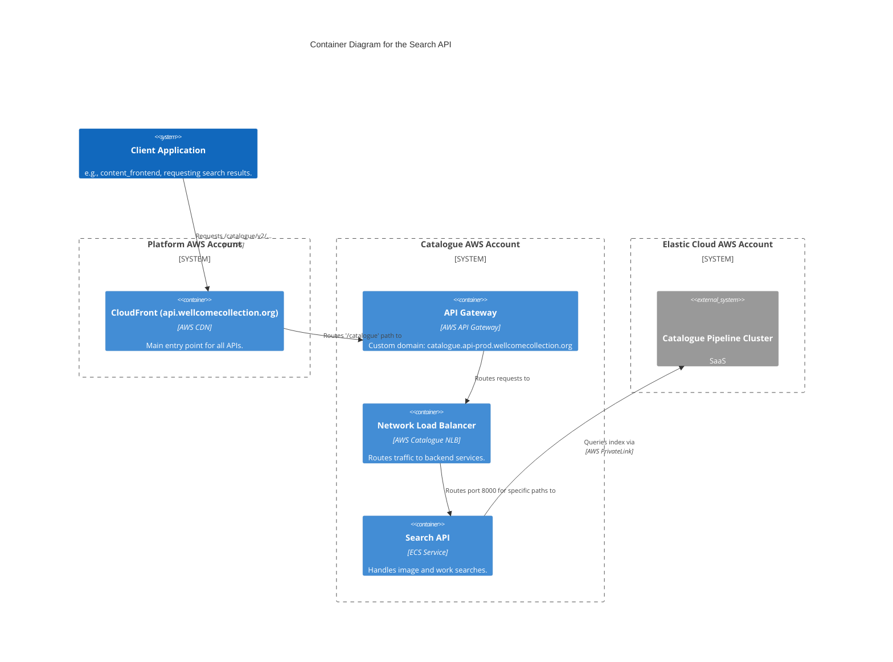
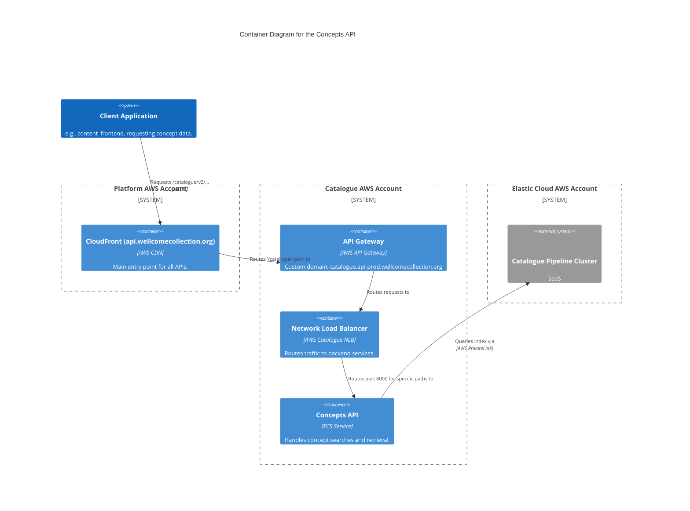
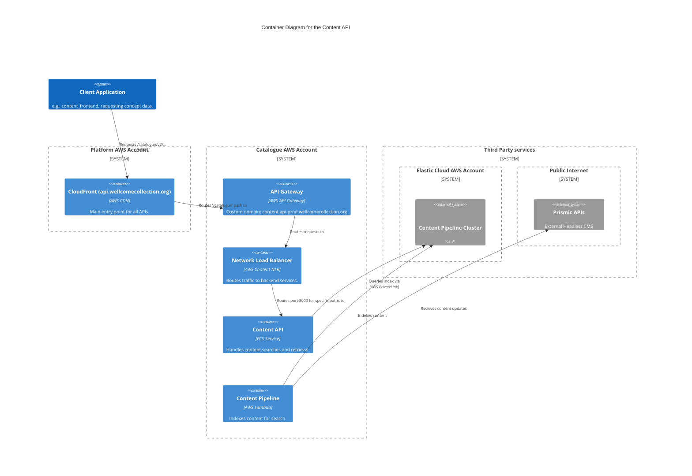

# Wellcome Collection API Services

- [search_api](#search_api)
- [content_api](#content_api)
- [concepts_api](#concepts_api)
- [data_api](#data_api)
- [items_api](#items_api)
- [identity_api](#identity_api)
- [requesting_api](#requesting_api)
- [iiif.wellcomecollection.org](#iiifwellcomecollectionorg)

## search_api

The Catalogue search API is responsible for handling search requests across the Wellcome Collection's digital catalogue. It provides endpoints for searching images and works

See the following repositories for more details on the services described above:

- [wellcomecollection/catalogue-api](https://github.com/wellcomecollection/catalogue-api)

## concepts_api

The Concepts API is responsible for managing and retrieving information about concepts within the Wellcome Collection's digital catalogue. It provides endpoints for searching and browsing concepts.

See the following repositories for more details on the services described above:

- [wellcomecollection/catalogue-api](https://github.com/wellcomecollection/catalogue-api)

## content_api

The Content API is responsible for managing and retrieving editorial content. It provides endpoints for searching content beyond what is available from Prismic APIs.

See the following repositories for more details on the services described above:

- [wellcomecollection/content-api](https://github.com/wellcomecollection/content-api)