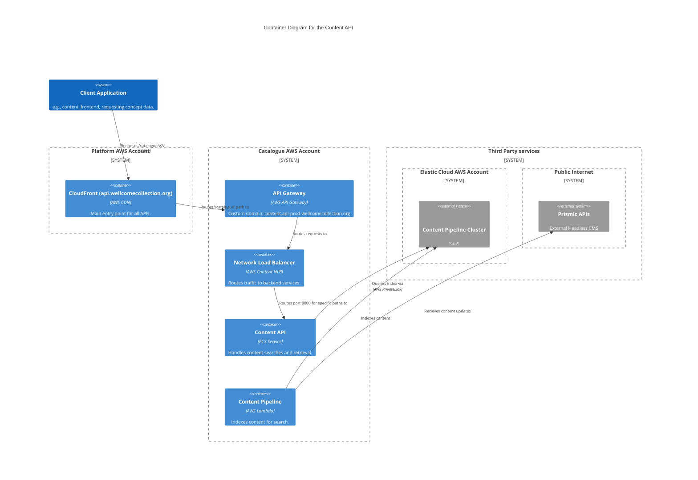

# content_api

The Content API is responsible for managing and retrieving editorial content. It provides endpoints for searching content beyond what is available from Prismic APIs.

## Architecture

## Accounts

- [catalogue](../../aws_accounts.md#catalogue)

## Repositories

See the following repositories for more details on the services described above:

- [wellcomecollection/content-api](https://github.com/wellcomecollection/content-api)
