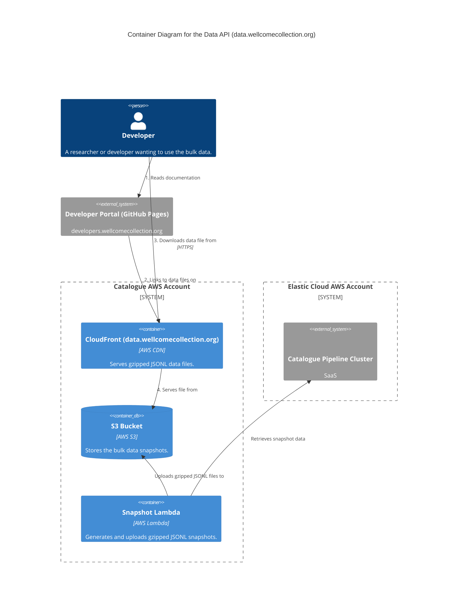

# data_api

The Data API provides endpoints for retrieving bulk data snapshots of the Wellcome Collection's digital catalogue. It allows users to download large datasets in gzipped JSONL format.

## Architecture

## Accounts

- [catalogue](../../aws_accounts.md#catalogue)

## Repositories

See the following repositories for more details on the services described above:

- [wellcomecollection/catalogue-api](https://github.com/wellcomecollection/catalogue-api)
- [wellcomecollection/developers.wellcomecollection.org](https://github.com/wellcomecollection/developers.wellcomecollection.org)
- [wellcomecollection/catalogue-pipeline](https://github.com/wellcomecollection/catalogue-pipeline)
