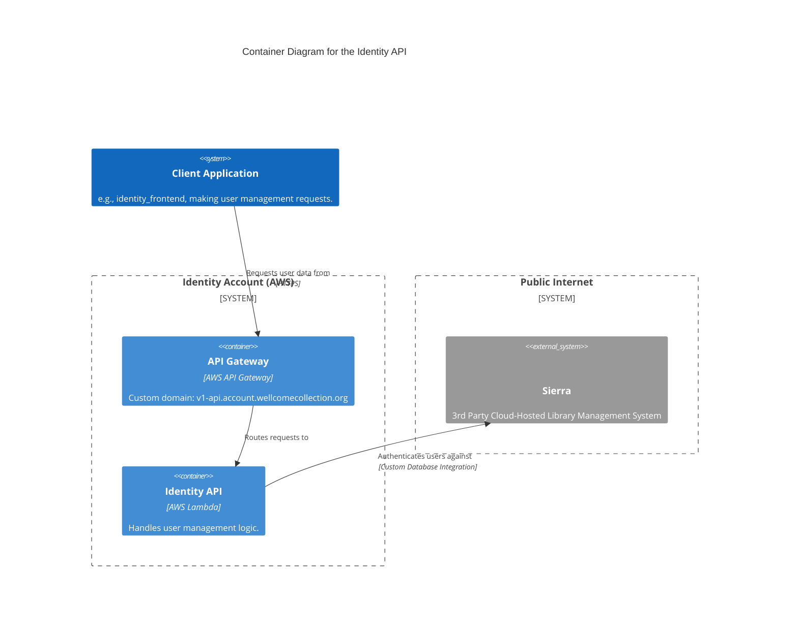

# identity_api

The Identity API is responsible for managing user identity and authentication. It provides endpoints for user registration, and profile management.

## Architecture

## Accounts

- [identity](../../aws_accounts.md#identity)

## Repositories

See the following repositories for more details on the services described above:

- [wellcomecollection/identity](https://github.com/wellcomecollection/identity)
