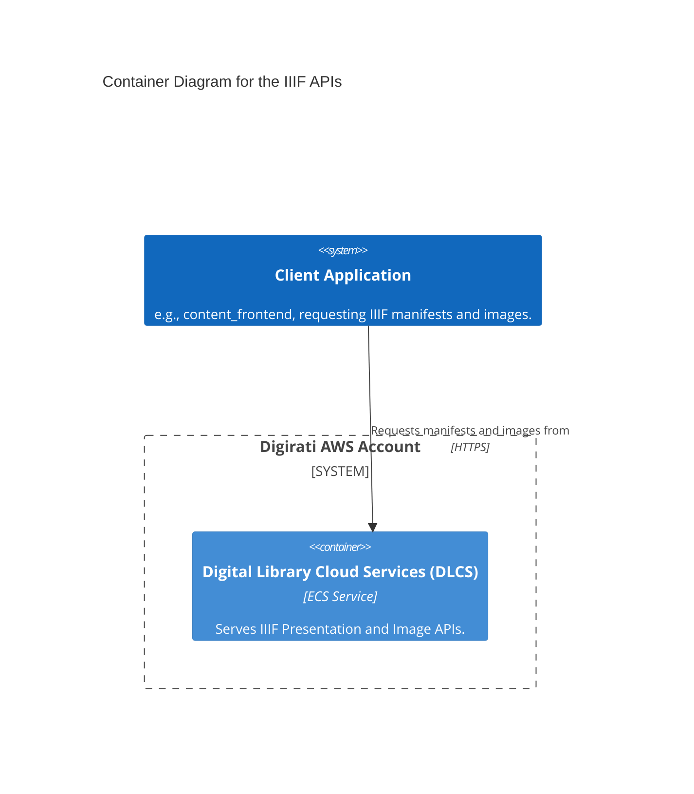

# iiif.wellcomecollection.org

The IIIF APIs serve metadata and images for Wellcome Collection digital assets ingested via the digital preservation workflow.

## Architecture

DLCS services contain a number of complex subsystems, not described here. Further detail is available in the DLCS repository linked below.

## Accounts

- [digirati](../../aws_accounts.md#digirati)

## Repositories

See the following repositories for more details on the services described above:

- [wellcomecollection/platform-infrastructure](https://github.com/wellcomecollection/platform-infrastructure)
- [dlcs/protagonist](https://github.com/dlcs/protagonist)
