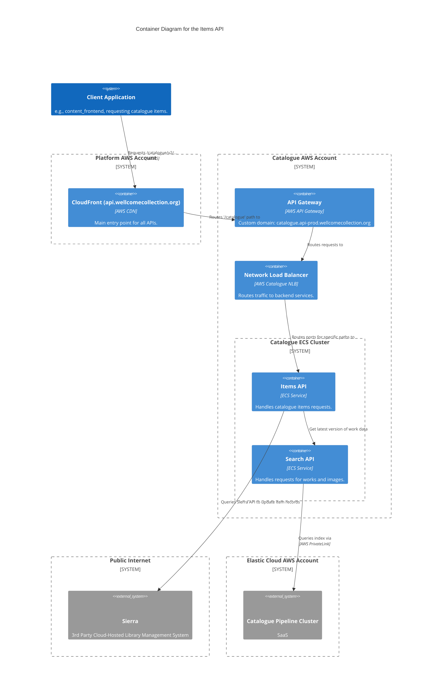

# items_api

The Items API provides endpoints for retrieving information about individual items in the Wellcome Collection's digital catalogue. It gets the freshest data for items from Sierra directly.

## Architecture

## Accounts

- [catalogue](../../aws_accounts.md#catalogue)

## Repositories

See the following repositories for more details on the services described above:

- [wellcomecollection/catalogue-api](https://github.com/wellcomecollection/catalogue-api)
- [wellcomecollection/catalogue-pipeline](https://github.com/wellcomecollection/catalogue-pipeline)
