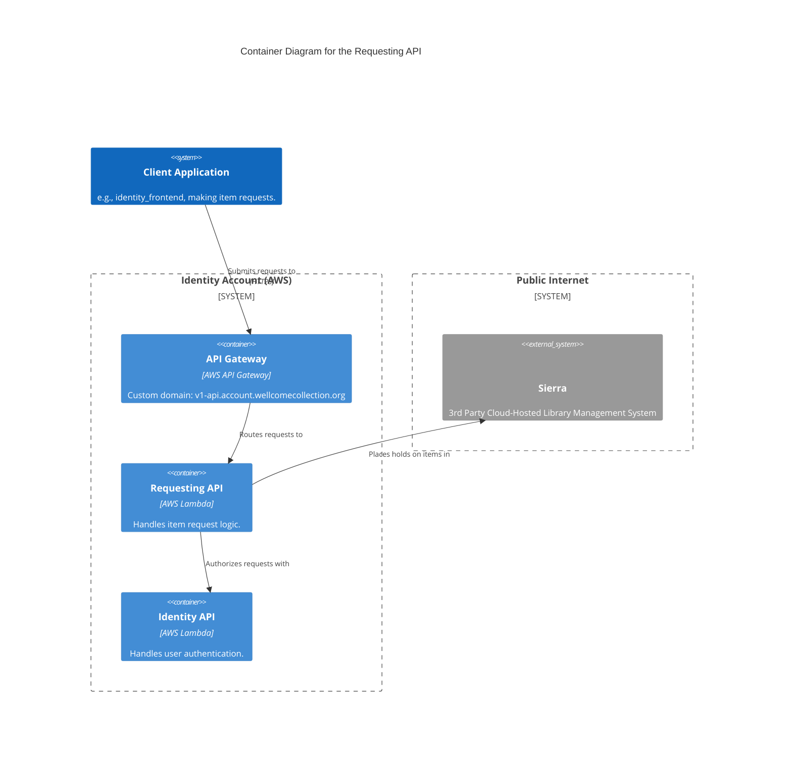

# requesting_api

The Requesting API is responsible for managing user requests to view items in the Wellcome Collection. It provides endpoints for submitting and tracking requests, and is authorized by the Identity API.

## Architecture

## Accounts

- [identity](../../aws_accounts.md#identity)

## Repositories

See the following repositories for more details on the services described above:

- [wellcomecollection/identity](https://github.com/wellcomecollection/identity) 
- [wellcomecollection/catalogue-api](https://github.com/wellcomecollection/catalogue-api)
