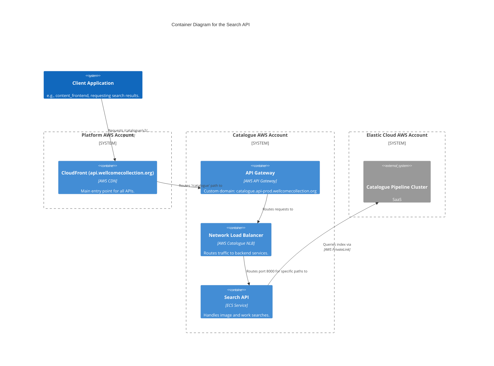

# search_api

The Catalogue search API is responsible for handling search requests across the Wellcome Collection's digital catalogue. It provides endpoints for searching images and works

## Architecture

## Accounts

- [catalogue](../../aws_accounts.md#catalogue)

## Repositories

See the following repositories for more details on the services described above:

- [wellcomecollection/catalogue-api](https://github.com/wellcomecollection/catalogue-api)
- [wellcomecollection/catalogue-pipeline](https://github.com/wellcomecollection/catalogue-pipeline)
