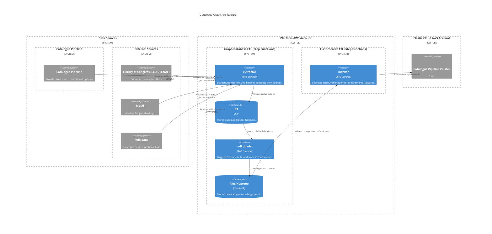

# catalogue_graph

## Architecture

The catalogue graph pipeline is a serverless, event-driven system for building and maintaining a knowledge graph of concepts, names, and locations, enriched with data from external sources. It integrates with the existing catalogue pipeline to provide a comprehensive view of Wellcome Collection concepts and their relationships.

For a more detailed overview, see the Catalogue Graph Pipline RFC: https://github.com/wellcomecollection/docs/blob/main/rfcs/066-graph_pipeline/README.md

The pipeline loads and enriches concepts from the Wellcome catalogue and external ontologies (LCSH, LCNAF, MeSH, Wikidata), and writes the resulting graph to AWS Neptune. Bulk loads are triggered via S3 and the Neptune bulk loader; incremental updates are processed via SNS/SQS and Lambda. All orchestration is managed by AWS Step Functions.

See: https://github.com/wellcomecollection/catalogue-pipeline/tree/main/catalogue_graph

## Repositories

See the following repositories for more details on the services described above:

- [wellcomecollection/catalogue-pipeline](https://github.com/wellcomecollection/catalogue-pipeline/tree/main/catalogue_graph)

## Accounts

- [platform](../../aws_accounts.md#platform)