# catalogue_pipeline

## Architecture

The catalogue pipeline creates the search index for our unified collections search. It populates an Elasticsearch index with data which can then be read by our catalogue API. This allows users to search data from all our catalogues in one place, rather than searching multiple systems which each have different views of the data.

The [catalogue_api (search_api)](../apis/search_api.md) is the public-facing API that provides access to the data in the catalogue pipeline. It accesses the Elasticsearch index written by the catalogue pipeline.

```mermaid
C4Container
    title EBSCO Adapter Architecture

    System_Boundary(platform_account, "Platform AWS Account") {
        System_Boundary(adapters, "Catalogue Pipeline adapters") {
            Container(sierra_adapter, "Sierra Adapter", "ECS Service", "Fetches data from the Sierra library management system and writes to the Sierra VHS.")
            Container(calm_adapter, "Calm Adapter", "ECS Service", "Fetches data from the Calm archive management system and writes to the Calm VHS.")
            Container(mets_adapter, "METS Adapter", "ECS Service", "Fetches METS XML data from the Wellcome Storage Service and writes to the METS VHS.")
            Container(ebsco_adapter, "EBSCO Adapter", "ECS Service", "Fetches MARCXML records from EBSCO FTP service and writes to S3.")
            Container(tei_adapter, "TEI Adapter", "ECS Service", "Fetches TEI XML data from the Wellcome Storage Service and writes to the TEI VHS.")
        }

        System_Boundary(catalogue_pipeline, "Catalogue Pipeline") {
            System_Boundary(transformers, "Transformers") {
                Container(sierra_transformer, "Sierra Transformer", "ECS Service(s)", "Transforms data for the catalogue pipeline.")
                Container(calm_transformer, "Calm Transformer", "ECS Service(s)", "Transforms data for the catalogue pipeline.")
                Container(mets_transformer, "METS Transformer", "ECS Service(s)", "Transforms data for the catalogue pipeline.")
                Container(ebsco_transformer, "EBSCO Transformer", "ECS Service(s)", "Transforms data for the catalogue pipeline.")
                Container(tei_transformer, "TEI Transformer", "ECS Service(s)", "Transforms data for the catalogue pipeline.")
            }
            System_Boundary(id_minter, "ID Minter") {
                Container(id_minter, "ID Minter", "ECS Service", "Generates unique identifiers for records in the catalogue pipeline.")
                ContainerDb(identifiers, "Identifiers", "RDS", "Stores identifiers for records in the catalogue pipeline.")
            }
            System_Boundary(matcher_merger, "Matcher/Merger") {
                System_Boundary(matcher, "Matcher") {
                    Container(matcher, "Matcher", "ECS Service", "Matches records in the catalogue pipeline.")
                    ContainerDb(matcher_db, "Matcher DB", "DynamoDB", "Stores matched records in the catalogue pipeline.")
                }
                Container(merger, "Merger", "ECS Service", "Merges records in the catalogue pipeline.")
            }
            System_Boundary(relation_embedder, "Relation Embedder") {
                Container(path_concatenator, "Path Concatenator", "ECS Service", "Concatenates paths for relation embedding.")
                Container(batcher, "Batcher", "ECS Service", "Batches records for relation embedding.")
                Container(relation_embedder, "Relation Embedder", "ECS Service", "Embeds relation data into merged records.")
            }
            System_Boundary(ingestors, "Ingestors") {
                Container(work_ingestor, "Work Ingestor", "ECS Service", "Ingests data into the catalogue pipeline.")
                Container(image_ingestor, "Image Ingestor", "ECS Service", "Ingests archive data into the catalogue pipeline.")
            }
        }
    }

    System_Boundary(elastic_Cloud, "Elastic Cloud AWS Account") {
        ContainerDb(catalogue_elastic, "Catalogue Pipeline Elasticsearch", "Elastic Cloud", "Stores data for the public catalogue.")
    }

    System_Boundary(catalogue_account, "Catalogue AWS Account") {
        ContainerDb(catalogue_api, "Catalogue API", "Elastic Cloud", "Stores data for the public catalogue.")
    }

    Rel(sierra_adapter, sierra_transformer, "Transforms data", "HTTPS/API")
    Rel(calm_adapter, calm_transformer, "Transforms data", "HTTPS/API")
    Rel(mets_adapter, mets_transformer, "Transforms data", "HTTPS/API")
    Rel(ebsco_adapter, ebsco_transformer, "Ingests data", "HTTPS/API")
    Rel(tei_adapter, tei_transformer, "Ingests data", "HTTPS/API")
    Rel(sierra_transformer, id_minter, "Generates identifiers", "HTTPS/API")
    Rel(calm_transformer, id_minter, "Generates identifiers", "HTTPS/API")
    Rel(mets_transformer, id_minter, "Generates identifiers", "HTTPS/API")
    Rel(ebsco_transformer, id_minter, "Generates identifiers", "HTTPS/API")
    Rel(tei_transformer, id_minter, "Generates identifiers", "HTTPS/API")
    Rel(id_minter, identifiers, "Stores identifiers", "RDS")
    Rel(id_minter, matcher, "Matches records", "HTTPS/API")
    Rel(matcher, matcher_db, "Stores matched records", "DynamoDB")
    Rel(matcher, merger, "Merges records", "DynamoDB")
    Rel(merger, path_concatenator, "Merges records", "DynamoDB")
    Rel(merger, work_ingestor, "Merges records", "DynamoDB")
    Rel(merger, image_ingestor, "Merges records", "DynamoDB")
    Rel(merger, batcher, "Merges records", "DynamoDB")
    Rel(batcher, relation_embedder, "Merges records", "DynamoDB")
    Rel(relation_embedder, work_ingestor, "Merges records", "DynamoDB")
    Rel(work_ingestor, catalogue_elastic, "Merges records", "DynamoDB")
    Rel(image_ingestor, catalogue_elastic, "Merges records", "DynamoDB")

    UpdateLayoutConfig($c4ShapeInRow="5", $c4BoundaryInRow="5")
```

## Repositories

See the following repositories for the code and configuration related to the catalogue pipeline:

- [wellcomecollection/catalogue-pipeline](https://github.com/wellcomecollection/catalogue-pipeline)

## Accounts

- [platform](../../aws_accounts.md#platform)
