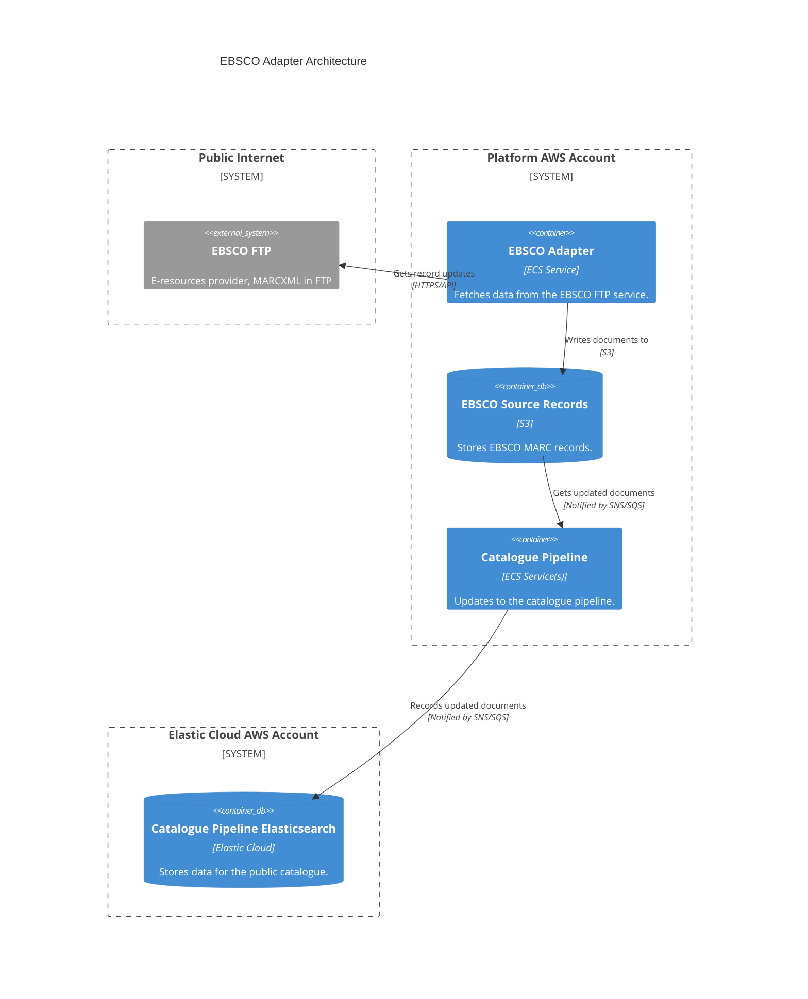

# ebsco_adapter

## Architecture

Adapter for ingesting data from EBSCO. It fetches MARCXML records from the EBSCO FTP service, stores them in S3, and notifies the catalogue pipeline of updates.

## Repositories

See the following repositories for the code and configuration related to the EBSCO adapter:

- [wellcomecollection/catalogue-pipeline](https://github.com/wellcomecollection/catalogue-pipeline/tree/main/ebsco_adapter)

## Accounts

- [platform](../../aws_accounts.md#platform)