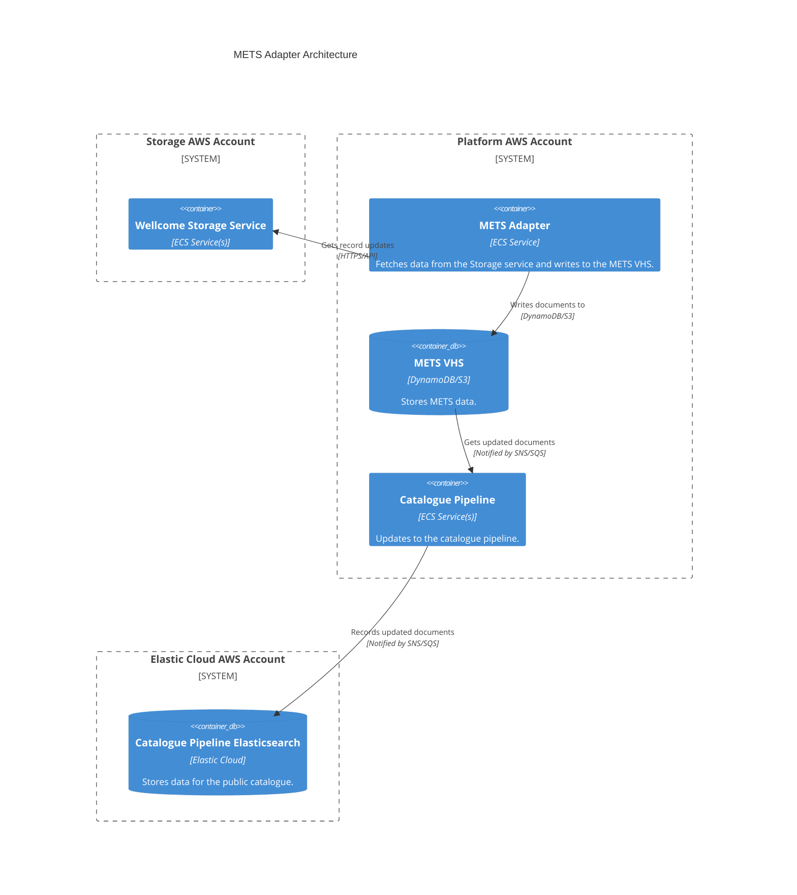

# mets_adapter

## Architecture

Adapter for ingesting METS XML data. METS (Metadata Encoding and Transmission Standard) is a standard for encoding descriptive, administrative, and structural metadata for digital objects. It is the output of digital preservation workflow systems like Archivematica & Goobi, and is used to represent complex digital objects with multiple files and metadata.

This service refers to data stored in the [Wellcome Storage Service](../workflow/storage_service.md), and is used to ingest data into the main catalogue.

## Repositories

See the following repositories for the code and configuration related to the METS adapter:

- [wellcomecollection/catalogue-pipeline](https://github.com/wellcomecollection/catalogue-pipeline/tree/main/mets_adapter)

## Accounts

- [platform](../../aws_accounts.md#platform)
