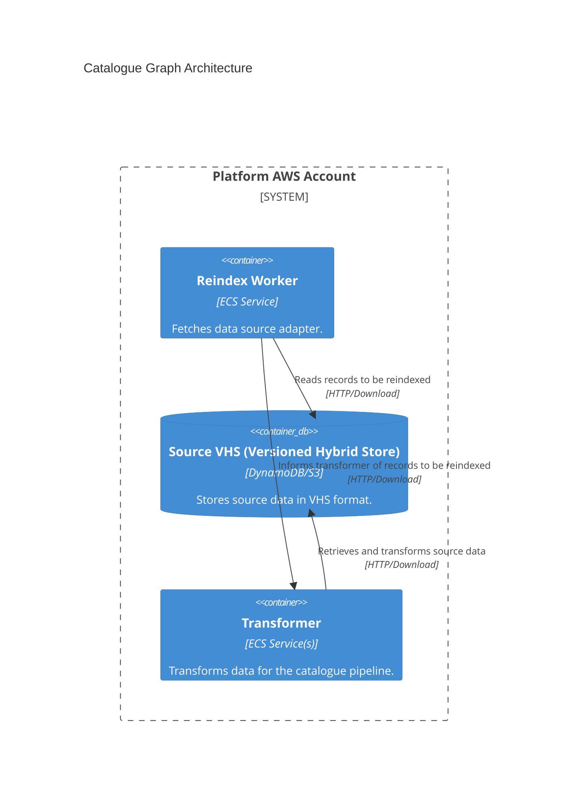

# reindexer

## Architecture

The service for re-indexing catalogue data, it sends data from the catalogue pipeline adapter source data stores through the catalogue pipeline to be re-transformed and re-indexed in the catalogue pipeline Elasticsearch index.

Adapters should expose source data in a way that allows the reindexer uses to trigger re-indexing of data. 

SeeL https://github.com/wellcomecollection/catalogue-pipeline/tree/main/reindexer for more details on the reindexer service architecture.

## Repositories

See the following repositories for more details on the services described above:

- [wellcomecollection/catalogue-pipeline](https://github.com/wellcomecollection/catalogue-pipeline/tree/main/reindexer)

## Accounts

- [platform](../../aws_accounts.md#platform)
