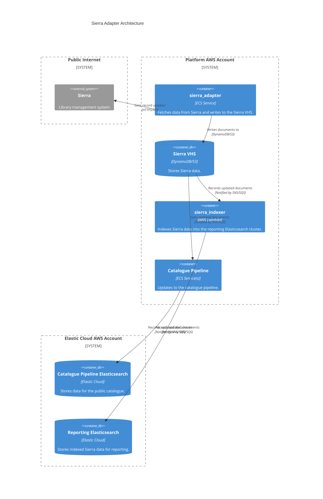

# sierra_adapter

## Architecture

Adapter for ingesting data from the Sierra library management system.

## Repositories

See the following repositories for more details on the services described above:

- https://github.com/wellcomecollection/catalogue-pipeline/tree/main/sierra_adapter

## Accounts

- [platform](../../aws_accounts.md#platform)