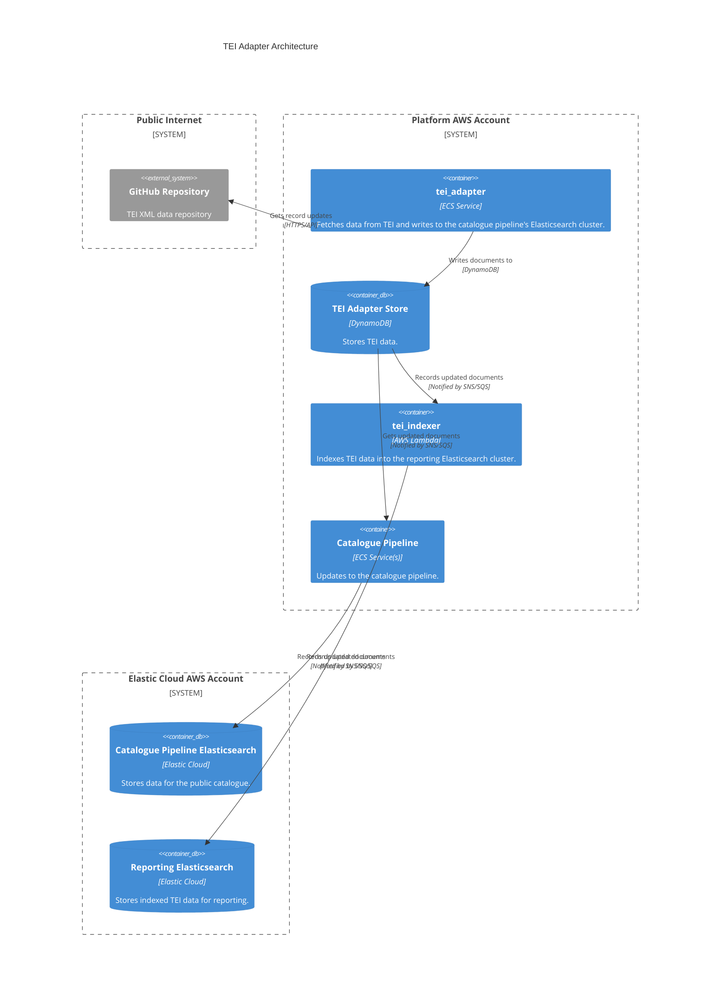

# tei_adapter

## Architecture

Adapter for ingesting TEI XML data.

## Repositories

See the following repositories for more details on the services described above:

- [wellcomecollection/catalogue-pipeline](https://github.com/wellcomecollection/catalogue-pipeline/tree/main/tei_adapter)
- [wellcomecollection/wellcome-collection-tei](https://github.com/wellcomecollection/wellcome-collection-tei)

## Accounts

- [platform](../../aws_accounts.md#platform)