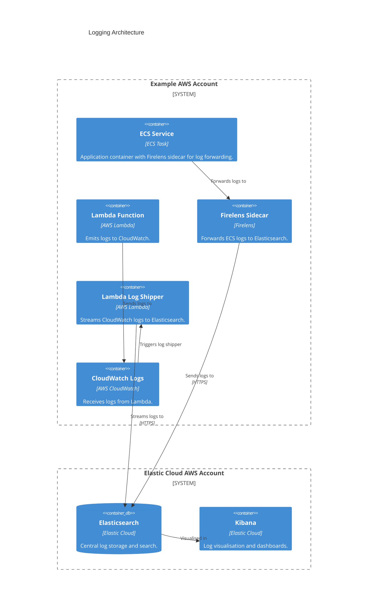

# logging.wellcomecollection.org

## Architecture

Centralised logging for applications and services.

This service provides a centralised logging solution for all Wellcome Collection applications and services. Logs from ECS services are forwarded to Elasticsearch using Firelens as a sidecar container, while logs from AWS Lambda functions are sent to CloudWatch Logs and then streamed to Elasticsearch by a dedicated log shipper Lambda. All logs are stored and indexed in Elasticsearch, which is hosted in Elastic Cloud, and can be visualised and queried using Kibana.

See [this ADR for more details](../../../adr/logging.md).

## Repositories

- [wellcomecollection/platform-infrastructure](https://github.com/wellcomecollection/platform-infrastructure/tree/main/logging)
- [wellcomecollection/elasticsearch-log-forwarder](https://github.com/wellcomecollection/elasticsearch-log-forwarder)
- [wellcomecollection/terraform-aws-ecs-service](https://github.com/wellcomecollection/terraform-aws-ecs-service/blob/main/modules/firelens/main.tf)

## Accounts

This configuration is used by all Collection AWS accounts.