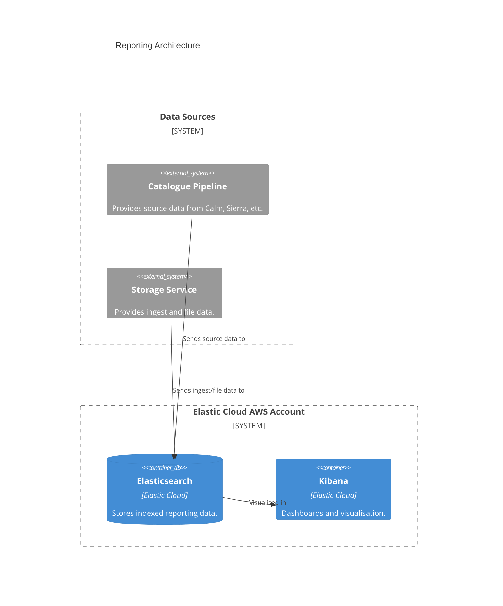

# reporting.wellcomecollection.org

## Architecture

Internal reporting dashboards and services, it provides:

- Dashboards to search source data from Calm, Sierra, and other sources. 
- Visibility on storage service ingests and files.

## Repositories

See the following repositories for more details on the services described above:

- [wellcomecollection/platform-infrastructure](https://github.com/wellcomecollection/platform-infrastructure/tree/main/cloudfront/reporting.wellcomecollection.org)

## Accounts

- [platform](../../aws_accounts.md#platform)
- [storage](../../aws_accounts.md#storage)