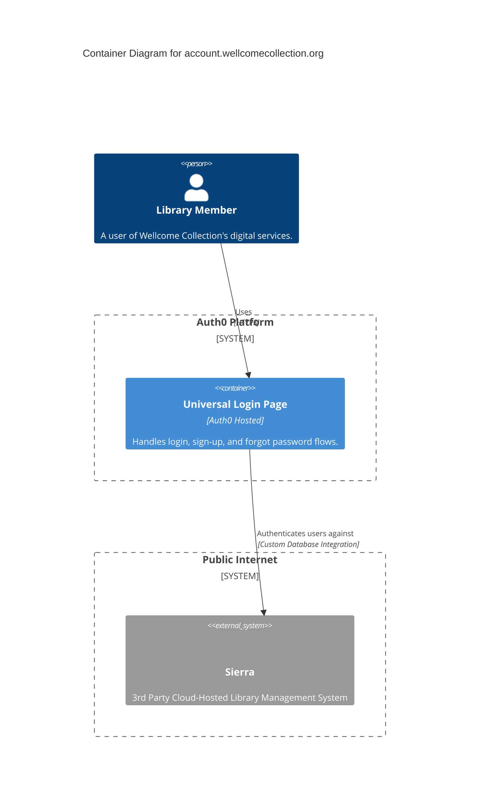

# account.wellcomecollection.org

This service handles user registration and login and is managed by Auth0. It integrates with the Sierra library management system for user authentication. Successful logins redirect to the main website, and will set a cookie to indicate the user is logged in.

## Architecture

## Accounts

- [identity](../../aws_accounts.md#identity)

## Repositories

See the following repositories for more details on the services described above:

- [wellcomecollection/wellcomecollection.org](https://github.com/wellcomecollection/wellcomecollection.org)
- [wellcomecollection/identity](https://github.com/wellcomecollection/identity)
