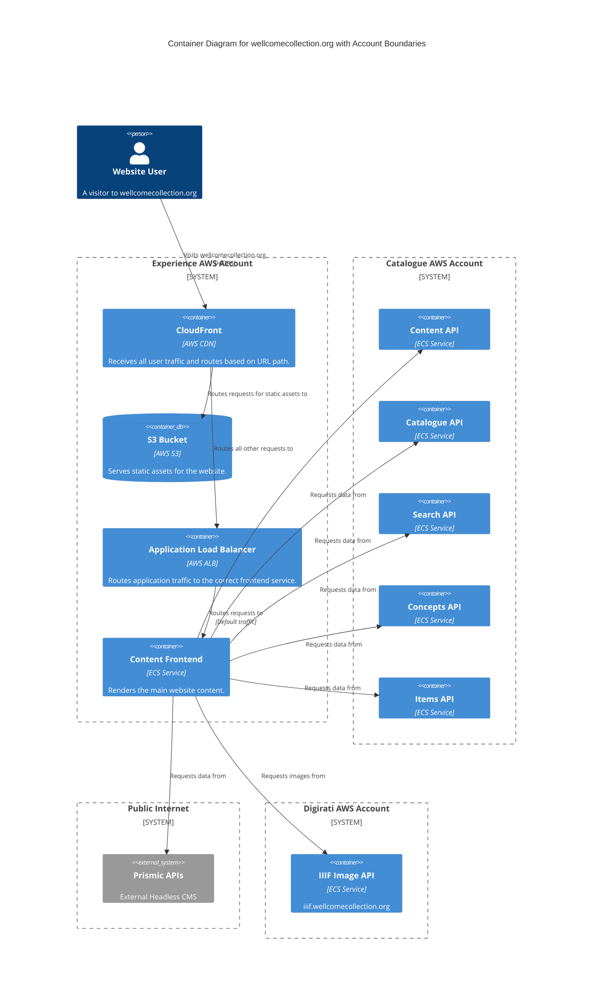

# content_frontend

This service is built with Next.js and provide the main website content and catalogue search functionality.

## Architecture

## Accounts

- [experience](../../aws_accounts.md#experience)

## Repositories

See the following repositories for more details on the services described above:

- [wellcomecollection/wellcomecollection.org](https://github.com/wellcomecollection/wellcomecollection.org)
- [wellcomecollection/catalogue-api](https://github.com/wellcomecollection/catalogue-api)
