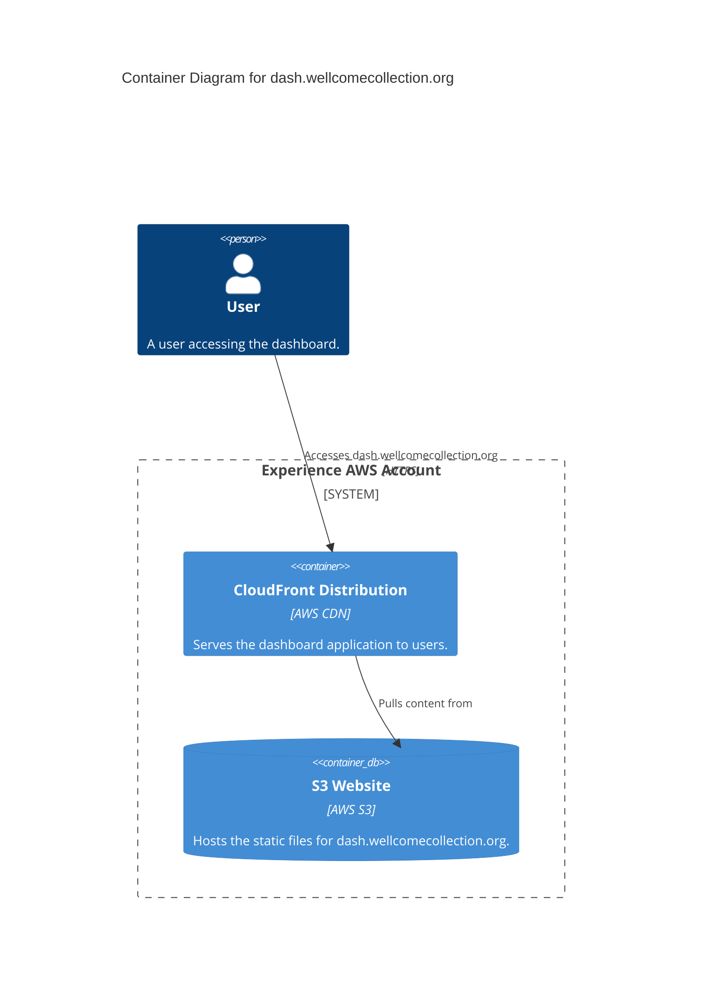

# dash.wellcomecollection.org

This service provides a dashboard for staff and developers, built with Next.js. It includes the toggles dashboard that drops cookies to indicate which features are enabled for the user.

## Architecture

## Accounts

- [experience](../../aws_accounts.md#experience)

## Repositories

See the following repositories for more details on the services described above:

- [wellcomecollection/wellcomecollection.org](https://github.com/wellcomecollection/wellcomecollection.org)
