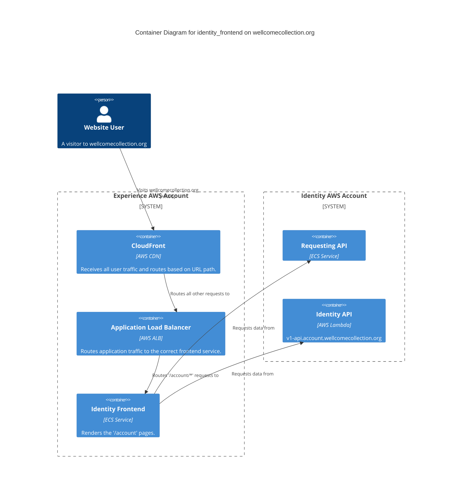

# identity_frontend

This service is built with Next.js and provides some user account management features.

## Architecture

## Accounts

- [experience](../../aws_accounts.md#experience)

## Repositories

- [wellcomecollection/wellcomecollection.org](https://github.com/wellcomecollection/wellcomecollection.org)
- [wellcomecollection/catalogue-api](https://github.com/wellcomecollection/catalogue-api)
- [wellcomecollection/identity](https://github.com/wellcomecollection/identity)
