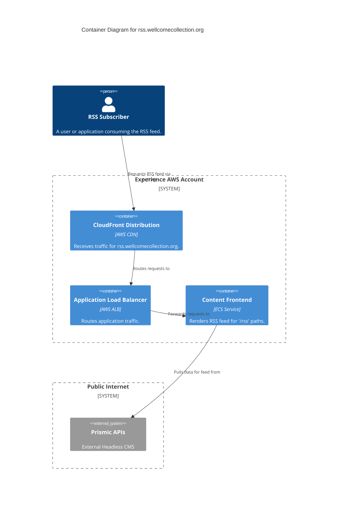

# rss_feed

This service generates RSS feeds for website content.

## Architecture

## Accounts

- [experience](../../aws_accounts.md#experience)

## Repositories

See the following repositories for more details on the services described above:

- [wellcomecollection/wellcomecollection.org](https://github.com/wellcomecollection/wellcomecollection.org)
