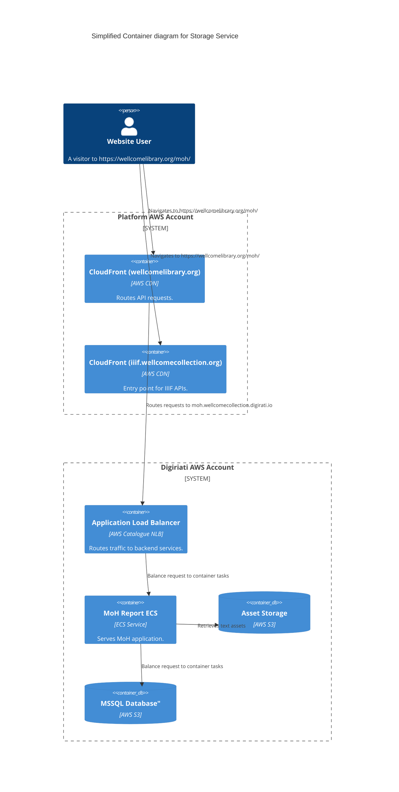

# moh (Medical Officer of Health reports)

## Architecture

A standalone service for the Medical Officer of Health reports (https://wellcomelibrary.org/moh/).

## Accounts

- [digirati](../../aws_accounts.md#digirati)

## Repositories

See the following repositories for more details on the services described above:

- [wellcomecollection/londons-pulse](https://github.com/wellcomecollection/londons-pulse)