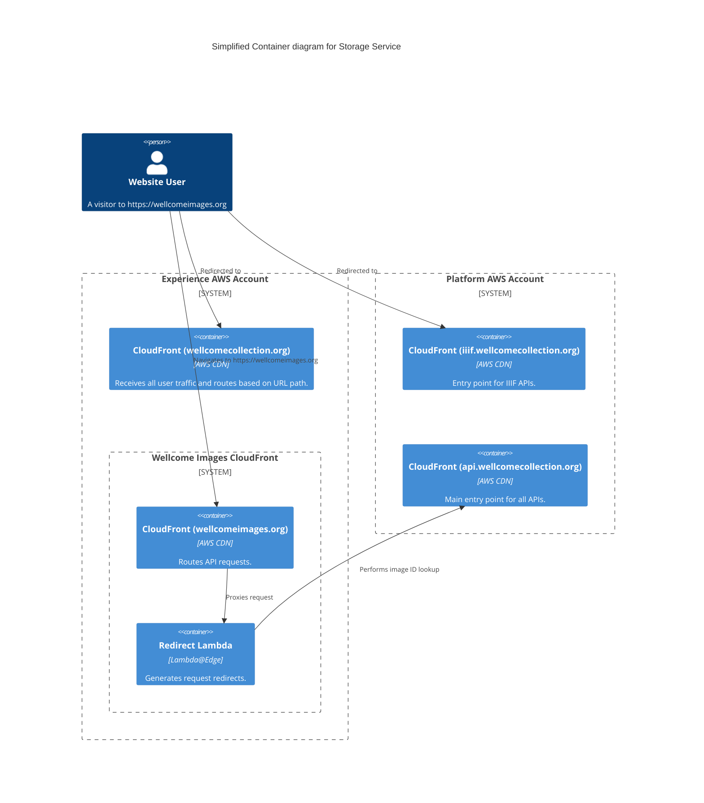

# wellcomeimages_redirects

## Architecture

Redirects for the legacy Wellcome Images website.

## Repositories

- [wellcomecollection/wellcomeimages.org](https://github.com/wellcomecollection/wellcomeimages.org)

## Accounts

- [experience](../../aws_accounts.md#experience)