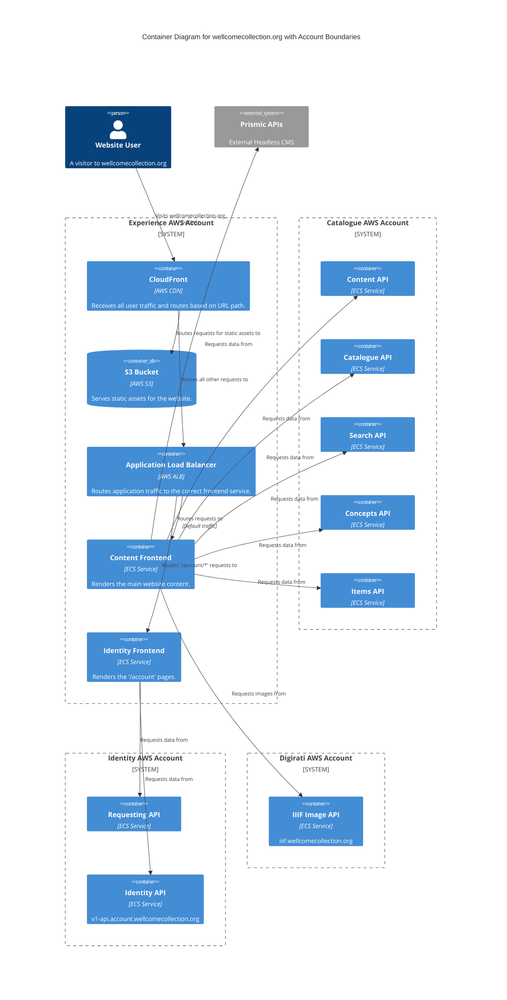
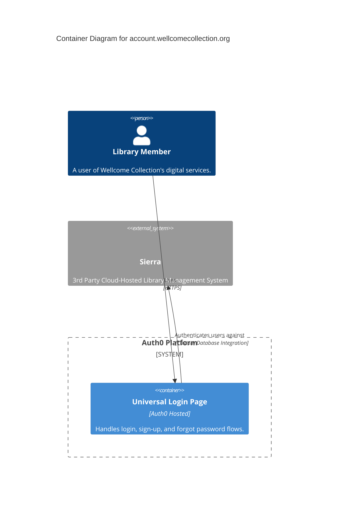
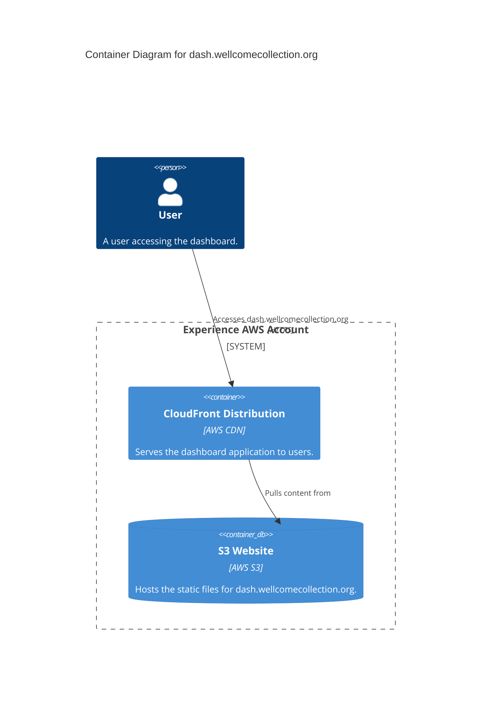
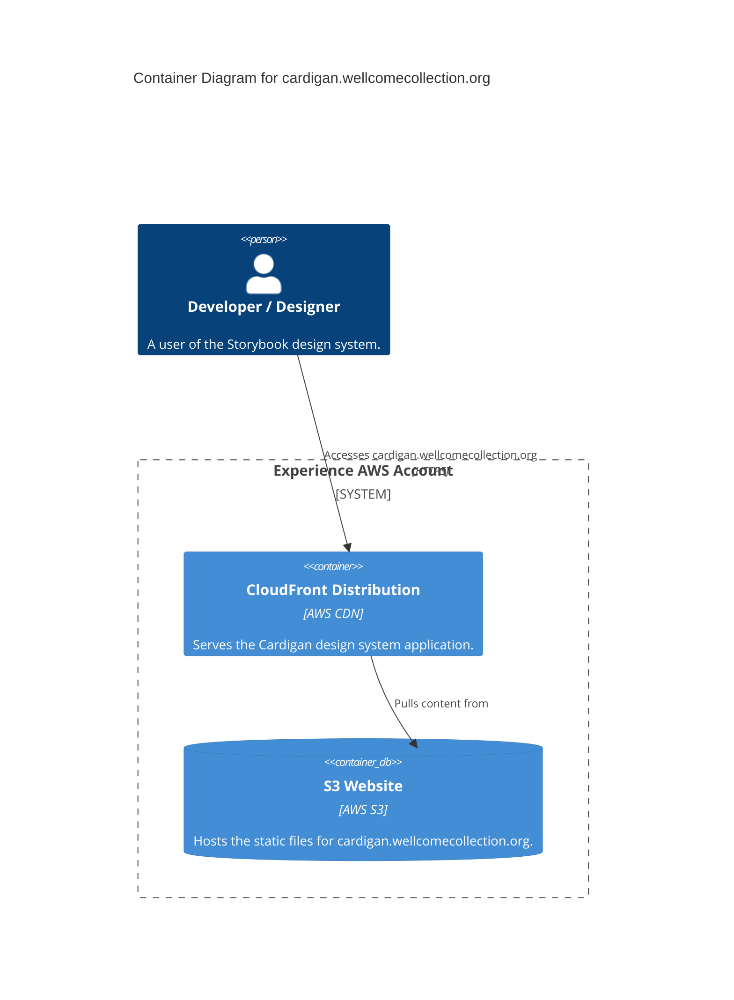
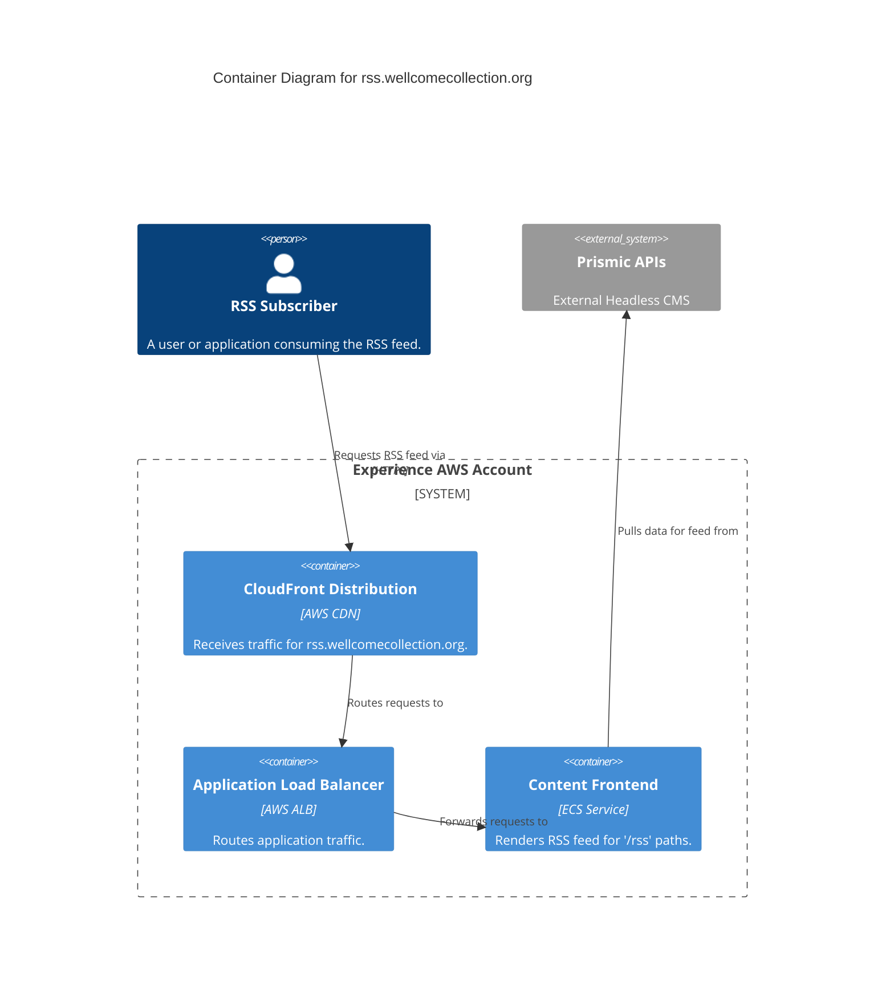
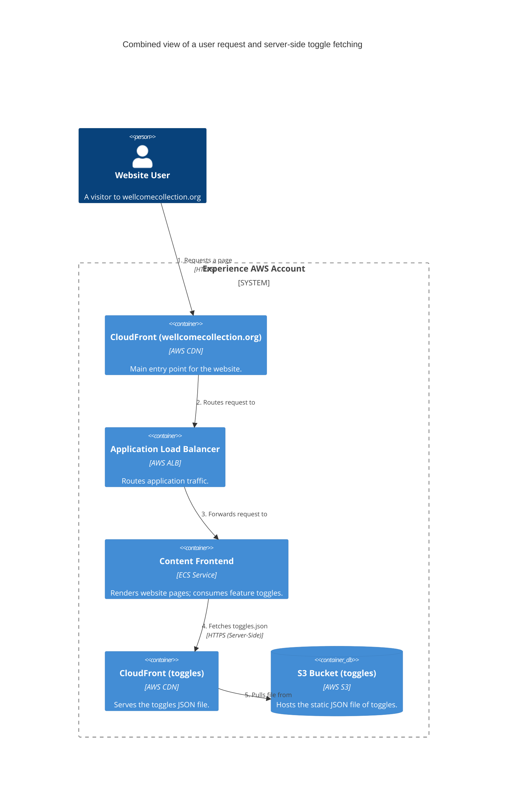

# wellcomecollection.org Services

Services that are directly related to the Wellcome Collection website and its user-facing features.

- [content_frontend / identity_frontend](#content_frontend-identity_frontend)
- [account.wellcomecollection.org](#accountwellcomecollectionorg)
- [dash.wellcomecollection.org](#dashwellcomecollectionorg)
- [cardigan.wellcomecollection.org](#cardiganwellcomecollectionorg)
- [rss_feed](#rss_feed)
- [toggles.wellcomecollection.org](#toggleswellcomecollectionorg)

## content_frontend / identity_frontend

These services are built with Next.js and provide the main website content and user account management features.

See the following repositories for more details on the services described above:

- [wellcomecollection/wellcomecollection.org](https://github.com/wellcomecollection/wellcomecollection.org)
- [wellcomecollection/catalogue-api](https://github.com/wellcomecollection/catalogue-api)
- [wellcomecollection/identity](https://github.com/wellcomecollection/identity)

## account.wellcomecollection.org

This service handles user account management, including registration, and login and is managed by Auth0. It integrates with the Sierra library management system for user authentication. Successful logins redirect to the main website, and will set a cookie to indicate the user is logged in.

See the following repositories for more details on the services described above:

- [wellcomecollection/wellcomecollection.org](https://github.com/wellcomecollection/wellcomecollection.org)
- [wellcomecollection/identity](https://github.com/wellcomecollection/identity)

## dash.wellcomecollection.org

This service provides a dashboard for staff and developers, built with Next.js. It includes the toggles dashboard that drops cookies to indicate which features are enabled for the user.

See the following repositories for more details on the services described above:

- [wellcomecollection/wellcomecollection.org](https://github.com/wellcomecollection/wellcomecollection.org)

## cardigan.wellcomecollection.org

This service is the Storybook component library for the design system, built with Next.js.

See the following repositories for more details on the services described above:

- [wellcomecollection/wellcomecollection.org](https://github.com/wellcomecollection/wellcomecollection.org)

## rss_feed

This service generates RSS feeds for website content.

See the following repositories for more details on the services described above:

- [wellcomecollection/wellcomecollection.org](https://github.com/wellcomecollection/wellcomecollection.org)

## toggles.wellcomecollection.org

This service provides a JSON endpoint for feature flags and A/B testing toggles. It is used by the main website to determine which features are enabled for the user.

See the following repositories for more details on the services described above:

- [wellcomecollection/wellcomecollection.org](https://github.com/wellcomecollection/wellcomecollection.org)