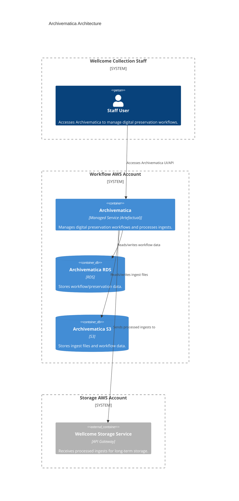

# archivematica

## Architecture

The Archivematica digital preservation system.

Archivematica is a digital preservation system managed by Artefactual. It is accessed by Wellcome Collection staff, stores workflow and preservation data in RDS and S3, accepts ingests from S3, processes them, and sends them to the Wellcome Storage Service for long-term storage. Archivematica runs in the Workflow AWS account.

It is maintained by a third-party vendor, [Artefactual](../../partners.md), and is used to manage digital preservation workflows for Wellcome Collection.

## Repositories

See the following repositories for the code and configuration related to Archivematica:

- [wellcomecollection/archivematica-infrastructure](https://github.com/wellcomecollection/archivematica-infrastructure)

## Accounts

- [workflow](../../aws_accounts.md#workflow)
