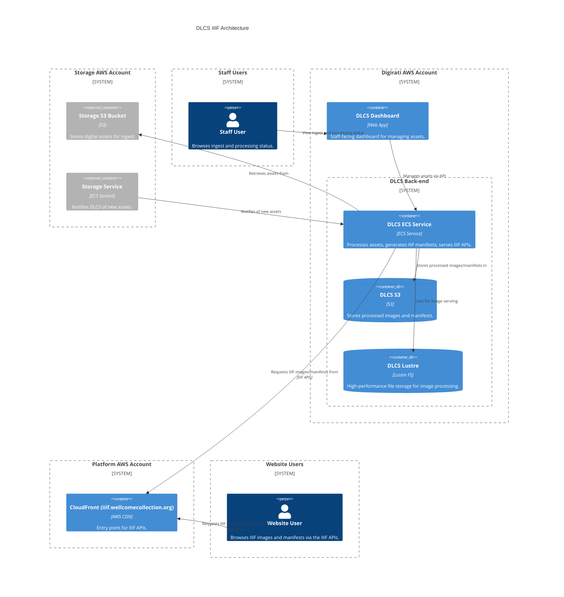

# dlcs_iiif

## Architecture

The Digital Library Cloud Service for serving IIIF images.

See [this diagram for a detailed overview of the DLCS architecture](https://raw.githubusercontent.com/dlcs/protagonist/master/docs/c4-container-diagrams/DLCS-2023-l2.png), provided by Digirati.

It is maintained by a third-party vendor, [Digirati](../../partners.md), and is used to serve IIIF images and other material for the Wellcome Collection.

## Repositories

See the following repositories for more details on the services described above:

- [dlcs/protagonist](https://github.com/dlcs/protagonist)

## Accounts
