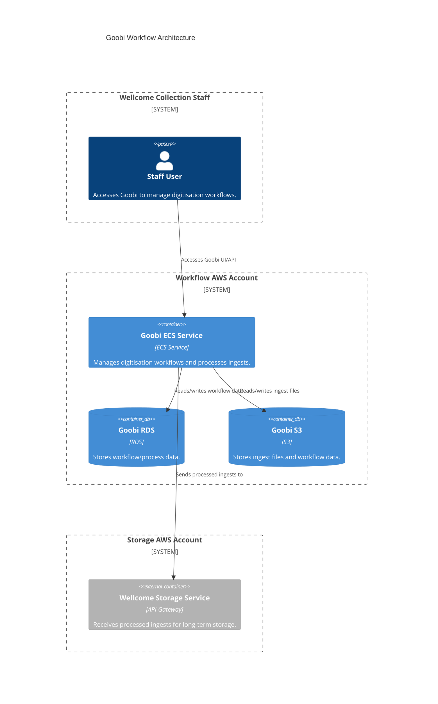

# workflow (Goobi)

## Architecture

The Goobi workflow management system for digitisation.

Goobi is an ECS service accessed by Wellcome Collection digital production staff. It stores workflow and process data in RDS and S3, accepts ingests from S3, processes them, and sends them to the Wellcome Storage Service for long-term storage. Goobi runs in the Workflow AWS account.

It is maintained by a third-party vendor, [Intranda](../../partners.md), and is used to manage some of the digitisation workflows for Wellcome Collection.

## Repositories

See the following repositories for the code and configuration related to Goobi:

- [wellcomecollection/goobi-infrastructure](https://github.com/wellcomecollection/goobi-infrastructure)

## Accounts

- [workflow](../../aws_accounts.md#workflow)
