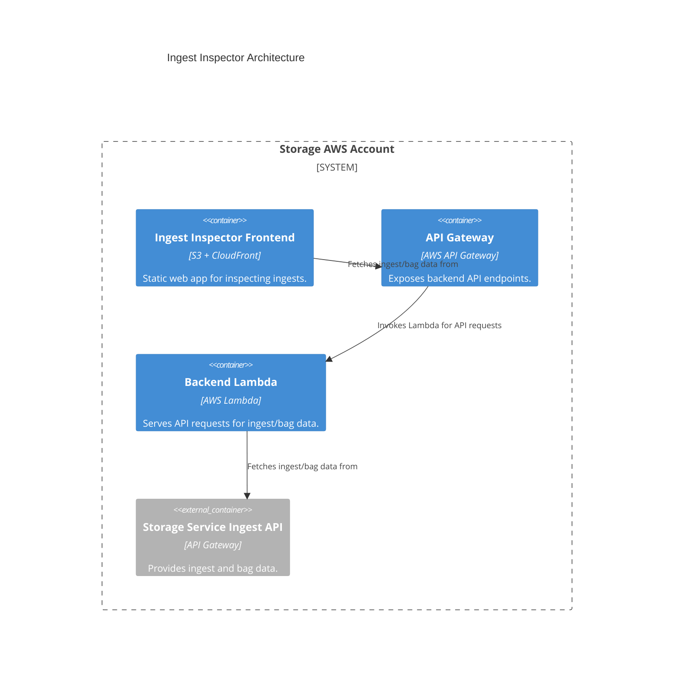

# ingest_inspector

## Architecture

A tool for inspecting data being ingested into the storage service.

The ingest inspector is a monitoring and debugging tool for the storage service. It is deployed entirely within the storage AWS account. The frontend is a static web application served from an S3 bucket behind a dedicated CloudFront distribution. The backend is an API Gateway endpoint backed by a Lambda function, which provides access to ingest and bag data for inspection by calling the storage service ingest API.

See https://github.com/wellcomecollection/storage-service/tree/main/monitoring/ingest_inspector for more details.

## Repositories

See the following repositories for the code and configuration related to the ingest inspector:

- [wellcomecollection/storage-service](https://github.com/wellcomecollection/storage-service/tree/main/monitoring/ingest_inspector)

## Accounts

- [storage](../../aws_accounts.md#storage)