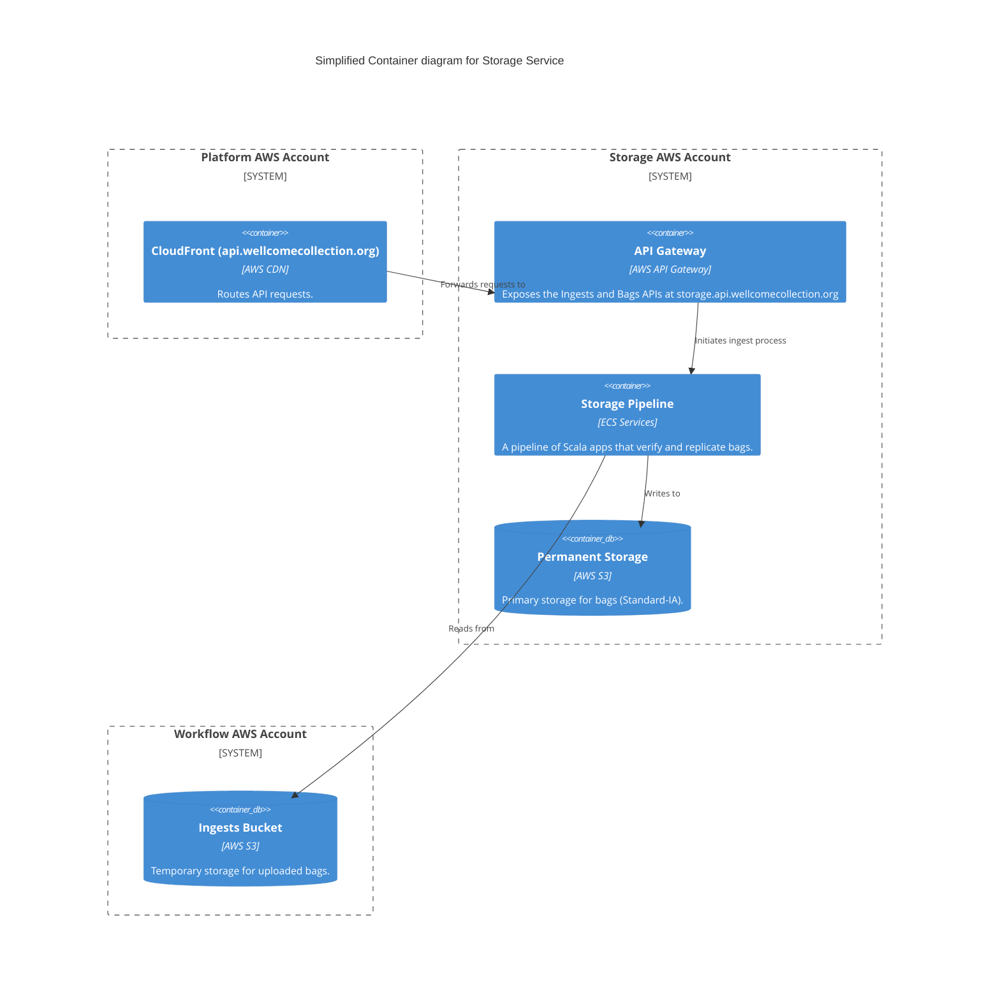

# storage_service

## Architecture

The storage service is responsible for the long-term preservation of our digital assets. It ensures that files are stored securely, their integrity is maintained, and they can be retrieved when needed.

The service is designed as a pipeline of applications that work together to process and store "bags" of files, which are packaged using the [BagIt specification](https://tools.ietf.org/html/rfc8493).

For a more detailed breakdown of the architecture, see the [architecture documentation in the storage-service repository](https://github.com/wellcomecollection/storage-service/blob/main/docs/architecture.md).

## Repositories

- [wellcomecollection/storage-service](https://github.com/wellcomecollection/storage-service)

## Accounts

- [storage](../../aws_accounts.md#storage)
