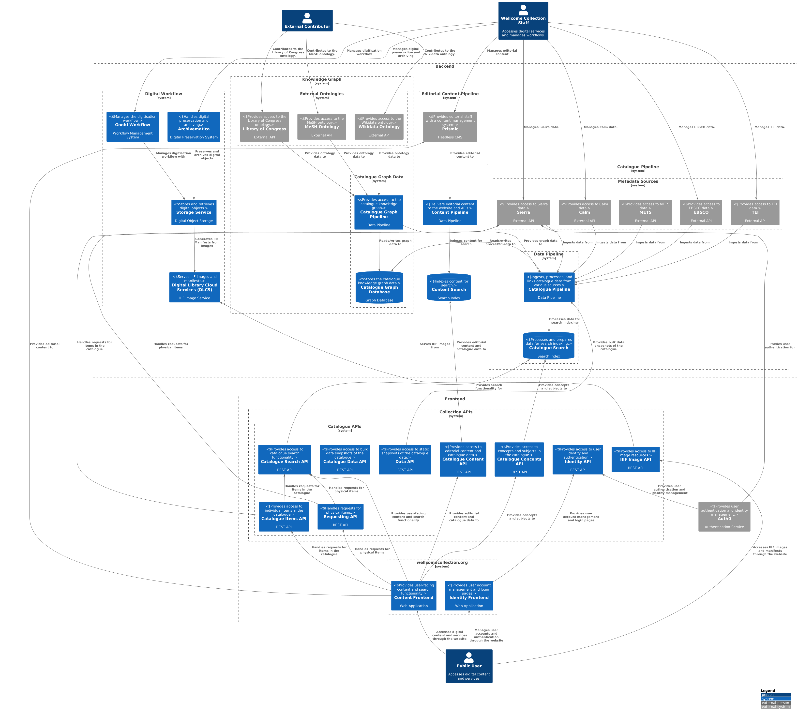

# System Context

This document provides an overview of the [system context](https://c4model.com/diagrams/system-context) for Wellcome Collection's digital services, including the main components, their interactions, and the accounts they reside in.

Here we are using the C4 model to represent the system context at a high level, incorporating the services described in the [Services](./services/README.md) section.

---

---

This image is generated from the PlantUML source file [`system_context.puml`](system_context.puml). You can view and edit the source file to make changes to the diagram. There are various options for rendering PlantUML diagrams, including using the [this PlantUML online editor](https://editor.plantuml.com/) or running a local PlantUML server.