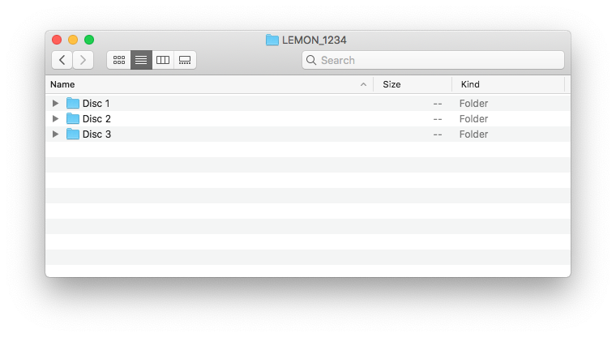
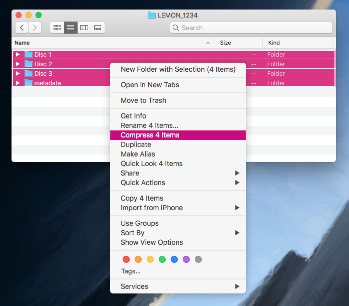

# How to: upload born digital accessions to Archivematica/the Wellcome Storage

1.  Put all the files that are part of your accession in a folder.

    

    Name the folder something meaningful to *you* -- the name of this folder isn't used by Archivematica or the Wellcome Storage.

2.  Use CALM to get an accession number and collection reference for your accession.
    In this example, let's suppose the accession number is `1234`, and the collection reference is `1234`.

3.  Inside the folder, create another folder called `metadata`, and in that folder create a CSV file `metadata.csv`.

    ```csv
    filename,collection_reference,accession
    objects/,LEMON,1234
    ```

    This is what the folder should look like:

    

4.  Select all the files in the folder, and compress them into a ZIP archive.

    

    Name the ZIP archive something meaningful to *you* -- the name of this folder isn't used by Archivematica or the Wellcome Storage.

5.  Use FileZilla to upload the ZIP file to the S3 bucket `wellcomecollection-archivematica-transfer-source` in the `born-digital/` folder.

    Refresh FileZilla -- you should see a `.log` file appear alongside the ZIP archive you just uploaded.

    *   If the name of the `.log` file contains `success`: hooray, your package has been successfully accepted for processing!
    *   If the name of the `.log` file contains `failed`: something went wrong trying to process your package.
        Download the log file, and read it with Notepad to understand what went wrong.
