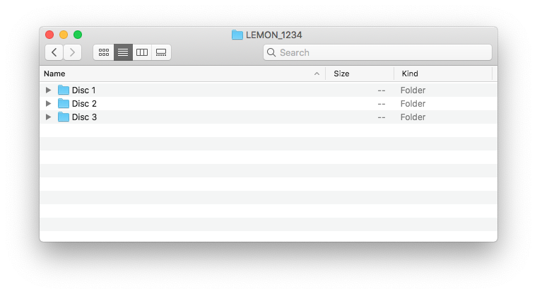
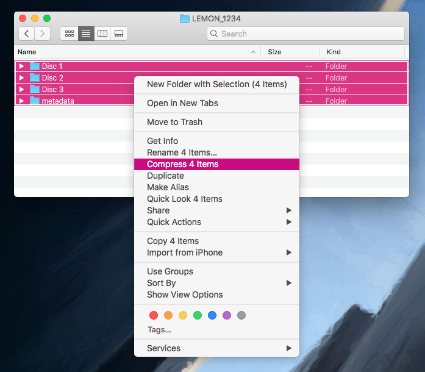
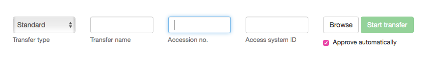

# How to: upload born digital accessions to Archivematica/the Wellcome Storage

1. Put all the files that are part of your accession in a folder.

   

   Name the folder something meaningful to _you_ -- the name of this folder isn't used by Archivematica or the Wellcome Storage.

2. Use CALM to get an accession number and collection reference for your accession. In this example, let's suppose the accession number is `1234`, and the collection reference is `LEMON`.
3. Inside the folder, create another folder called `metadata`, and in that folder create a CSV file `metadata.csv`.

   ```text
   filename,collection_reference,accession_number
   objects/,LEMON,1234
   ```

   This is what the folder should look like:

   

4. Select all the files in the folder, and compress them into a ZIP archive.

   

   Name the ZIP archive something meaningful to _you_ -- the name of this folder isn't used by Archivematica or the Wellcome Storage.

5. Use FileZilla to upload the ZIP file to the S3 bucket `wellcomecollection-archivematica-transfer-source` in the `born-digital/` folder.

   Refresh FileZilla -- you should see a `.log` file appear alongside the ZIP archive you just uploaded.

   * If the name of the `.log` file contains `success`: hooray, your package has been successfully accepted for processing!
   * If the name of the `.log` file contains `failed`: something went wrong trying to process your package.

     Download the log file, and read it with Notepad to understand what went wrong.

   \(If you don't see a log file within a minute or so, speak to the devs.\)

6. If you go to the Archivematica dashboard \([https://archivematica.wellcomecollection.org/](https://archivematica.wellcomecollection.org/)\), you should see the transfer package has been picked up after a few minutes. It will gradually process through the "Transfer" tab, then the "Ingest" tab. When it completes the Ingest tab, it will have been successfully stored in the Wellcome Storage with the settings:
   * storage space: `born-digital-accessions`
   * external identifier: `{accession number}`

## Why do it this way?

If you're starting a transfer manually, you can specify an accession number in the Archivematica dashboard:



We want transfers that are started manually and automatically to have the same metadata in their METS file, so the process that triggers transfers needs to know what the accession number should be. Writing the accession number into `metadata.csv` means the process can extract it and send it to Archivematica when it starts the transfer.

## Alternatives that were considered

* Use the collection reference and the accession number in a single string \(e.g. `LEMON/123`\).

  This is how Preservica recorded accession identifiers, but it has potential for ambiguity. Is `LEMON/1` a catalogue reference or an accession identifier? We decided not to reproduce this ambiguity in Archivematica.

* Just use the accession number.

  In theory, the accession number is a unique identifier, and we don't need anything else. In practice, the collection reference is useful for a couple of reasons.

  If you have the transfer package files, you can easily work out which collection it's part of \(the `metadata.csv` is copied into the AIP\).

  Also, if the accession number is mistyped, you can work out what the correct number is. When migrating the existing born-digital accessions, there was an accession which had a typo – `2339` vs `2399`. Having the collection reference made it easy to work out what the correct number was.

* Use the `identifiers.json` file in the metadata subdirectory. This is another way Archivematica can receive identifiers: [https://www.archivematica.org/en/docs/archivematica-1.10/user-manual/transfer/transfer/\#transfers-with-existing-persistent-identifiers](https://www.archivematica.org/en/docs/archivematica-1.10/user-manual/transfer/transfer/#transfers-with-existing-persistent-identifiers)

  We might use this in future, but for a first pass a CSV file is easier to create and explain.

