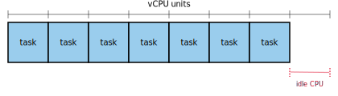

# Scaling down big ECS tasks during deployments

### 14 January 2020, Alex Chan

Most of our ECS tasks use a classic blue-green deployment model:


We're running an old task definition (blue).
We create a new task definition (green), and update the ECS service to start running the new task definition.
It starts the new task alongside the old task, and only stops the running task when the new task has started correctly.

This has several benefits:

-   Deployments don't have any downtime: there's always at least one task running, so the service can always serve requests.

-   We have some protection against bad deployments – if the new task never starts successfully, ECS will never stop the old task.

-   Easy rollbacks: if we deploy a bad task and it starts successfully, we can run this process in reverse to get to a known good version.

If you're running your tasks in Fargate, this is fine – you have effectively unlimited CPU/memory resources to use, so you can always start a new task alongside the old task.

If you're running your tasks on EC2 instances, this is tricker – you have to keep enough CPU/memory spare to start a new task, which is effectively wasted resource.

If you have lots of small tasks, this is okay:

<figure>
  
  <figcaption>
    <small>
      This EC2 instance has eight CPU cores, and each task uses a single CPU core.
      We can run seven tasks and still be able to do blue-green deployments, and only a single core is sitting idle.
    </small>
  </figcaption>
</figure>

But if you have one big task, you're wasting a lot of CPU:

<figure>
  
  <figcaption>
    <small>
      This task needs four CPU cores – so the other four cores are sitting idle for when we need to do a deployment.
    </small>
  </figcaption>
</figure>

If this big task doesn't need continuous uptime (for example, it's a background process), then it would be better to allocate it all eight CPU cores, and allow ECS to scale it to zero when we do a deployment.

We had this scenario when setting up Archivematica:

*   We have to run tasks in EC2, not Fargate, because they need access to a shared EBS volume.
*   The MCP client task will use as much CPU as you give it, and it's the bottleneck for transfer speeds.
    If we could recover some of the idling CPU cores, we'd get faster Archivematica performance.

If you set the `deployment_minimum_healthy_percent` parameter to 0 in your ECS service, you can recover this idling CPU:

```hcl
resource "aws_ecs_service" "mcp_client" {
  name            = "mcp_client"
  cluster         = aws_ecs_cluster.archivematica.id
  task_definition = aws_ecs_task_definition.mcp_client.arn

  deployment_minimum_healthy_percent = 0
  ...
}
```

This tells ECS "scale this task to zero during a deployment", which frees up the resources of the old task for the new task.
This is what a deployment looks like with this setting:


Note: this setting means ECS will *always* stop your running tasks, even if your instance has sufficient resources to do a downtime-free deployment.
