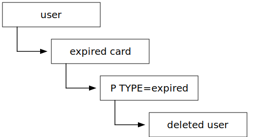

# Handling error cases in requesting

For the new item requesting service, we need to handle errors coming from the Sierra API (for varying definition of "error").

*   The item/requests APIs need to recognise the error, and provide a suitable response.

*   The front-end needs to present error messages to users based on responses from the APIs.

I had a conversation with Natalie about some of the errors we might encounter when looking up or requesting items in Sierra:

*   **A server error from Sierra.**
    The Sierra API returns a 500 error.

*   **Sierra is unavailable.**
    Sierra sometimes goes down for maintenance/upgrades.
    Our API should handle that correctly (i.e., not hang forever waiting for a Sierra response).

*   **Handling barred users correctly.**
    Patron records have an MBLOCK field, which has four possible values:

    -   Empty (the default)

    -   b (BARRED) -- anybody who isn't allowed in the library or to request items.
        These records persist forever.
        If a barred user tries to request an item on the current site, they get an error:

        > There is a problem with your library record. Please see a librarian.

    -   l (CLUB) -- a legacy field that stopped existing years ago.
        It's nothing to do with the library.
        I don't think we expect to see any users with this field.

    -   m (MESSAGE) -- so staff can record a message.
        This stops current users from requesting (but Natalie was surprised by this).

*   **Handling deleted/expired users correctly.**

    

    Library cards have an expiry date.

    -   After the expiry date passes, the patron is no longer able to make requests.
        They get a generic error message if they try to request an item on the current site:

        > There is a problem with your library record. Please see a librarian.

    -   If the card has been expired for a while, the patron is moved to `P TYPE=expired` in Sierra
    -   If the patron sits in that state for even longer, the patron record is deleted entirely (unless the patron is barred)

    We should be able to handle this correctly:

    -   If the API is asked to place a hold for an expired user, it gives an appropriate error message (maybe surfacing this information in the UI)
    -   If the API is asked to place a hold for a deleted user, it gives an appropriate error message
    -   If a patron's account expires and then they renew their card, they can place holds again

*   **Hitting the patron hold limit.**

    The current hold limit is 20; if a patron has already placed holds on 20 items, they cannot place another hold.

    Cases to consider:

    -   The patron is at (or above?) their hold limit
    -   If the patron is at their hold limit, then cancels a hold and places a new hold, the hold should succeed

    Questions:

    -   Is the hold limit configurable, on a per-user/per-library basis?
    -   Is it possible to go above the hold limit using Sierra jiggery-pokery?

*   **An item is already on hold.**

    -   If Alice has a hold on an item, and tries to place a second hold on it, we should handle that in the API and present a sensible message in the UI
    -   If Alice has a hold on an item, Bob should not be able to place a hold on the same item (or get any information about Alice)

*   **An item is not available to be requested.**

    The rules about whether an item can be requested are based on *Sierra loan rule tables*, and this dictates whether a button appears in the current UI.

    -   Suppressed and deleted items don't appear at all.
        (The API should still handle requests to hold them, e.g. if a user leaves a tab open, and the item is suppressed or deleted in the meantime.)

    -   Items on loan to somebody else (e.g. staff members)

    -   Items in a location that means they're not requestable (e.g. an inter-library loan)
