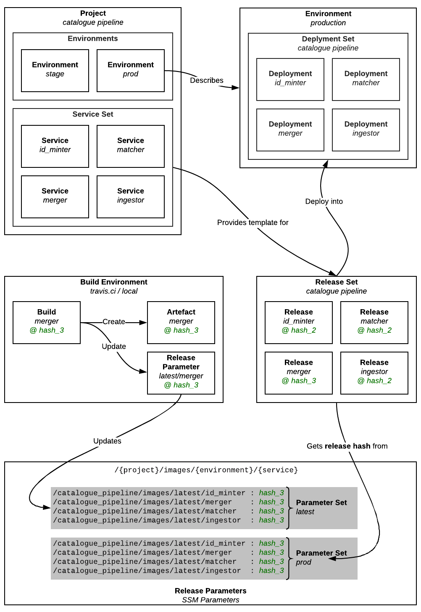

# RFC 013: Release & Deployment tracking

**Last updated: 24 January 2019.**

## Background

We have multiple projects that are themselves composed of multiple services, which can deploy into multiple environments (e.g. production/staging).

Folk are regularly making changes, building updated services and deploying them into the appropriate environments. Keeping track of what is deployed where, by who and why is essential to working effectively.

In general the build/release/deployment process can be described as follows:

More specifically including a high level view of infrastructure includes:

- A build environment to build artifacts, e.g. Travis
- An artifact store to store things, e.g. ECR
- A database to keep track of what should be released where e.g. DynamoDB
- A Deployment environment to run things in, e.g. ECS

### Glossary

In order that we can talk about the numerous concepts flying about here, we'll define some terms and visualise how they fit together:

- **project:** A high level abstraction, consisting of one or more **service set**'s. Practically this might indicate whole product and should be a single git repository, e.g. the "catalogue" project.

- **service set:** A functional grouping of **services** within a project. e.g. all the services for the catalogue pipeline. You can have multiple per project, for example in the catalogue project, you've got pipeline, api and adapters.

- **service:** Performs a distinct function within a **project**, practically it may be composed of a few closely related containers. e.g. id_minter, requests API, Front-end content app.

- **environment:** Where you deploy your **services** when you want them to run! e.g. staging, production

- **build environment:** Where you build artifacts to deploy, for example CircleCI, Travis, or your local machine (if tooling allows).

- **build:** The process of creating a **build artifact** for a single **service**

- **build artifact:** A deployable _thing_ for a single service, practically this is a container image stored in ECR.

- **release hash:** Metadata uniquely identifying a **build artifact**, practically this will be a git ref. 

- **release:** Metadata indicating the intention to deploy a particular **build artifact** at a given **release hash**. Generally part of a **release set**.

- **release set:** WIP

## What we do now

See the documentation on [version 1](v1/README.md).

### Problems with the current approach

WIP

- It doesn't actually deploy so things get out of sync
- Multi-step to actually deploy something is confusing / unnecessary
- Poor visibility of what is actually deployed

### Proposed Solution

WIP