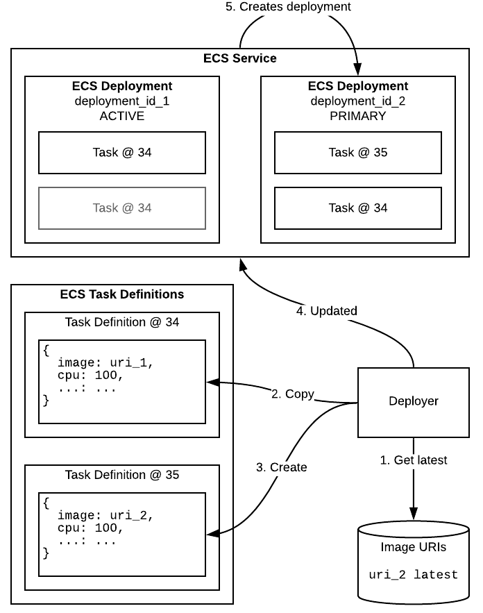
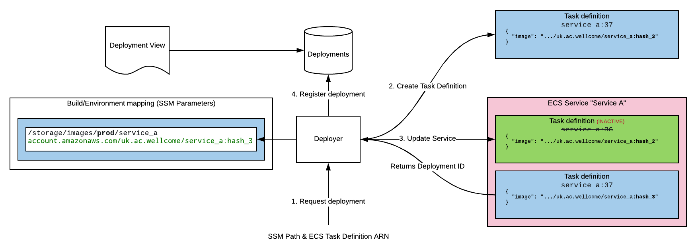

# RFC 013: Release & Deployment tracking

**Last updated: 24 January 2019.**

## Background

We have multiple projects that are themselves composed of multiple services, which can deploy into multiple environments (e.g. production/staging).

Folk are regularly making changes, building updated services and deploying them into the appropriate environments. Keeping track of what is deployed where, by who and why is essential to working effectively.

In general the build/release/deployment process can be described as follows:


More specifically including a high level view of infrastructure includes:

- A build environment to build artifacts, e.g. Travis
- An artifact store to store things, e.g. ECR
- A database to keep track of what should be released where e.g. DynamoDB
- A Deployment environment to run things in, e.g. ECS


### Glossary

In order that we can talk about the numerous concepts flying about here, we'll define some terms and visualise how they fit together:

- **project:** A high level abstraction, consisting of one or more **service set**'s. Practically this might indicate whole product and should be a single git repository, e.g. the "catalogue" project.

- **service set:** A functional grouping of **services** within a project. e.g. all the services for the catalogue pipeline. You can have multiple per project, for example in the catalogue project, you've got pipeline, api and adapters.

- **service:** Performs a distinct function within a **project**, practically it may be composed of a few closely related containers. e.g. id_minter, requests API, Front-end content app.

- **environment:** Where you deploy your **services** when you want them to run! e.g. staging, production

- **build environment:** Where you build artifacts to deploy, for example CircleCI, Travis, or your local machine (if tooling allows).

- **build:** The process of creating a **build artifact** for a single **service**

- **build artifact:** A deployable _thing_ for a single **service**, practically this is a container image stored in ECR.

- **release hash:** Metadata uniquely identifying a **build artifact**, practically this will be a git ref. 

- **release:** Metadata indicating the intention to deploy a particular **build artifact** at a given **release hash**. Generally part of a **release set**.

- **release set:** A set of **build artifacts** at particular **release hashes** based on a **service set** template that is intended to be released into an **environment** together.

- **deployment:** A deployed **service**.
- **deployment set:** A set of deployed **services** created from a **release set** that has been deployed into an **environment**.


## What we do now

See the documentation on [version 1](v1/README.md).

### Problems with the current approach

- It is not clear how to release a single service
- In order to actually deploy something there are multiple steps:
  - Create a release using the CLI tool
  - Deploy a release using the CLI tool
  - Run `terraform apply` to _actually_ update the running services
- Release/Deploy descriptions are not well used / hidden
- Poor visibility of what is actually deployed

### Proposed Solution

We intend to address the problems described above my improving on the existing CLI tool.

We will:

- Provide complete documentation with examples for the updated CLI tool
- Provide "single step" deployment capability in the CLI tool
- Remove the requirement to run `terraform apply` to update existing services
- Provide a web dashboard which shows a current state of releases & deployments
- Extract "descriptions" for releases from commit messages

#### Moving away from terraform for deployment

We currently use `terraform apply` to deploy services at a particular release hash. The choice to use terraform was driven by a requirement to describe our task definitions in code. 

Separating service deployment from infrastructure deployment is desirable as infra/service deployments have differing concerns and pace, i.e. high-value infrequent (infra), vs. low-value frequent (deploying new versions of services). 

Running terraform in a CI environment like Travis is also not desirable as giving an automated environment the power to run infrastructure updates needs careful consideration.

##### Why this is hard

An ECS task definition contains configuration for volume mounts, CPU & memory requirements, as well as indicating the container image URI to use when creating tasks.

The container image URI cannot be updated independently from other parameters in a task definition. This makes ignoring a change to the task definition difficult, see this [epic GitHub issue thread](https://github.com/terraform-providers/terraform-provider-aws/issues/632).

When terraform updates a task definition it has a version of the task definition in code to send to ECS, the ECS Service is then updated by terraform to point at that new task definition and a deployment is started in ECS.

A mechanism to update the task definition outside terraform might look like this:



However if the task definition is updated and differs from that recorded by the terraform state (which updating the image _would_ cause) terraform will attempt to return the task definition to a known state, which would be undesirable.

In order to move away from using `terraform apply` it will be necessary to synchronise state between our deployment tool and terraform.

##### A solution

If we extract the definitive source from which the image URI is loaded by terraform and ensure that the task definition matches the state expected by terraform we can avoid the terraform state being out-of-sync when applied separately.

The terraform state will record the task definition version, so we will need to always provide the most recent version in terraform for the ECS service as well as ensuring the ECS task definition 

#### CLI Tool

```
release-tool

Usage:
    release-tool deploy (all | <service>) <env> [--project project_name] [--skip_confirm]
    release-tool register <ecr_uri> <service> [--project project_name] [--env env_name]` 
    release-tool status (all | <service>) <env> [--project project_name]
Options: 
    --project           Project name, default from .weco-project, required where ambiguous 
    --env               Environment name, e.g. prod, stage [default: latest]
    --skip_confirm      Do not ask for confirmation during a deploy (useful in CI)
```

##### deploy

###### Example usage

```
> release-tool deploy my_service prod

This will deploy:

    my_service_1@hash_1
    my_service_2@hash_1
    my_service_3@hash_1

Do you wish to continue? (y/n) y

Deployment requested.
```

##### register

###### Example usage

```
> release-tool register account.amazonaws.com/uk.ac.wellcome/bag_register:4246187 bag_register

Updated: /project_name/images/latest/bag_register 
```

##### status

###### Example usage

```
> release-tool status all prod
    
     Last released: 12/02/12 16:32:12
       Released by: Bob Beardly <bob@beardcorp.com>
            Status: IN_PROGRESS

    my_service_1    hash_1     COMPLETE
    my_service_2    hash_1     IN_PROGRESS
    my_service_3    hash_1     IN_PROGRESS

```

#### Metadata

In order to build releases that describe which version of a service to deploy to a particular environment we need a machine readable description of project structure.

##### Project manifest

```json
{
  "project_name": {
    "environments": [
      {
        "id": "stage",
        "name": "Staging"
      },
      {
        "id": "prod",
        "name": "Production"
      }
    ],
    "name": "Example project"
  }
}
```

This file `.wellcome_project` should be in the project root.

##### Container Images / Environment map

We need to keep track of what container images should be in what environment at any given time. We will use AWS SSM Parameters for this as it provides a simple key value store and is easily accessible via Terraform data blocks.

```
/{project}/images/{environment}/{service} 

```


.wellcome_project
values in SSM
values in terraform
dynamodb

#### Dashboard

view on deployments
view on releases, filtered by environment deployment is in


