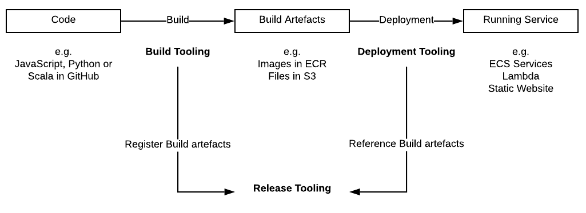
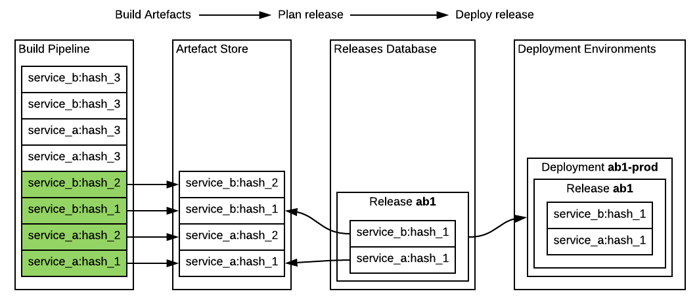
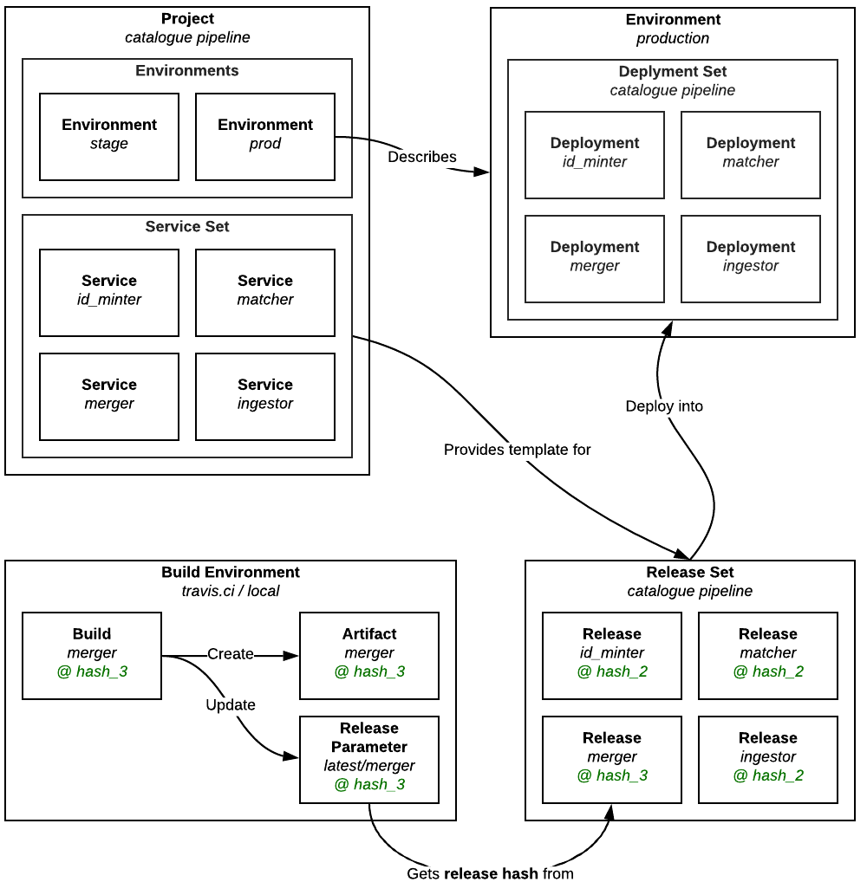
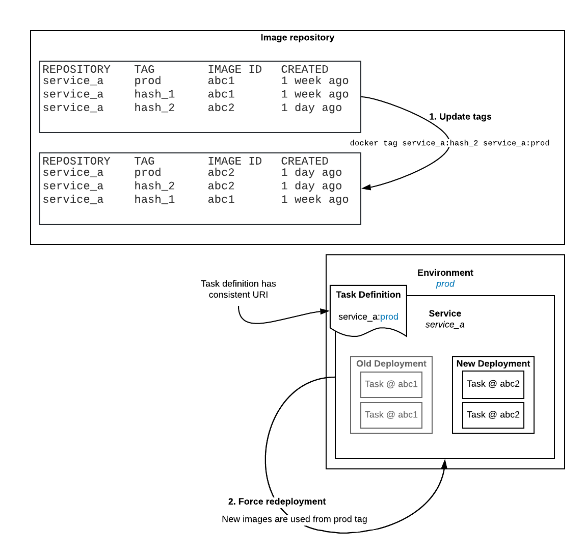

# RFC 013: Release & Deployment tracking

**Last updated: 24 January 2019.**

## Background

We run a lot of applications. People are regularly making changes and deploying new code. In order that we don't get confused about what code is deployed where we should track what is deployed where, by whom, and for what reason.

The build/release/deployment process can be described as follows:



A high level view of infrastructure includes:

- A service that creates build artifacts from a given version of the codebase, e.g. creating a Docker image (a *build environment*)
- A store for the created artifacts, e.g. Docker images (an *artifact store*)
- An environment where services can run, e.g. ECS or Kubernetes (a *deployment environment*)
- A database that tracks what version of each application is running



### Glossary

- **project:** The top level, consisting of one or more **service set**'s. This might indicate whole product and should be a single git repository, e.g. the catalogue project.

- **service:** Performs a distinct function within a **project**. e.g. id_minter, requests API, Front-end content app.

- **service set:** A functional grouping of **services** within a project. You can have multiple per project, for example in the catalogue project, you've got pipeline, api and adapters.

- **build:** The process of creating a **build artifact** for a single **service**

- **build artifact:** A deployable _thing_ for a single **service**, e.g. a Docker image or Lambda zip file.

- **release hash:** Metadata that allows us to work out what version of the code was used to create a given build artifact, e.g. the Git commit hash.

- **release:** Metadata indicating the intention to deploy a particular **build artifact** at a given **release hash**. Generally part of a **release set**.

- **release set:** A set of **build artifacts** at particular **release hashes** based on a **service set** template that is intended to be released into an **environment** together.

- **deployment:** A deployed **service**.

- **environment:** Where you deploy your **release sets** when you want them to run e.g. staging, production.

- **deployment set:** A set of deployed **services** created from a **release set** that has been deployed into an **environment**.

#### How these terms fit together



## What we do now

See the documentation on [version 1](v1/README.md).

### Problems with the current approach

- It is not clear how to release a single service
- In order to actually deploy something there are multiple steps:
  - Create a release set using the CLI tool
  - Deploy a release set  using the CLI tool
  - Run `terraform apply` to _actually_ update the running services
- Release/Deploy descriptions are not well used / hidden
- Poor visibility of what is actually deployed

#### Moving away from terraform for deployment

We currently use `terraform apply` to deploy services at a particular release hash. The choice to use terraform was driven by a requirement to describe our task definitions in code. 

Separating service deployment from infrastructure changes is desirable as infra/service deployments have differing concerns and pace, i.e. high-value infrequent (infra), vs. low-value frequent (deploying new versions of services). 

Running terraform in a CI environment like Travis is not desirable as giving an automated environment the power to run infrastructure updates needs careful consideration.

#### Why this is hard

An ECS task definition contains configuration for volume mounts, CPU & memory requirements, as well as indicating the container image URI to use when creating tasks.

The container image URI cannot be updated independently from other parameters in a task definition. This makes ignoring a change to the task definition difficult, see this [epic GitHub issue thread](https://github.com/terraform-providers/terraform-provider-aws/issues/632).

When terraform updates a task definition it has a version of the task definition in code to send to ECS, the ECS Service is then updated by terraform to point at that new task definition and a deployment is started in ECS.

However if the task definition is updated and differs from that recorded by the terraform state (which updating the image URI _would_ cause) terraform will attempt to return the task definition to a known state, which would be undesirable.

In order to move away from using `terraform apply` it will be necessary to decouple updating the task definition from deploying updated services.

### Proposed Solution

We intend to address the problems described above my improving on the existing CLI tool.

We will:

- Provide complete documentation with examples for the updated CLI tool, so it is easier to see how to deploy both single services and a complete service set
- Provide "single step" deployment capability in the CLI tool.
  In particular, we will remove the requirement to run `terraform apply` to update existing services.
- Provide quick visibility on the current state of deployments
- Remove or automate "descriptions" required from users of the CLI tool

#### General approach

We'll use consistent image URIs in task definitions and update what those URIs reference instead of updating image URIs, allowing us to keep task definitions static when updating which container images they should use. 

As the relationship between which container image to use in which service is no longer described as part of the infrastructure we can avoid terraform.

Docker container image repositories allow us to do this through the use of tags. A particular docker image can have multiple tags, and we can use this to provide "environment based tags", e.g. prod, stage. We update what tags are attached to which image to indicate what should be deployed where.

In order that tag changes are "noticed" by our deployed services we will need to force redeployment of the correct ECS services after updating tags. This will cause the tasks created by the new deployment to read their container images from their new tag.



#### Register images

When container images are built we should tag them with:
- **release hash** as we do now, to keep track of the relationship between release hash and container image id. This tag will always be associated with the same container image.
- **latest** so we have a way of knowing the most recently created image for each service which is useful when planning deployments. This tag should always be on the most recently built image for a service.

If you were to use the docker CLI tool, this would look like:

```sh
# Create tags!
docker tag image_i_just_built ecr_repo/service_name:hash_1
docker tag image_i_just_built ecr_repo/service_name:latest

# Push tags!
docker push ecr_repo/service_name:hash_1
docker push ecr_repo/service_name:latest
```

The release CLI tool should automate this process so that we encode this logic in one place. 

#### Deploying

Deploying is now a process of:

 - Deciding which services you wish to deploy
 - Deciding which images you wish to deploy for those services
 - Identifying the environment to deploy to
 - Tagging the chosen images in ECR (docker repository)
 - Forcing a deployment via the ECS API
 - Recording the deployment

##### Which services to deploy

In order to deploy a particular service set we need to know which services go together. We can do this using a "Project manifest".

We will need to keep track of the relationship between a service and its' container registry in order to apply tags as described above.

Our project manifest should allow for multiple service sets, with the environments those sets can be deployed into.

###### Project manifest

This is an updated manifest from version 1. 

```json
{
  "project": {
    "name": "Catalogue",
    "service_sets": [
      {
        "id": "catalogue_pipeline",
        "name": "Catalogue Pipeline",
        "account_id": "1234567890",
        "environments": [
          {
            "id": "stage",
            "name": "Staging",
            "cluster_name": "my_stage_cluster"  
          },
          {
            "id": "prod",
            "name": "Production",
            "cluster_name": "my_prod_cluster"
          }
        ],
        "services": [
          {
            "id": "id_minter",
            "name": "ID Minter",
            "repository_name": "uk.ac.wellcome/id_minter"
          },
          {
            "id": "matcher",
            "name": "Matcher",
            "repository_name": "uk.ac.wellcome/matcher"
          },
          {
            "id": "merger",
            "name": "Merger",
            "repository_name": "uk.ac.wellcome/merger"
          }
        ]
      }
    ]
  }
}
```

This file `.wellcome_project` should be in the project root.

This file requires that:
- `project.service_sets[].environments[].cluster_name` maps to an ECS cluster name.
- `project.service_sets[].services[].id` maps to an ECS service name.

##### Deploying to an environment

We will make use of the concept of ECS cluster to indicate environment as it provides a useful way to classify & separate services.

When we want to deploy to the production environment, we can match services described in the project manifest to those running in the "prod" cluster and force redeployment as described above.

Using the docker & aws CLI tools to release "latest" this might look like:

```
CLUSTER_NAME=prod_cluster
SERVICE_NAME=my_service

# Add the prod tag to whichever image is currently tagged latest
docker tag ecr_repo/"$SERVICE_NAME":latest ecr_repo/service_name:prod
docker push ecr_repo/"$SERVICE_NAME":prod

# Force service deployment in prod cluster
aws ecs update-service \
  --cluster "$CLUSTER_NAME" \
  --service "$SERVICE_NAME" \
  --force-new-deployment
```

##### Recording deployments

We want to provide visibility on:

- What version of a service is deployed in which environment _right now_
- When deployments have taken place
- Why a deployment took place (along with _who_ deployed if appropriate).

In order to identify which version of a service is deployed we need to get the release hash that a container image was tagged with. The release hash (git ref) is our link to version control on the code the container image is built from. 

When a container image is built it also has an "image id" which provides an immutable reference to that container image which we should record to provide a definitive record of what was deployed.

We will continue to use DynamoDB to record deployments. 

There will be a single "deployment table" in the platform account for all projects.

The proposed updated table structure is:

|project_id    | release_n | date_requested      | requested_by  | release_manifest | environment 
|---           |---        |---                  |---            |---               |---
|my_project    | 1         | 2019-02-08T12:32:42 | jim@org.com   | `{"..."}`        | prod
|my_project    | 2         | 2019-02-08T12:32:42 | jim@org.com   | `{"..."}`        | stage
|your_project  | 1         | 2019-02-08T12:32:42 | jim@org.com   | `{"..."}`        | prod
|your_project  | 2         | 2019-02-08T12:32:42 | jim@org.com   | `{"..."}`        | stage

The following keys are required:

- `project_id`: Hash Key
- `release_n`: Range Key

Having an increasing integer as our range key will allow us to efficiently find the latest deployment for a particular project, and provides a human readable identifier that carries useful information.

`project_id:release_n` forms a unique **deployment identifier**

A release_manifest looks like this:

###### Release manifest

```json
{
  "service_1": {
    "release_hash": "abcdefg...",
    "image_digest": "sha256:afe605d...",
    "deployment": {
      "service_arn": "arn:service_1",
      "deployment_id": "ecs-svc/4529926..."
    }
  },
  "service_2": {
    "release_hash": "abcdefg...",
    "image_digest": "sha256:afe605d...",
    "deployment": {
      "service_arn": "arn:service_1",
      "deployment_id": "ecs-svc/4529926..."
    }
  }
}
```

Field reference: 
- `image_digest`: The ECR (container repository) immutable ID of the image deployed.
- `release_hash`: The release hash tag attached to the image id.
- `service_arn`: The ARN of the ECS service that was deployed, this identifies both cluster and service deployed to.
- `deployment_id`: When you force a redeployment of a service ECS will provide you a `deployment_id` that can be used to track the progress and status of deployment for a particular service.

#### CLI Tool

The proposed use of the CLI tool is as follows:

```
release-tool

Usage:
    release-tool deploy (all | <service>) <environment> [--project project_name] [--skip_confirm]
    release-tool latest <local_container_name> <remote_repository> [--project project_name]
    release-tool status <environment> [--project project_name]
Options: 
    --project           Project name, default from .weco-project, required where ambiguous 
    --skip_confirm      Do not ask for confirmation during a deploy (useful in CI)
```

##### deploy

> Deploys the latest container images for a service set to an environment.

The `deploy` command will:

- Read the project manifest and extract the service/container repository pairs for a given project
- Look up from the container repository the container images tagged with `latest` for those services
- Tag those images with the specified `environment` (checking it matches one of those in the project manifest)
- Force redeployment of the correct ECS services as indicated by the environment -> cluster name mapping
- Record a deployment in the deployment table as described above

If there is only a single project that will be the default project, otherwise the command will fail requiring you to specify a project name.

For example:

```
> release-tool deploy my_service prod

This will deploy:

    my_service_1@hash_1
    my_service_2@hash_1
    my_service_3@hash_1

Do you wish to continue? (y/n) y

Deployment requested.
```

##### latest

> Tags local container_image with `latest` and pushes to a remote repository

The `latest` command will:

- Tag the specified local container image with latest
- Push the specified local container image to ECR
- Push the latest tagged container image to ECR

This command allows you to quickly mark a container as latest.

The local container_image should be specified with a release_hash tag.

For example:

```
> release-tool latest bag_register:hash_1 account.amazonaws.com/uk.ac.wellcome/bag_register 

Updated account.amazonaws.com/uk.ac.wellcome/bag_register:latest 
```

###### status

> Reads the status of the latest deployment for a project

The `status` command will:
- Look up the latest deployment for the given project in the deployments table
- Filter the results by the specified environment
- For each service in the release manifest:
    - describe the service from the ECS API
    - read `.deployments` from the API response
    - match the recorded ECS deployment ID to that in the API response
    - calculate the status of the individual service deployment and write it out
    - calculate the overall status of the **deployment set** and write it out
    
Calculating the "status" of a deployment is non-trivial and discussed below.

If there is only a single project that will be the default project, otherwise the command will fail requiring you to specify a project name.

For example:

```
> release-tool status all prod
    
     Last released: 12/02/12 16:32:12
       Released by: Bob Beardly <bob@beardcorp.com>
            Status: IN_PROGRESS

    my_service_1    hash_1     COMPLETE
    my_service_2    hash_1     IN_PROGRESS
    my_service_3    hash_1     IN_PROGRESS

```

#### Deployment Status in ECS

ECS provides ["deployment types"](https://docs.aws.amazon.com/AmazonECS/latest/developerguide/deployment-types.html) for handling moving from one set of tasks to another. At time of writing there are 3 options only the default ["rolling update"](https://docs.aws.amazon.com/AmazonECS/latest/developerguide/deployment-type-ecs.html) strategy is suitable for our use at the current time.

##### Deployment controllers

Discussion on updating our deployment controller or making use of the new ["external deployment" controller](https://docs.aws.amazon.com/AmazonECS/latest/developerguide/deployment-type-external.html) is far reaching and should take place elsewhere. 

It should suffice for now to notice that "Service auto scaling is not supported when using an external deployment controller".

##### Rolling update

When you initiate a "rolling update" deployment for a service in AWS a "deployment id" is created and visible attached to an ECS Service.

ECS service deployments can have one of the states:

- PRIMARY: The most recent deployment of a service.
- ACTIVE: A service deployment that still has running tasks, but are in the process of being replaced with a new PRIMARY deployment.
- INACTIVE: A deployment that has been completely replaced.

A careful reading of these states reveals there is no definitive "success" state. 

The last created deployment is always "PRIMARY", but there may also be "ACTIVE" deployments in existence that are in the process of being replaced. 

A single deployment with the status "PRIMARY" where the number of tasks running for that service is equal to the number of tasks desired for that service and there are _no pending tasks_ could be described as a successful deployment.

##### Determining overall deployment status 

When you match an ECS deployment id recorded in the deployment table to a describe service ECS API response we can use the following to determine overall deployment status.

ECS API describe service response:

```json
{
    "services": [
        {
            "status": "ACTIVE",
            "serviceArn": "arn:aws:ecs:us-west-2:123456789012:service/my-http-service",
            "deployments": [
                {
                    "id": "ecs-svc/1234567890123456789",
                    "status": "PRIMARY",
                    "pendingCount": 0,
                    "desiredCount": 10,
                    "runningCount": 10,
                    "...": "..."
                }
            ],
            "events": [],
            "...": "...",
        }
    ],
    "...": "..."
}
```

You can then match your recorded deployment ID to those listed. 

We suggest the following designations for different states:

 - Matched deployment status is PRIMARY: 
    - len(deployments) == 1 AND runningCount==desiredCount 
      This deployment is **COMPLETE**
    - len(deployments) > 1
      This deployment is **IN_PROGRESS**
    - len(deployments) == 1 AND runningCount!=desiredCount
      This deployment is **NOT_STABLE**
 - Matched deployment status is ACTIVE:
    - This deployment is **RETIRING**
 - Matched deployment status is INACTIVE
    - This deployment is **RETIRED**
 - Deployment id does not match any in list:
    - This deployment is **DEAD**
    
