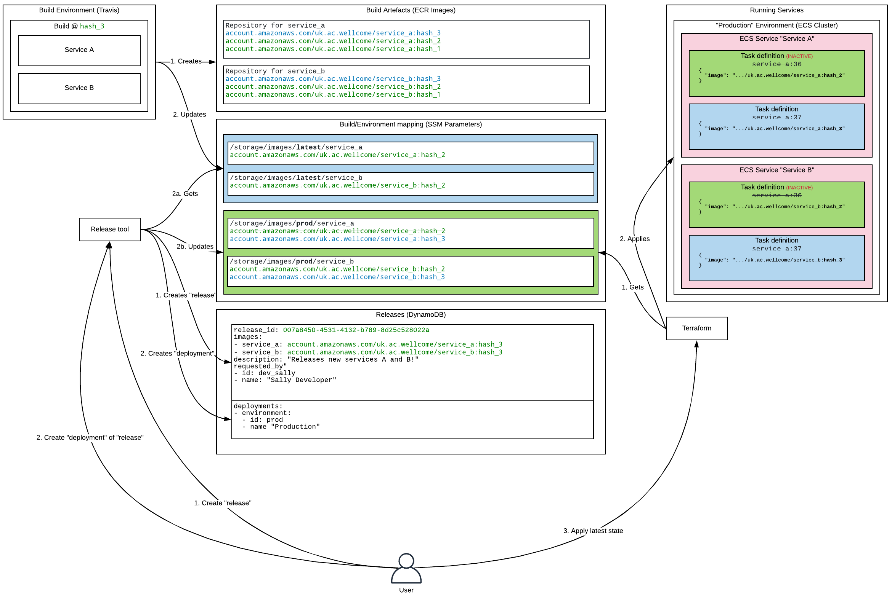

# Version 1 

## Implementation from 24/01/2019

This solution describes steps to track, build, release and deploy our services but is deliberately agnostic of deployment mechanism. 

We use SSM to track which release should be deployed into which environment. Our Terraform code reads from SSM to get which images to apply.

Terms defined in this document apply only here.

### Build artifacts

> **Build artifact:** A Docker image containing our application code. An artifact does not contain configuration; instead, it can be configured by passing environment variables.

Our build tooling creates Docker images and publishes them to an ECR repository in AWS.

#### Build artifact SSM Parameters

The URI of the container image in ECR will stored in an SSM parameter with a key:

 `/{project_id}/images/{label}/{service_id}`

The attributes are described as follows:
- **project_id**: an identifier for a project.
- **label:** A label for the set of images released, e.g. latest, stable, v2-branch

 For example:

 `/storage/images/latest/archivist`

SSM parameters provide a record of build artifacts.

We update SSM parameters with a Python application, packaged in a Docker container distributed via the https://github.com/wellcomecollection/dockerfiles repository.

### Project structure

> **Project:** A set of services that are deployed together.

We store information about the structure of a project in a JSON file, which is named `.wellcome_project` and lives in the root of a repository:

The following structure is used:

```json
{
  "my_example_project": {
    "environments": [
      {
        "id": "stage",
        "name": "Staging"
      },
      {
        "id": "prod",
        "name": "Production"
      }
    ],
    "name": "Example project"
  }
}
```

This is a **project manifest**.

This file `.wellcome_project` should be in the project root.

### Releases & deployments

> **Release:** A set of services at known versions to be deployed to an environment.

> **Deployment:** A statement of intent to deploy a given _release_ to a particular environment.

We propose the following to track releases & deployments for a particular project.

The container image URIs can be sourced from the SSM Parameters:

| key  	                                    | value                                         |
|---	                                    |---	                                        |
| /{project_id}/images/{label}/{service_id} | http://example.com/images/{service_id}/00001  |

#### Releases table

Release details should be kept in a dynamo table that contains the following attributes:

- **release_id**: (_hash key_) an identifier for a project.
- **project_id**: an identifier for a project.
- **project_name**: an identifier for a project.
- **created_at:** Unixtime representation of time the record was written.
- **last_date_deployed:** Unixtime representation of the time a deployment was updated.
- **release_manifest:** JSON blob representing the release manifest.
- **requested_by:** a Map of id/name for the requester.
- **images:** a Map of service_name/container_image_uri for all services in the release.
- **deployments:** List of Map containing the deployments of this release. A Deployment has the structure:
  ```json
    {
      "date_created": "2019-07-10T10:44:12.983539",
      "description": "Some description",
      "environment": {
        "id": "stage",
        "name": "Staging"
      },
      "requested_by": {
        "id": "unknown",
        "name": "unknown"
      }
    }
  ```

### Examples

#### Deploying the latest images to a stage environment.

In order to create a release we can list the ECR URIs available in SSM for a particular project with the images labelled `latest`.
 
 We would look in SSM for the following parameters:

| key  	                                    | value                                     |
|---	                                    |---	                                    |
| /bugfarm_73649/images/latest/hatching  	| http://example.com/images/hatching/00001  |
| /bugfarm_73649/images/latest/feeding 	    | http://example.com/images/feeding/00001  	|

This would result in an entry in the release table as follows:

```json
{
  "date_created": "2019-07-10T10:44:02.272898",
  "deployments": [],
  "description": "Some description",
  "images": {
    "hatching": "http://example.com/images/hatching/00001",
    "feeding": "http://example.com/images/hatching/00001"
  },
  "last_date_deployed": "2019-07-10T10:44:12.983539",
  "project_id": "example",
  "project_name": "Example project",
  "release_id": "0efcc940-e709-4a51-b264-809a670629b6",
  "requested_by": {
    "id": "unknown",
    "name": "unknown"
  }
}
```

Requesting a deployment would result in the release entry being updated as follows:

```json
{
  "date_created": "2019-07-10T10:44:02.272898",
  "deployments": [
    {
      "date_created": "2019-07-10T10:44:12.983539",
      "description": "new pipeline",
      "environment": {
        "id": "stage",
        "name": "Staging"
      },
      "requested_by": {
        "id": "unknown",
        "name": "unknown"
      }
    }
  ],
  "description": "Some description",
  "images": {
    "hatching": "http://example.com/images/hatching/00001",
    "feeding": "http://example.com/images/hatching/00001"
  },
  "last_date_deployed": "2019-07-10T10:44:12.983539",
  "project_id": "example",
  "project_name": "Example project",
  "release_id": "0efcc940-e709-4a51-b264-809a670629b6",
  "requested_by": {
    "id": "unknown",
    "name": "unknown"
  }
}
```

And we would then run `terraform apply` in the consuming stack to apply this state.

## Overview


