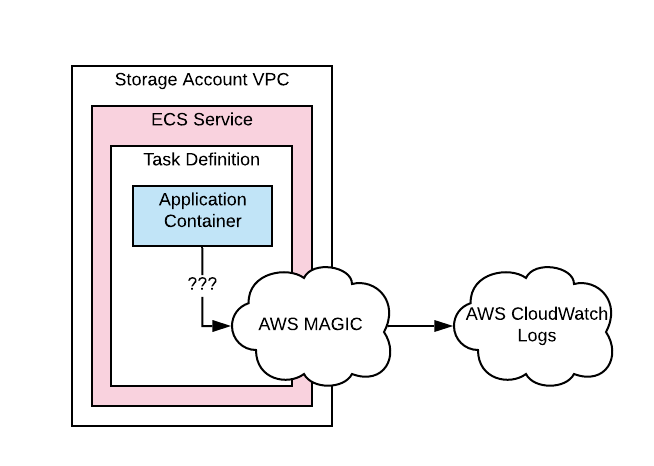
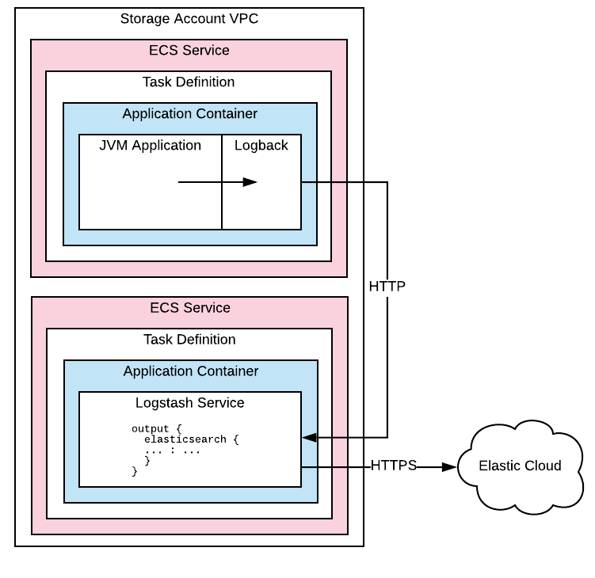
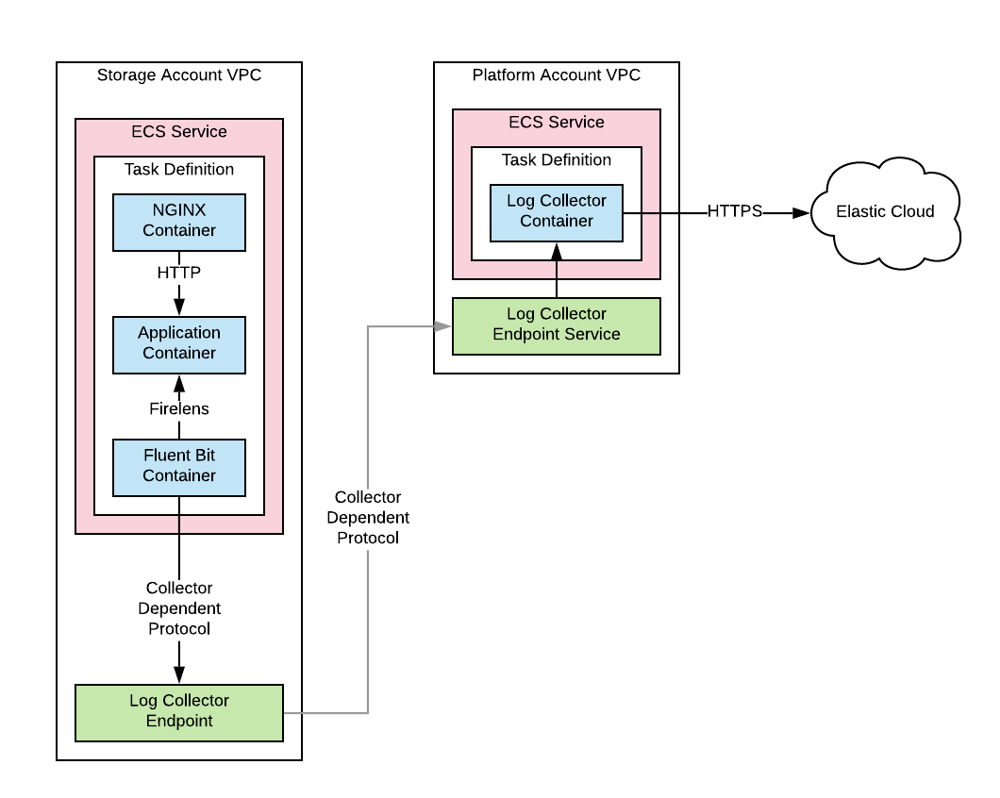

# RFC 022: Logging

**Last updated: 20 March 2020.**

```
2020-03-13 17:55:23.372 [apm-remote-config-poller] ERROR co.elastic.apm.agent.report.HttpUtils - Exception when closing input stream of HttpURLConnection.
2020-03-13 17:50:18.315 [apm-remote-config-poller] ERROR co.elastic.apm.agent.configuration.ApmServerConfigurationSource - Read timed out
```

We use logs to monitor running services following the [Log aggregation pattern](https://microservices.io/patterns/observability/application-logging.html).

Logs are human readable semi-structured text output. Having visibility of what our services are up lets us more easily make decisions about how to react to their behaviour. 

## What we want

A logging service should be easy to query, reliable, low cost and simple to configure for clients.

In order to see what's going on easily across the estate, logs from all applications should be searchable in one place.
 
We should annotate logs with:
- The originating product, service and environment e.g. `[catalogue-pipeline, id_minter, stage]`
- A release reference e.g. the container image tag `items_api:31982ae519bc6a5856cf8c078573a320aaca69bf`

## What we've done so far

### CloudWatch

Previously we have used the [`awslogs` Log Driver](https://docs.aws.amazon.com/AmazonECS/latest/developerguide/using_awslogs.html) in ECS which pushes logs into [CloudWatch Logs](https://docs.aws.amazon.com/AmazonCloudWatch/latest/logs/WhatIsCloudWatchLogs.html).



#### Pros

This mechanism allows the application to care very little about how logging is done. Configuration can be made [part of a service infrastructure template](https://github.com/wellcomecollection/terraform-aws-ecs-service/blob/master/task_definition/single_container/task_definition.json.tpl#L16).

We don't need to worry about running any of our own log collection and searching infrastructure.

#### Cons

We have found CloudWatch Logs to be expensive for us when publishing millions of log lines. We haven't found an easy way to query logs across services and over periods of time longer than a few days.

### Logback

In order to reduce costs and allow us to use [ElasticSearch](https://www.elastic.co/log-monitoring) a familiar and well suited log querying solution, we have moved to using an ["ELK" (Elasticsearch, Logstash, Kibana) stack](https://www.elastic.co/what-is/elk-stack).



Each application incorporates the [Logback library](http://logback.qos.ch/) and must carry the configuration about how to log to Logstash. Each cluster has a `logstash-transit` service to allow logs to be relayed to Elasticsearch running in Elastic Cloud.

The `logstash-transit` service provides log collection for a particular cluster and handles Elastic Cloud authentication and holds that configuration in one place for that cluster.

#### Pros

Elasticsearch and Kibana provide an effective mechanism for aggregating and searching Logs. We have found that querying logs in this way is much faster and more effective than using CloudWatch.

#### Cons

We are managing a significant portion of our own logging infrastructure, using language specific libraries and running multiple log collectors.

Each application must contain the Logback library and be configured to send logs to the local `logstash-transit` service. We don't have an effective mechanism for standardising the configuration of both applications and logstash services. As a consequence of inconsistent configuration, services logs are not reliably available across the platform.

There is also proliferation of `logstash-transit` services in the platform adding cost and complexity.

## Proposed solution

If we can take advantage of the container level logging drivers available in ECS we can return to a position where our applications have no configuration for transporting logs elsewhere. This would eliminate some of the current configuration and infrastructure complexity.

At time of writing the logging drivers available for the [AWS Fargate](https://aws.amazon.com/fargate/) containers that make up the vast majority of our services [are limited to `awslogs`, `splunk`, and `awsfirelens`](https://docs.aws.amazon.com/AmazonECS/latest/APIReference/API_LogConfiguration.html). 

### Firelens

`awsfirelens` is a solution for custom log routing that makes use of a [Fluent Bit](https://fluentbit.io/) or [Fluentd](https://www.fluentd.org/) container as a [sidecar](https://www.oreilly.com/library/view/designing-distributed-systems/9781491983638/ch02.html) to your application container.

AWS provides pre-built images for running both Fluent Bit and Fluentd in ECS and provide [instructions for setting up custom log routing](https://docs.aws.amazon.com/AmazonECS/latest/userguide/using_firelens.html).

Firelens requires you to add a container to your task definition, though that could be provided with fluent bit configuration from the existing [`terraform-aws-ecs-service`](https://github.com/wellcomecollection/terraform-aws-ecs-service) module allowing us to standardise that configuration.

We may still need to provide a mechanism to forward logs collected to Elasticsearch. 

### Fluent Bit

AWS recommends using Fluent Bit as a log collector over Fluentd [due to performance and resource considerations](https://aws.amazon.com/blogs/opensource/centralized-container-logging-fluent-bit/). 

Fluent Bit is similar to Logstash in function and is capable of [relaying logs to Logstash](https://github.com/fluent/fluent-bit-tutorials/blob/master/ship_to/logstash.md) if required. See the [Fluent Bit](https://docs.fluentbit.io/manual/) manual for details of input & output plugins.

### Routing logs to Elasticsearch

At present we route logs through a cluster-local Logstash service that is configured to authenticate with a Elastic Cloud hosted Elasticsearch instance and forward logs there with several `logstash-transit` services across the estate.

There are a few options for routing to Elasticsearch.

- Directly to Elasticsearch from the Fluent Bit sidecar.
  - (pro) No other log forwarding infrastructure.
  - (con) Elasticsearch config would be required in each service.
- Forwarding logs to a cluster-local collector as we do now.
  - (???) We can use the Fluent Bit [`forward`](https://docs.fluentbit.io/manual/input/forward) input and so replace Logstash with Fluent Bit which _might_ be more reliable.
  - (con) Multiple `???-transit` services would still be required.
- Provide a single collector service across the platform utilising [AWS PrivateLink](https://docs.aws.amazon.com/vpc/latest/userguide/endpoint-service.html).
  
  VPC Endpoint Services (AWS PrivateLink) allows you to share an [NLB (Network Load Balancer)](https://docs.aws.amazon.com/elasticloadbalancing/latest/network/introduction.html) fronted service between VPCs and between AWS accounts. We have made use of AWS PrivateLink to share on-premises VPN accessible services (e.g. our Workflow service "Goobi") between accounts with success in the past.
  
  Endpoint services would be provisioned alongside network and account configuration in the [platform-infrastructure](https://github.com/wellcomecollection/platform-infrastructure) terraform stack. 
  
  - (pro) One service with central configuration for Elasticsearch authentication.
  - (pro) We have experience with successfully using PrivateLink.
  - (con) Requires some log collector infrastructure and network configuration though centralised and with a single instance of the collector service.
  
  
  
  


