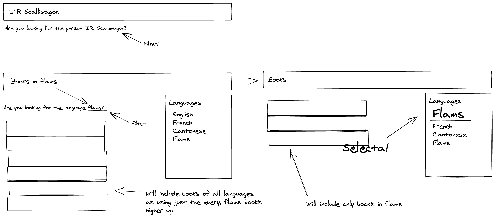
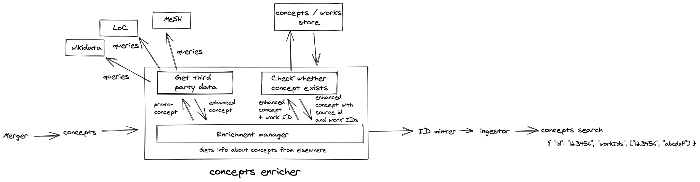

# RFC 024: Concepts Enricher

**Status:** 🏗 Draft 🚧

**Last updated:** 2020/05/01

## Background / motivation

### What's a concept?

In this RFC, we're defining _Concepts_ as the union of our _Subjects_, _Genres_ and _Contributors_. These are broadly things which can be named and identified, are not works themselves, and are used to label and aggregate works.

This definition could grow to include other source fields in the future, but is limited to those three for now.

We'll also refer to _proto-concepts_, which are the existing data we hold on a concept before enrichment, eg

```json
{
  "label": "francis crick",
  "id": "n12345",
  "id_type": "lc-names"
}
```

and _enriched concepts_, which are cleaned, disambiguated concepts with extra data aggregated from external authorities.

### What's the problem

Currently, our concepts are a mess:

- Labels which refer to the same concept are inconsistent (eg `"Henry Wellcome"`, `"Wellcome, Henry"`, `"Henry Wellcome."`)
- Concepts have no understanding of their variant names or aliases: We don't treat `Ganesha` and `Vinayaka` as the same thing, or `Influenza` and `Flu`.
- Some concepts have external authority identifiers while others don't, and even those labelled have no understanding of their equivalents in other authorities. eg `{"label": "coronavirus", "mesh_id": "D12345"}` has no relation to `{"label": "coronavirus", "lc-subjects": "sh67890"}`
- When a user on a works page clicks on a concept label, we currently run a search for the label string in the same way as any other query, ie searching works for the tokens `henry` `wellcome`, rather than filtering works for a concept identifier referring to the specific person.
- Users at the search bar have a mix of the same problems - searching for "flu" just looks for works containing the token `flu` anywhere, rather than understanding that the user is more likely to be looking for works tagged with `influenza`, `flu`, `grippe`, etc. There might be an overlap in these results, but we can more clearly match their intention by disambiguating the concepts in their query and our works.
- Many works have rich descriptions and notes entries, which contain mentions of what we're describing as concepts, but do not include them in the concept fields. This is particularly true for archive collections, which have no subjects but plenty of notes and text-heavy description.
- We regularly see concept labels containing outdated language. Often, these labels have been updated in the source which the identifier refers to. We don't have a functioning system for updating language, and suspect that instances of outdated language are often deleted rather than updated in place.

### Intended outcomes

We should be able to:

- aggregate concepts' variant names and acknowledge that they refer to the same thing in our data model
- enrich those concepts with extra information which our catalogue does not contain, eg descriptions, birth/death dates, broader and narrower hierarchical concepts, etc
- autocomplete queries using the list of clean, disambiguated concept labels
- point users to concept pages, which show an aggregation of 'tombstone' information about the concept and a list of the works associated with it
- allow users to search for concepts using their external authority IDs
- filter works by concept

a couple of these outcomes are illustrated below:



## Proposal

We'll use the structure established for [data-science enrichers in the pipeline](../021-data_science_in_the_pipeline/README.md) to disambiguate the existing concepts against external authorities and infer extra data about them.

These enriched concepts will be aggregated in a concepts/works store (likely some kind of graph database which is capable of representing the many-to-many bipartite graph of works and concepts), before concepts are given IDs, added to works, and stored in a separately searchable index.

### Enrichment Implementation details

An enrichment manager handles the interaction with data science services, thereby keeping the data science and pipeline logic separate. Here, a concepts enricher will contain one enrichment manager and several enrichers.



A proto-concept is passed to the manager, which makes a request to the first enricher. The first enricher should check external authorities for the provided ID / label, aggregating 'tombstone' information and returning an enriched concept like:

```json
{
  "lc_names": {
    "id": "n81086851",
    "title": "Crick, Francis, 1916-2004",
    "variants": ["Crick, F. H. C. (Francis Harry Compton), 1916-2004"]
  },
  "wikidata": {
    "id": "Q123280",
    "title": "Francis Crick",
    "description": "British molecular biologist, biophysicist, neuroscientist; co-discoverer of the structure of DNA",
    "birth_date": "+1916-06-08T00:00:00Z",
    "death_date": "+2004-07-28T00:00:00Z",
    "variants": ["Francis Harry Compton Crick", "Francis H.C. Crick"],
    "broader_concepts": ["human"]
  }
}
```

The second enricher should take the resulting enriched concept, check for a sufficient match in the graph store of existing concepts/works, and return the same information with an existing ID or an instruction for a new concept ID to be minted.

The manager should then pass the resulting enriched concept (with IDs for all connected works) to the next steps in the pipeline, comprising an ID minter, ingestor, and index for searching concepts.

### Pipeline implementation details

TBD

### Outstanding questions

- Are the `concepts` and `works` pipelines (beyond the merger) separate, or the same?
- How hard will it be to check for existing concepts in the second enricher task? Is neo4j / a similarly graphy DB the best candidate for the store it queries?
- How often will concepts be updated if the works are unchanged? How often do we need to check for updates in external authorities?
- The enricher relies on making a lot of requests to external APIs? How slow/expensive is this going to be, and how can those be optimised?
- How should concepts be attached to works? Probably denormalised across the whole catalogue index, but how do they get there? Updater? Pub sub? A loop all the way back to the recorder? A new recorder?
- What do we use as a source identifier? In cases where concepts come pre-labeled with external authority IDs, this is fairly simple, but in cases where we only have a rough label which is subject to change, becomes much more difficult.
