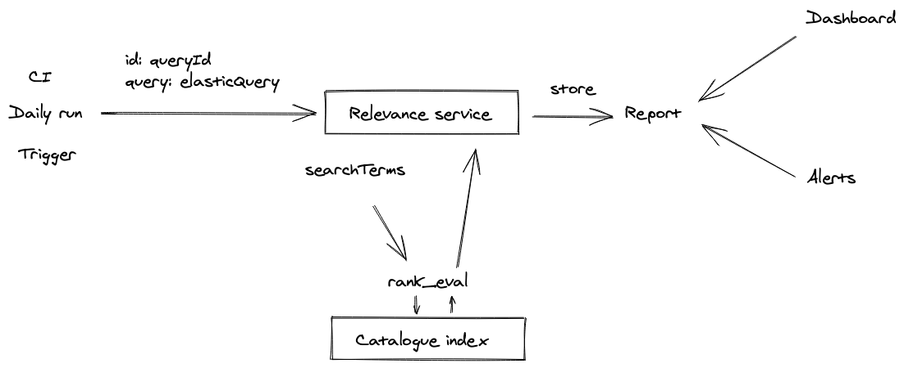

# RFC 026: Relevance reporting service

**Last updated: 06 July 2020.**

## Glossary

* **elastic-query:** A blob of JSON we send to Elasticsearch
* **search-terms:** A set of terms sent as a string from a client to a search service

## Summary

A way for us to be able to test and report on the efficacy of elastic-queries by being able to compare a set of search-terms and their respective expected results and ordering.

## Motivation

We need to have and instil transparency and confidence in the way that our search relevancy works.

Any test to help with this will need to be against our production data, as that is exactly what people will be seeing.

### Use cases

* Developers and data-scientists being able to write new search queries with  confidence in improvement and without fear of regression
* Allowing internal teams to have a greater understanding and more input as to how the search works, thus being able to share this with external researchers
* External researchers interested in how their results are being returned

## Proposal

1. Creating a public API where you can send elastic-queries
1. This query will be run against a set of predefined search-terms, which will also have a preset set of relevant documents which should match
1. This will be run against Elastic's [ `rank_eval` ](https://www.elastic.co/guide/en/elasticsearch/reference/current/search-rank-eval.html) api
1. We will report on the response of `rank_eval` response

### Collection search-terms

@alicerichmond is going through some rounds of qualitative research with internal people first, and working with them to go through some searches that they know should return certain results. There are a few documents about which we will distil into this `*` .

@taceybadgerbrook is also working on analysing the quantitative search queries to help come up with this. [e.g.](https://github.com/wellcomecollection/catalogue/pull/634/files)

 `*`  Documents to distil

* https://docs.google.com/document/d/1aIbE4IAOZb1Cbyp9ei81HtZ5w98AVZHIrudP9RUG1Is/edit#heading=h.byr3zbqes7qg
* https://wellcomecloud-my.sharepoint.com/:w:/g/personal/a_richmond_wellcome_ac_uk/EZ-5bvoQ76NCkIBDok_L0c0BaqsaFKFLN-J9KtnEprUsKw?e=lyzSmO
* https://wellcomecloud-my.sharepoint.com/:w:/g/personal/a_richmond_wellcome_ac_uk/EZ-5bvoQ76NCkIBDok_L0c0BaqsaFKFLN-J9KtnEprUsKw?e=lyzSmO

## Technical implementation

The relevance service will be a lambda that can be triggered by services that have IAM permission to do so.

The service can return a fail / pass as a response to the call, being useful for CI etc, and can store that report in S3 for dashboards.

### Getting started

We have a set of work creating queries that return known works by their title in progress.

This will be a good place to start as the terms and relevant documents should be easy enough to get.

## Alternatives

Currently we use a set of unit tests which don't pick up on the nuances of our actual metadata, nor account for the data changing over time by either new transformations, new sources, or just ongoing updates from the different content management systems.

We could write a set of queries and test agaist the HTTP API. We would then need to write our own reporting and way of scanning returned documents. While this is definitely an option, it feels better to explore the tool that has been created for this rather than write our own.

## Questions

* We're not sure how brittle this might make our tests, so not sure how tightly to integratet it in CI/CD
* Where exactly in the tests does this service sit? e.g. a new pipeline is spun up, how will we ensure running this is part of the switch to that pipeline
