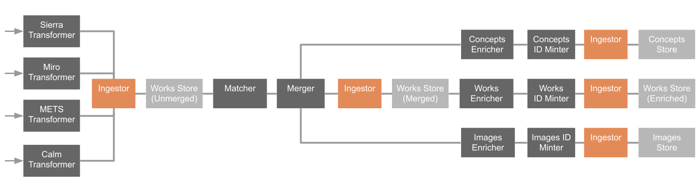

# RFC 026: Relation Embedder

This RFC describes a proposal for how to denormalise relations between works in the catalogue pipeline, to improve the API response times and allow for richer queries.

**Last modified:** 2020-09-07T10:16:09+01:00

## Background

Recently we have started ingesting archive data from Calm. An archive according to our model is a collection of works arranged hierarchically in a tree structure according to some path. For example, the works with paths `A`, `A/1`, `A/1/X`, `A/1/Y` and `A/2` would form the following tree:

```
A
├── 1
│   ├── X
│   └── Y
│
└── 2
```

Our API allows us to display relations for some particular work using a number of fields: 

* `parts` is an array containing the children of the work (i.e. `parts` for work `A` would contain `A/1` and `A/2`)

* `partOf` is an array containing the ancestors of the work (i.e. `partOf` for work `A/1/X` would contain `A` and `A/1`)

* `precededBy` is an array containing the siblings of the work earlier in sort order (i.e. `precededBy` for work `A/2` would contain `A/1`)

* `succeededBy` is an array containing the siblings of the work later in sort order (i.e. `succeededBy` for work `A/1/X` would contain `A/1/Y`)

Note that the works contained within any of these relation fields are partial (only a core number of fields).

## Problem

Currently we calculate work relations dynamically on the server during a request cycle in the API, by querying Elasticsearch given some work path: we first fetch the original work by ID, then sequentially send a group of follow up queries for the relations (using the Elasticsearch multi search functionality). This approach has a number of drawbacks:

* The API performs unnecessary work which could be done up front to provide faster response times.

* It is not simple to extend this functionality to display relation data on the multi-work API endpoint, with it currently limited to the single work endpoint (the naive method of one extra request per work would result in a great number of Elasticsearch queries within a single incoming HTTP request).

* The fact that the relations are not indexed up front means we can not use related data within search queries (such as if we wanted to include the title of the root of the collection for any descendent works, for example).

* The use of paths for encoding the structure of the tree couples relations tightly to Calm. There is upcoming use cases for relations beyond just archives, and on a conceptual level the goal of the pipeline should be to generate data which is abstracted away from any particular source system.

We therefore need a method to generate relation data on works within the pipeline, in advance of indexing for the API.

## Relation embedder

In order to include relation data on the work model itself it is clear there needs to be an additional stage of the pipeline which is able to query relationships between works, and include data from related works onto the work itself. This proposed name for this stage is the relation embedder.

It is important that this stage takes place after the merger: if denormalisation happens before this stage the related data may be inconsistent with what exists on the work post merging. For this reason the relation embedder should exist near the end of the pipeline immediately preceding the ID minter.

There are a few possible methods by which the relation embedder can query relationships between works:

1) Assuming the merged works coming into the relation embedder are stored within some Elasticsearch index, the existing API code for querying on the archive path could be repurposed for this.

2) Before coming into the relation embedder we could build and store a directed graph representation of the archives in some data store, with each node being a work and the edges encoding relations. We will discuss this further in the [Graph Store](#graph-store) section.

In either case, denormalisation of works within the relation embedder would consist of:

1. Fetching the relations for a given work
2. Emitting a new work containing the relevant fields embedded (`parts`, `partOf`, `precededBy`, `succeededBy`)
3. Traversing the relations and emitting works for these in turn.

Part `3` here is required as we have two way relations encoded for particular fields: for example, if in the tree below there is a node added with path `A/1/Z`, we not only need to send this work downstream but also send work `A/1` (containing updated `parts`), and works `A/1/X` and `A/1/Y` (containing updated `succeededBy`).

```
A
├── 1
│   ├── X
│   └── Y
│
└── 2
```

Generally, for the insertion, update or removal of any given node, we need to update its siblings, its parent, and the whole subtree containing its descendants. The worst case for this process is an update of the root node, in which case the whole archive needs to be denormalised, with the largest archives containing in the order of 1000 works.

## Commonalities with Other Pipeline Stages

The matcher and merger stages have similar underlying functionality to the relation embedder. Abstractly these stages involve:

1) Receiving a work as input and applying domain knowledge to build a graph of connections to other works
2) Using the input work and its graph to emit a new work at the output, including any required data from the relations

This points to a potential universal solution within the pipeline, such as using a common service, library or data store to assist with some of these tasks. Additionally, there are potential similarities with upcoming concepts work, where there has been some investigation into how concepts would fit within a graph model.

There are a few issues to bear in mind when considering how a shared solution would work:

* Whilst stage 1 (currently the matcher) could potentially also involve analysis of archive relations, it is important as stated above that the denormalisation in the relation embedder takes place on a merged works to ensure data consistency. This indicates the merger and relation embedder stages being separate and accessing works from two separate works stores (unmerged and merged).

* The matcher currently uses a custom DynamoDB graph implementation which was built specifically for the purpose. This was never meant to be a general solution and a rewrite would likely need to be involved in the building of some common system.

* The graph element of both the matcher and relations work are relatively similar, but the denormalisation stages (the relation embedder and the merger) have fewer parallels. For example, the input to the merger is currently a group of work IDs to be merged with the stage having no knowledge of the graph representation, unlike the relation embedder which is likely to receive single works and needs access to the graph.

Besides from the use of graphs and similarities to the matcher and merger, another aspect worth mentioning is the fact that we will need another store for denormalised works in addition to a store for merged works. Having two Elasticsearch indices coupled to corresponding ingestors is a possible solution (one for the current index of merged works and adding an additional one for denormalised works). There have been some previous discussions about replacing the recorder VHS with an Elasticsearch index, so it might be a worthwhile time to consider how this would work in this context, as here we would introducing an Elasticsearch index which was not the sink of the pipeline but used as an intermediate store.

## Graph Store

There has been some investigation into the use of graph databases such as Neo4j and AWS Neptune for storage and analysis of concepts in the pipeline. Using a specialised graph store might be a good general solution for relationships within our data.

Neo4j for example would enable us, if desired, to store heterogeneous data types and relationships within a single graph:

```
[ Work A ] ── (matches with) ── [ Work C ]
    │
(parent of)
    │
[ Work B ]
    │
(relates to)
    │
    ├── [ Concept A ]
    └── [ Concept B ]
```

Here square brackets indicate entities and parentheses indicate (directed) relationships.

Having a single graph representation would enable richer queries and analytics of our data, and would likely be especially useful for machine learning work. However this may introduce complexity by breaking assumptions about data flow in the pipeline, such as if there were multiple stages which had the ability to write to the graph. This should therefore should be considered with caution. Whether as part of a single graph representation or a more specialised store solely for inter work relationships in the context of archives, using such a database to store relationships would aid implementation of the denormalisation stage, especially with the traversal and emitting of related works.

Rather than storing the full work within the graph database, if only the IDs and relationships are stored this allows us more flexibility about where the graph analysis is performed in the pipeline and prevent data inconsistency errors in cases where the analysis was performed on pre-merged works. The current matcher database also stores solely the IDs, with the merger using these IDs to fetch the works themselves from the recorder VHS.

There are a number of graph and non graph stores we could use for storing relationships:

* [Neo4j](https://neo4j.com) is the most well known graph store and probably the most advanced. The version 4 release from this year introduces sharding and thus provides horizontal scalability. We could run this hosted with [Neo4j Aura](https://neo4j.com/aura) or deploy to AWS ourselves. Scala supports seems OK, with a [DSL library](https://github.com/manishkkatoch/scala-cypher-dsl) which seems semi-official but not exactly widely used.

* [AWS Neptune](https://aws.amazon.com/neptune) is a fully managed graph database solution from Amazon. Querying is done via Gremlin or SPARQL.

* We could use a more traditional relational database such as [PostgreSQL](https://postgresql.com), such as with Amazon RDS. It is very natural to represent this sort of relation data via foreign keys, but can become cumbersome when storing heterogeneous entities (although definitely possible, especially when the graph only stores IDs into other stores rather than the objects themselves). Querying will also be much less powerful than a dedicated graph database, although it remains to be seen how advanced querying capabilities we require.

* [DynamoDB](https://aws.amazon.com/dynamodb) and [Elasticsearch](https://elastic.co) are our most common data stores, although I believe these are not particularly suitable for the job: the existing DynamoDB graph implementation uses complex custom locking code which would not be required if using a database with stronger consistency guarantees and transactions like Neo4J or PostgreSQL (Elasticsearch is the least suited of them all in this regard), and neither are particularly good at the representation and querying of relational data.

## Possible approach

If it is agreed that we will require a separate relation embedder stage which is used to perform the denormalisation, and which is somewhat independent from the stage in the pipeline which performs any graph analysis, there is a possible 2 step approach. This involves first building a new relation embedder service that has access to the merged works Elastsearch index, and which uses the existing API code for querying for related works. Then at a later date we can transition it across to use the graph store.

The initial architecture would look something like this:



With a small amount of abstraction we can make the relation embedder service not dependent on any particular method for retrieving related works, initially using Elasticsearch queries on paths and later updating to querying of some graph store:

```scala
case class RelatedWorks(
  parts: List[IdentifiedWork],
  partOf: List[IdentifiedWork],
  precededBy: List[IdentifiedWork],
  succeededBy: List[IdentifiedWork],
)

trait RelatedWorksService {
  def retrieveRelatedWorks(work: IdentifiedBaseWork): Future[RelatedWorks]
}

class ElasticsearchRelatedWorksService(es: ElasticClient) {
  def retrieveRelatedWorks(work: IdentifiedBaseWork): Future[RelatedWorks] = {
    // Path query implementation
  }
}
```

This has the advantage of requiring more gradual changes to the existing pipeline architecture rather than introducing lots of new services and logic all at once, and allows us to start writing code straight away, giving us more time to consider how a graph implementation would work with both the current matcher / merger and upcoming concepts work.

## Potential problems

The extra pipeline stage discussed introduces more work to be performed in the pipeline, with at least one additional service and extra Elasticsearch index. This could potentially be costly, especially due to the fact that updates to one work have implications on others. It may make sense in the longer term to introduce more complexity into the pipeline regarding knowing when an update is required (this could take the form of knowing what fields are included in related works for example, and only emitting related updates when one of these changes).
