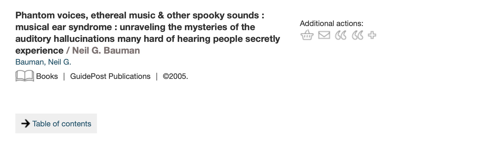

# RFC 035: Modelling MARC 856 "web linking entry"

[MARC field 856](https://www.loc.gov/marc/bibliographic/concise/bd856.html) is used to link to other resources, and it has a variety of uses at Wellcome.
Among other things, it links to websites, electronic journals, and links to canned searches in our catalogue.

For example, on b30204021:

```
856 41 |zTable of contents|uhttp://catdir.loc.gov/catdir/toc/
       fy0701/2006282336.html
```

This is displayed as a link on wellcomelibrary.org:



We want to include these links on the new Wellcome Collection website, so we need to expose these links in the API.
This RFC provides examples of how we use 856, and suggests an initial approach to modelling these in the API.


## How MARC 856 is used

This analysis is based on a February 2021 snapshot of the Sierra catalogue.
At time of writing, we have

-    262,754 instances of MARC 856 on bib records
-    9,611 instances of MARC 856 on holdings records
-    No instances of MARC 856 on item records


### Multiple instances of 856 on a single bib/holdings

MARC 856 is repeatable, and in practice we do use multiple instances of the same field.
In general, we can't assume any relationship between them:

*   Some bibs/holdings describe e-journals, and have an 856 for each volume of the journal.
    These are different resources.

*   Some bibs have different URLs for "library member access" and "free UK access".
    They point to the same resource, so these are two locations for one resource.

*   Some bibs point to different URLs, e.g. [b20434406](https://search.wellcomelibrary.org/iii/encore/record/C__Rb2043440?lang=eng) links to the publisher description and table of contents for a printed book.
    These are different resources.

**We will treat multiple instances of 856 as distinct resources.**


### First indicator -- Access method

The first indicator describes how you access the resource: for example, HTTP, FTP, or email.

On holdings records, the first indicator is always empty.

On bib records, the first indicator is mostly "4 - HTTP".
We do have a handful of records with a different first indicator, but manual inspection shows that they all contain HTTP URLs.

<details>
<summary>Analysis of first indicator on bib records</summary>

On bib records, the first indicator is used as follows:

<table>
    <tr>
        <th>first indicator</th>
        <th># of records</th>
    </tr>
    <tr>
        <td>4 - HTTP</td>
        <td>262,706</td>
    </tr>
    <tr>
        <td>1 - FTP</td>
        <td>27</td>
    </tr>
    <tr>
        <td>(empty)</td>
        <td>17</td>
    </tr>
    <tr>
        <td>0 - Email</td>
        <td>3</td>
    </tr>
    <tr>
        <td>7 - Method specified in subfield $2</td>
        <td>1</td>
    </tr>
</table>

I manually inspected the 48 records where the first indicator isn't 4; all of them contain HTTP URLs and it looks like the first indicator has just been incorrectly applied.
I have uploaded a list with [the bib IDs of these records](bibs_with_incorrect_first_indicator.txt).

The current Wellcome Library website always presents a link to the contents of 856 subfield $u, even if the first indicator isn't "4 - HTTP".
Examples:

*   [b30297552](https://search.wellcomelibrary.org/iii/encore/record/C__Rb3029755?lang=eng)

    ```
    856 7  |uhttp://www.aci-iac.ca/william-kurelek|2http|yview the
           publication online
    ```

*   [b17744854](https://search.wellcomelibrary.org/iii/encore/record/C__Rb1774485?lang=eng)

    ```
    856 1  |uhttps://sounds.bl.uk/oral-history/disability-voices
           |zListen to testimony relating to 'Cerebral Palsy'
    ```


*   [b13753344](https://search.wellcomelibrary.org/iii/encore/record/C__Rb1375334?lang=eng)

    ```
    856 00 |uhttp://www.history.ac.uk/cmh/epiheal.html|zText
           available online:
    ```

*   [b32188560](https://search.wellcomelibrary.org/iii/encore/record/C__Rb3218856?lang=eng)

    ```
    856    |uhttp://bvbr.bib-bvb.de:8991/F?func=service&
           doc_library=BVB01&local_base=BVB01&doc_number=029740967&
           sequence=000001&line_number=0001&func_code=DB_RECORDS&
           service_type=MEDIA|zInhaltsverzeichnis
    856 42 |mV:DE-605;X:Imageware|qapplication/pdf|uhttp://digitale-
           objekte.hbz-nrw.de/storage2/2018/02/08/file_149/
           7534738.pdf|3Inhaltsverzeichnis
    ```

</details>

**We will ignore the first indicator in the Catalogue API.**


### Second indicator -- Relationship

The second indicator describes how this resource relates to the bib: is it the resource, or a version of it, or something related?

On holdings records, the second indicator is always empty.

On bib records, the second indicator is mostly "0 - Resource".

We don't distinguish between these relationships in the Catalogue API, and it's not worth adding that distinction for this field.
At best, we'd have a few thousand records that use it.

**We will ignore the second indicator in the Catalogue API.**


### Subfields

The most interesting subfield for the catalogue is subfield $u, which contains the URL.
A handful of instances of field 856 don't contain subfield $u or contain multiple instances; this seems like a cataloguing error.

These are the subfields I think we'll want to use:

*   $z = public note.
    This is used to label links on wellcomelibrary.org.
    It contains a mixture of values that could be link text (e.g. *"View resource"* or *"Library member access"*) and labels (e.g. *"Chicago Journals"*).

*   $y = link text.
    This is only used on three records ([b20432227](https://search.wellcomelibrary.org/iii/encore/record/C__Rb2043222?lang=eng), [b30011668](https://search.wellcomelibrary.org/iii/encore/record/C__Rb3001166?lang=eng), [b30297552](https://search.wellcomelibrary.org/iii/encore/record/C__Rb3029755?lang=eng))

*   $3 = materials specified.
    This often provides more description (e.g. *"Related archival materials"* or *"Cover image"*).
    This is also exposed in the link text on wellcomelibrary.org.

And these are the subfields I think we can ignore:

*   $x = non-public note.

*   $a = host name.
    This field is used inconsistently.
    There are a few places where it's been used to store a URL instead of subfield $u; we should get those fixed in the catalogue rather than adding logic to the Catalogue API.

*   $q = electronic format type.
    This is only used on nine records, for `text/html` and `application/pdf`.

*   $m = contact for access assistance.
    Only used on eight record numbers to store what look like reference numbers.

*   $2 = access method.
    This is only used once with the value `http`, which should be expressed by the indicator instead.


## How field 956 is used

The companion field to field 856 "Electronic Location and Access" is field 956 "Local Electronic Local and Access".

In the Wellcome catalogue, this is only used for URLs of the form `http://wellcomelibrary.org/item/{bnumber}`, which we don't need to expose in the Catalogue API.


## Records that need cataloguing fixes

This table lists the records I found which need some cataloguing fixes:

<table>
    <tr>
        <th>bib ID</th>
        <th>proposed fix</th>
    </tr>
    <tr>
        <td><a href="https://search.wellcomelibrary.org/iii/encore/record/C__Rb1498281?lang=eng">b1498281x</a></td>
        <td>The URL in subfield $a should be moved to subfield $u</td>
    </tr>
    <tr>
        <td><a href="https://search.wellcomelibrary.org/iii/encore/record/C__Rb1533244?lang=eng">b15332445</a></td>
        <td>The URL in subfield $a should be moved to subfield $u</td>
    </tr>
    <tr>
        <td><a href="https://search.wellcomelibrary.org/iii/encore/record/C__Rb1544605?lang=eng">b15446050</a></td>
        <td>The URL in subfield $a should be moved to subfield $u</td>
    </tr>
    <tr>
        <td><a href="https://search.wellcomelibrary.org/iii/encore/record/C__Rb1550463?lang=eng">b15504633</a></td>
        <td>The URL in subfield $a should be moved to subfield $u</td>
    </tr>
    <tr>
        <td><a href="https://search.wellcomelibrary.org/iii/encore/record/C__Rb1646418?lang=eng">b16464187</a></td>
        <td>The URL in subfield $a should be moved to subfield $u</td>
    </tr>
    <tr>
        <td><a href="https://search.wellcomelibrary.org/iii/encore/record/C__Rb2064143?lang=eng">b20641436</a></td>
        <td>Field 856 doesn't contain any useful information</td>
    </tr>
    <tr>
        <td><a href="https://search.wellcomelibrary.org/iii/encore/record/C__Rb3029755?lang=eng">b30297552</a></td>
        <td>ind1 = "7" and $2 = "http" should be replaced by ind1 = "4"</td>
    </tr>
    <tr>
        <td><a href="https://search.wellcomelibrary.org/iii/encore/record/C__Rb3029756?lang=eng">b30297564</a></td>
        <td>The multiple URLs in field 856 $u should be split into multiple instances of field 856</td>
    </tr>
    <tr>
        <td><a href="https://search.wellcomelibrary.org/iii/encore/record/C__Rb3227870?lang=eng">b32278706</a></td>
        <td>The URL in subfield $z should be moved to subfield $u</td>
    </tr>
</table>


## How we will present field 856 in the Catalogue API

For every instance of field 856, we will create an unidentified Item with a single DigitalLocation.
The location will have the following fields:

*   `url` = the value of subfield $u.

    If subfield $u is skipped or repeated, we will log a warning and not create the item.

    If the contents of subfield $u doesn't look like a URL, we will log a warning and not create the item.

*   `linkText` = the space-joined contents of subfields $z, $y and $3.

    These will be joined in the original subfield order.
    If this is an empty string, we will omit the linkText field.

    At some point we might want to do quality control on this field and omit some of the values -- e.g. if removing generic "view online" descriptions from the Sierra data, so the front-end can use more consistent vocabulary.

*   `locationType` = OnlineResource

If the 856 is attached to a bib record, then the Item is attached directly to the bib Work.

If the 856 is attached to a holdings record, then the Item is attached to every Work that the holdings is attached to.
(i.e. every bib that the holdings links to)


## Examples

<details>
<summary><a href="https://search.wellcomelibrary.org/iii/encore/record/C__Rb1766070?lang=eng">b17660701</a> – field 856 with link text</summary>

MARC field:

```
856 40 |uhttp://0-
       gateway.proquest.com.catalogue.wellcomelibrary.org/
       openurl?ctx_ver=Z39.88-2003&res_id=xri:eebo&rft_val_fmt=&
       rft_id=xri:eebo:image:193067|zView resource.
```

Catalogue API output:

```json
"items": [
  {
    "locations": [
      {
        "locationType": {
          "id": "online-resource",
          "label": "Online resource",
          "type": "LocationType"
        },
        "linkText": "View resource.",
        "url": "http://0-
       gateway.proquest.com.catalogue.wellcomelibrary.org/…",
        "type": "DigitalLocation"
      }
    ],
    "type": "Item"
  }
]
```

</details>

<details>
<summary><a href="https://search.wellcomelibrary.org/iii/encore/record/C__Rb2043440?lang=eng">b20434406</a> – multiple instances of field 856</summary>

MARC fields:

```
856 41 |3Table of contents|uhttp://catdir.loc.gov/catdir/toc/
       wiley022/96047734.html
856 42 |3Publisher description|uhttp://catdir.loc.gov/catdir/
       description/wiley031/96047734.html
```

Catalogue API output:

```json
"items": [
  {
    "locations": [
      {
        "locationType": {
          "id": "online-resource",
          "label": "Online resource",
          "type": "LocationType"
        },
        "linkText": "Table of contents",
        "url": "http://catdir.loc.gov/catdir/toc/wiley022/96047734.html",
        "type": "DigitalLocation"
      }
    ],
    "type": "Item"
  },
  {
    "locations": [
      {
        "locationType": {
          "id": "online-resource",
          "label": "Online resource",
          "type": "LocationType"
        },
        "linkText": "Publisher description",
        "url": "http://catdir.loc.gov/catdir/description/wiley031/96047734.html",
        "type": "DigitalLocation"
      }
    ],
    "type": "Item"
  }
]
```

</details>
