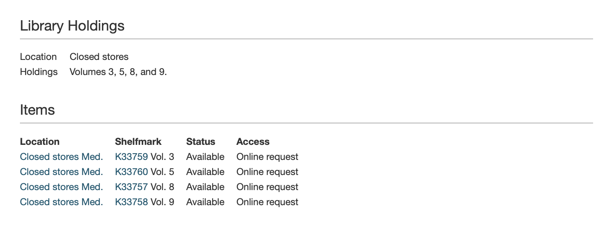

# RFC 036: Modelling holdings records

Holdings records are a type of record in Sierra, alongside bibs and items (which we already present through the Catalogue API).

In library science, the *holdings* are the materials owned (or "held") by a library.
At Wellcome, the list of materials we own is split between item records and holdings records.
We tend to use item records for single, one-off objects (for example, a book), and holdings records for more complex or continuously published objects (for example, journals, periodicals, and electronic subscriptions).

Holdings records are presented separately from item records on the current Wellcome Library website.
For example, on [b10000240](https://search.wellcomelibrary.org/iii/encore/record/C__Rb1000024?lang=eng):



We need to include information from holdings records on the new Wellcome Collection website.
This RFC provides examples of the data in a holding his record, and suggests an initial approach to modelling these in the API.


## How holdings records are used

This analysis is based on a February 2021 snapshot of the Sierra catalogue.
At time of writing, we have 42,662 holdings records.


### How holdings records connect to other records

Holdings records in the Sierra API have fields `bibIds` and `itemIds`.


A bib is the core of a Work in the Catalogue API, so by identifying all the holdings associated with a single bib, we have all the holdings that should be part of a particular Work.

In theory we could also combine based on items, but this field is often incomplete, and it doesn't tell us anything about Works.
In practice, if a holdings record links to an item, it also explicitly links to all the bibs that the item links to.
(Put another way, linking is [transitive](https://en.wikipedia.org/wiki/Transitive_relation).)


### MARC fields on holdings records

Wellcome uses the following MARC fields (in decreasing order of usage):

-   **Fixed field 40 Location.**
    This is a Sierra code that describes where the holdings are kept, e.g. *stax* (Closed stores) or *elro* (Online).
    Unlike bib/item records, we only get the code and not the full location name.

-   **[866 Textual Holdings](https://www.oclc.org/bibformats/en/8xx/866.html).**
    This is a free-text description of the holdings, often written by a cataloguer.
    Examples include *"Complete set"*, *"Vol. 1 only"* or *"1913 (in Provincial sequence)"*.

    Within the 866 field, we mostly use subfields $a (textual holdings), $x (nonpublic note) and $z (public note).

*   **989.**
    This contains old migration data that we don't need to show the public.
    See [discussion in Slack](https://wellcome.slack.com/archives/CGXDT2GSH/p1611746151042100).

*   **853 and 863 [Enumeration and Chronology](https://www.oclc.org/bibformats/en/8xx/84x-87x.html).**
    These fields are used to describe which parts of a multi-part object we have: for example, the individual issues of a journal.

    The fields come in pairs (853 is labels, 863 is values).
    For example, 853 might contain labels `vol.`, `no.` and `issue`, and 863 might contain the values `1–9`, `1–90`, `2000–2010`.
    These would be joined to form the string `vol. 1–9 no. 1–90 issue 2000–2010`.

    There are similar pairs 854/864 (for supplementary material) and 855/865 (for captions and indexes).

*   [**856 Electronic Location.**](https://www.oclc.org/bibformats/en/8xx/856.html)
    See [RFC 035](https://github.com/wellcomecollection/docs/tree/master/rfcs/035-marc-856) about how we model electronic locations for more discussion of this field.

*   **949 Shelfmark.**
    This contains values like /JOU, /HIS and /MED.
    These are currently exposed on wellcomelibrary.org, e.g. [b13488284](https://search.wellcomelibrary.org/iii/encore/record/C__Rb1348828?lang=eng)

*   **[843 Reproduction Note](https://help.oclc.org/Metadata_Services/Local_Holdings_Maintenance/OCLC_MARC_local_holdings_format_and_standards/8xx_fields/843_Reproduction_Note).**
    It's not clear how we're actually using this field: it contains values like "Library Display" and "Reading Room", accompanied by a range of dates, sometimes years passed.

We also have a handful of records using fields 000, 561, 596, 852, 860, 876, 990.
Because these are so infrequently used, we will skip using them in the initial model.

----


## How should we present holdings records in the Catalogue API?

### Can we present holdings records as Items?

The Catalogue API already has a model for `Work` and `Item`.
The Work model is populated from bibs, and the `Item` model from items.

We did consider trying to put data from holdings records into the `Item` model, but the data in holdings records doesn't really fit.
For example:

-   Two items titled *Volume 1* and *Volume 2*, and a holdings record titled *Complete set*.
    It's useful to know that these two volumes form a complete set, but it wouldn't make sense to store this information on the individual items.

-   Two items titled *Volume 1* and *Volume 2*, and a holdings record titled *Missing volume 3*.
    Here the holdings record is even more important, but there's no way to encode the absence of an item.

-   A run of journals, with each issue itemised, and a holdings record titled *100 issues, 1957–1972*.
    The holdings record can provide useful summary information that isn't easily observed from the items.

### Creating a separate Holdings type

Rather than reuse the `Item` type, we will create a new `Holdings` type with the same fields (at least, initially).
This will appear as a list on a Work called `"holdings"`.

We will populate it as follows:

*   The `title` will come from the concatenated contents of MARC field 866 subfields $a and $z.
    We will append the label from 853 and 863 (newline-separated), one per 853/863 pair.
    (We might need to split this out if it becomes unwieldy.)

*   The `locations` list will contain:

    *   A digital location using field 856 if the location in fixed field 40 is `elro` (online)
    *   A physical location using fixed field 40 for the location type/label, and 949 for the shelfmark.

*   For now, we won't add any identifiers.
    We could add them as h-prefixed Sierra IDs, but I don't see much use of those identifiers -- usually people use the b number when discussing the associated holdings record.

### Possible future enhancements

Although we're treating items and holdings as separate types, we might be able to do some de-duplication of data in a future release (e.g. two items *Vol. 1* and *Vol. 2*, and a holdings record *Vols. 1 and 2*).
This would be quite expensive to do, so we're not going to spend significant time on that until the One Website Project is finished.
There are better places that time/effort can be spent.


## Examples

<details>
<summary>A bib with a single physical holdings record</summary>

b10032538 (<a href="https://search.wellcomelibrary.org/iii/encore/record/C__Rb1003253?marcData=Y&lang=eng">Library</a>/<a href="https://api.wellcomecollection.org/catalogue/v2/works/esstapc9?include=items">API</a>)

```json
{
  "type": "Work",
  "id": "esstapc9",
  "holdings": [
    {
      "identifiers": [
        {
          "identifierType": {"id": "sierra-system-number", "label": "Sierra system number", "type": "IdentifierType"},
          "value": "1063290"
        }
      ]
      "title": "Vol. 1-7",
      "locations": [
        {
          "locationType": {
            "id": "closed-stores",
            "label": "Closed stores",
            "type": "LocationType"
          },
          "label": "Closed stores",
          "type": "Location"
        }
      ],
      "type": "Holdings"
    }
  ],
  …
}
```

</details>

<details>
<summary>A bib with a single electronic holdings record</summary>

b10035370 (<a href="https://search.wellcomelibrary.org/iii/encore/record/C__Rb1003537?lang=eng">Library</a>/<a href="https://api.wellcomecollection.org/catalogue/v2/works/fjuk8v9k?include=items">API</a>)

```json
{
  "type": "Work",
  "id": "fjuk8v9k",
  "holdings": [
    {
      "locations": [
        {
          "locationType": {
            "id": "online-resource",
            "label": "Online resource",
            "type": "LocationType"
          },
          "accessConditions": [
            {
              "accessStatus": {
                "id": "licensed-resources",
                "label": "Licensed resources",
                "type": "AccessStatus"
              },
              "type": "AccessCondition"
            }
          ],
          "linkText": "View this e-book",
          "url": "http://ark.cdlib.org/ark:/13030/ft0d5n99m0/",
          "type": "Location"
        }
      ],
      "type": "Holdings"
    }
  ],
  …
}
```

</details>

<details>
<summary>A bib with multiple physical holdings records</summary>

b11514176 (<a href="https://search.wellcomelibrary.org/iii/encore/record/C__Rb1151417?lang=eng">Library</a>/<a href="https://api.wellcomecollection.org/catalogue/v2/works/jpwt378k?include=items">API</a>)

```json
{
  "type": "Work",
  "id": "jpwt378k",
  "holdings": [
    {
      "title": "Vol. 6 wanting.",
      "locations": [
        {
          "locationType": {
            "id": "closed-stores",
            "label": "Closed stores",
            "type": "LocationType"
          },
          "label": "Closed stores",
          "type": "Location"
        }
      ],
      "type": "Holdings"
    },
    {
      "title": "Vol. 3 only",
      "locations": [
        {
          "locationType": {
            "id": "closed-stores",
            "label": "Closed stores",
            "type": "LocationType"
          },
          "label": "Closed stores",
          "type": "Location"
        }
      ],
      "type": "Holdings"
    }
  ],
  …
}
```

</details>
