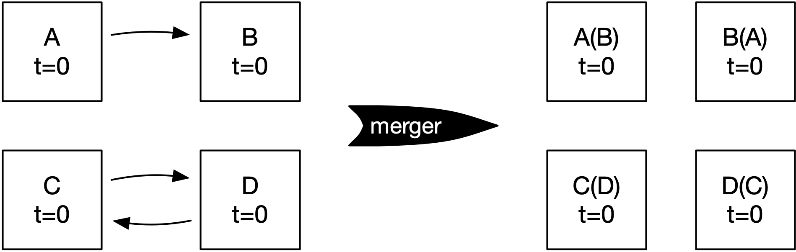
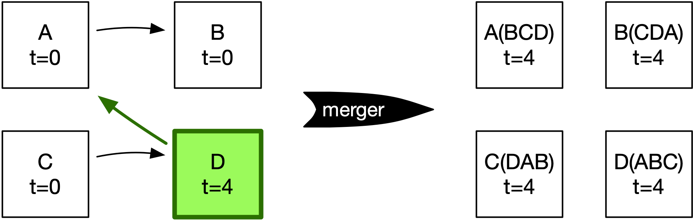
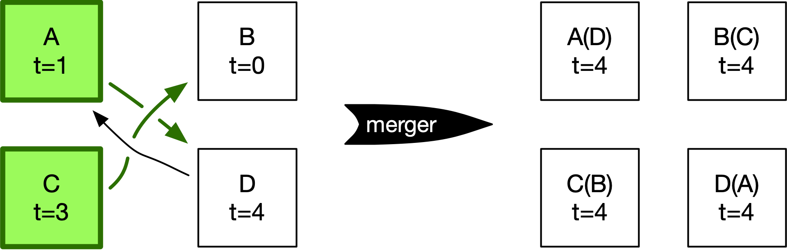
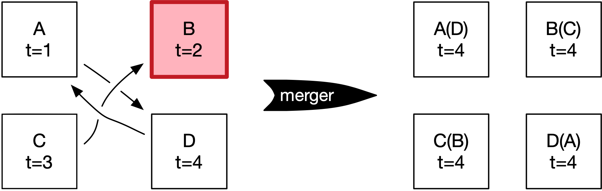
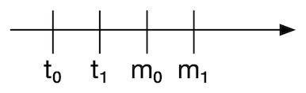
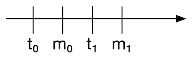
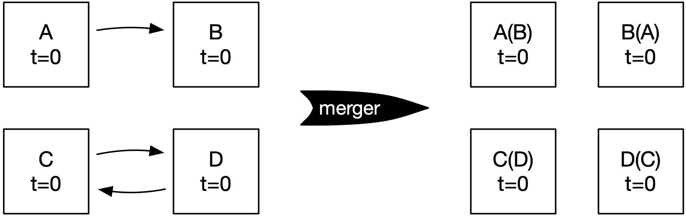
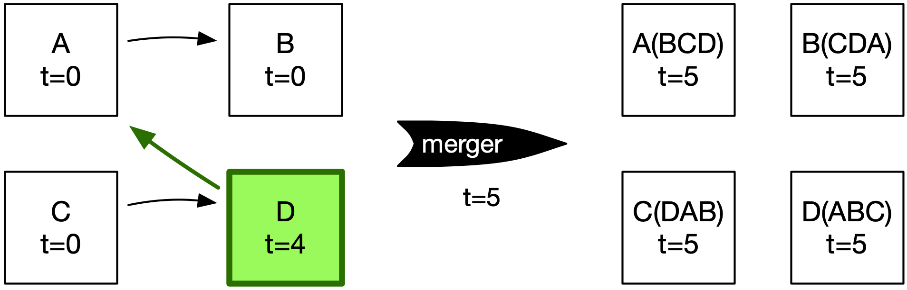
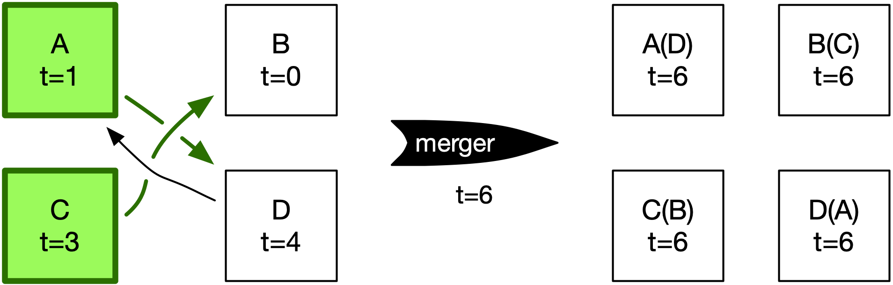
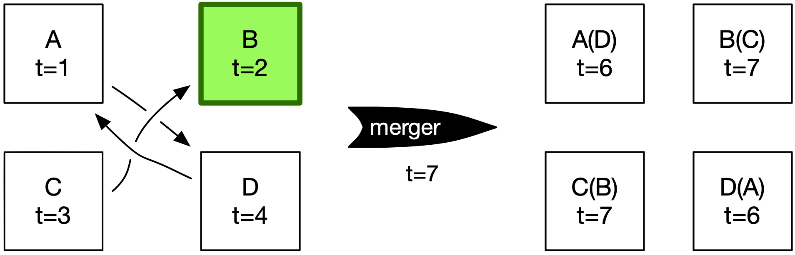

# Matcher versioning

**Last updated:** 16 April 2021

## The problem

We keep having discussions around how to "version" works in the pipeline.
These versions aren't exposed externally, but they do inform the order in which updates are processed in the pipeline.
We need to impose some form of ordering, because our underlying queue primitive (SQS) only gives us [best-effort ordering](https://aws.amazon.com/sqs/features/).

Our current approach (from [RFC 030](https://github.com/wellcomecollection/docs/tree/master/rfcs/030-pipeline_merging):

> We pass through in the work a field with the timestamp of the last update.
> The merger should then use the maximum of the timestamps of all works sent by the matcher as the version for each of the works.)

This approach turns out to be flawed.


## The problem: a worked example

This is based on a real example of an issue we had with merging and Sanskrit manuscripts.

1.  Start with four works joined in two pairs AB and CD, all created at time t=0:

    

    The merger will take the maximum timestamp of each group to create the merged work, so it will create four works all with timestamp t=0.

2.  Now suppose we realise these are paired incorrectly, and should actually be AD and BC.
    We update A at time t=1, B at time t=2, C at time t=3, D at time t=4.
    However, due to best-effort ordering, we don't process these updates in the correct order.

3.  Suppose we process D, which was updated at time t=4.

    

    All four works were processed together, so the merger creates four works all with timestamp t=4.

4.  Then we process A and C, which were updated at time t=1 and t=3, respectively.

    

    Again, the merger assigns the max timestamp t=4 to all four works.
    This is equal to the previous max timestamp, so all four updates can be sent to the rest of the pipeline.

5.  Finally, we try to process B, which was updated at t=2 – but we can't!

    

    The matcher will send B and C together, so the merger uses the max timestamp t=3.
    But there are already post-merger works for B/C from t=4, so these updates will be rejected.

    It is impossible for the pipeline to process this update to B.
    This update has become "stuck" because the post-merger works "remember" the works they used to be linked to.


## Observations

*   Works do sometimes become unlinked, and we need to handle it correctly.

*   This problem gets worse when the pipeline is stable, and we don't reindex very often.
    Every time we reindex, the pipeline "forgets" everything but the latest version of each source record, and any works with this issue get fixed.

    This may explain some of the pipeline non-determinism issues we've seen – if one pipeline is "stuck", it would get different results from a fresh pipeline, regardless of how many times we retry or redrive.

*   It's relatively easy to spot an issue of this with our current tooling – you see a warning message from the merger when it tries to index the relevant works, e.g.

    ```
    INFO  u.a.w.p.ElasticIndexer - Skipping h3xbcs2m because already indexed item has a higher version
    INFO  u.a.w.p.ElasticIndexer - Skipping jz8d34qd because already indexed item has a higher version
    INFO  u.a.w.p.ElasticIndexer - Skipping nymm52zc because already indexed item has a higher version
    ```

    But it can't be fixed once it's occurred, unless you manually edit the post-merger Elasticsearch indexes (scary).

*   Until the matcher/merger, we have a 1:1 correspondence between "source record" and "catalogue Work".
    After those services, we potentially break that link, and relying on it for ordering gets more difficult.


## Proposed fix

**We track the latest modified time of a *matcher graph*, and use that to version works post-matcher.**

*   The matcher doesn't care about work versions, because it always retrieves the latest version of a work from the pipeline storage index.
    We know the ID minter is keeping the works in that index ordered.

    For a read-only pipeline storage index, the graphs it creates should be totally deterministic.

*   The message sent by the matcher should include a timestamp.
    The merger will copy this timestamp into the created Works, rather than using the max of their timestamps.

    Specifically, we will extend the `MatcherResult` model to include a `timeSent` field (an Instant).
    The matcher will populate this with the current time when it sends the message, and the merger will use this timestamp in the works it creates.

*   This gives us sensible. ordering behaviour.

    **Loose proof:**
    Suppose we have a work which is updated twice, at times *t0* and *t1*, with *t0* &lt; *t1*.

    Suppose the matcher runs twice, at times *m0* and *m1*, with *m0* &lt; *m1*.

    Assume further that *t0* ≤ *m0* and *t1* ≤ *m1*.

    Will a downstream service always accept and store the version of the work that was created at time *t1*?

    There are two cases to consider:

    -   *t1* ≤ *m0*

        

        Then the matcher will read the work corresponding to *t1* on both occasions, and send the appropriate graph to the merger.

        In turn, the merger will create a Work[Merged] from the work corresponding to *t1*, which is what we want.

    -   *m0* &lt; *t1*

        

        Now the merger will create two works:

        *   after the matcher run at *m0*, it creates a Work[Merged] from the work at *t0*
        *   after the matcher run at *m1*, it creates a Work[Merged] from the work at *t1*

        Because *m1* &gt; *m0*, the downstream services will prefer the work with modified time *m1*, which is based on *t1*, which is what we want.


## Proposed fix: a worked example

Let's repeat the original example with the new behaviour:

1.  Start with four works joined in two pairs AB and CD, all created and processed by the matcher at time t=0:

    

    The merger will use the time these works were processed by the matcher to create the merged work, so it will create four works all with timestamp t=0.

2.  Now suppose we realise these are paired incorrectly, and should actually be AD and BC. We update A at time t=1, B at time t=2, C at time t=3, D at time t=4. However, due to best-effort ordering, we don’t process these updates in the correct order.

3.  Work D was updated at time t=4, and it gets processed by the matcher at time t=5.

    

    The merger uses time t=5 for the works it creates.

4.  Then we process A and C, which were updated at time t=1 and t=3, respectively.
    The matcher processes these two updates at time t=6.

    

    The merger uses time t=6 for the works it creates.
    This is newer than the previous timestamp, so these works can replace the ones from the previous run of the merger.

5.  Finally we process B, which was updated at time t=2.
    The matcher processes this update at time t=7.

    

    Because the merger uses time t=7 for the works, these can be indexed in pipeline storage and replace the previous versions.
    Success!
