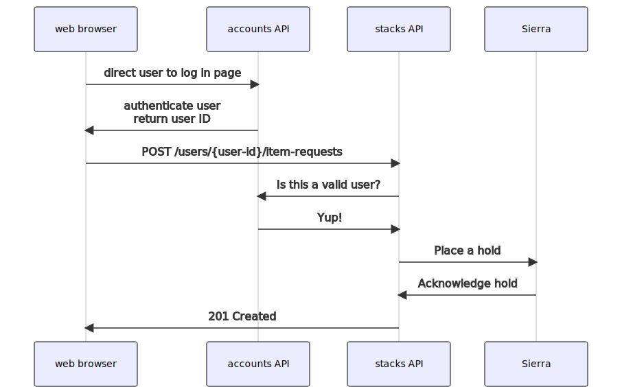

# Requesting API design

## Background

As part of the work to add requesting, we need to add new some new APIs.
In particular, these APIs should allow a user to:

-   Get the status of a given item (e.g. available, on hold)
-   Request an item
-   See a list of their current requests

Relinquishing a request is out of scope for the initial API.
There's currently no automated process to do this, and we'd need to coordinate with LE&E to define such a process.

This RFC describes how these APIs will work, and provides examples of requests and responses.

It does *not* suggest implementation details – those can be discussed separately.


## Guiding principles

1.  **We should not assume requests are sent to a particular service.**

    Although the initial implementation will be making requests for items in Sierra, we may add support for requesting from other systems in a future update.
    We should not assume the use of Sierra.

2.  **We should use platform identifiers throughout.**

    We may include source identifiers, but interactions with these APIs should start with platform identifiers (e.g. `a222wwjt`).
    This is a consequence of principle (1).


## Proposed APIs

### Get the status of a given item

We will add a new endpoint `/catalogue/v2/works/{workId}/items`.

-   This will return a modified version of our existing `Work` model.

    In particular, responses will have only two fields: `id` and `items`.
    The `Item` model will in turn only have two fields: `id` and `status`, the latter of which returns an instance of a new `ItemStatus` type, e.g.

    ```
    "status": {
      "id" : "available",
      "label" : "Available",
      "type": "ItemStatus"
    }
    ```

-   This will return an item for every identified item in the corresponding `/works` request.

    If an item cannot be requested (e.g. it is tracked in Calm, not Sierra), we will return a `not-requestable` status.
    This includes items that only have digital locations.

-   We will apply rate limiting to this endpoint, and possibly an API key (tbd).

    Requests to this endpoint will trigger requests to Sierra (and possibly other systems in future).
    We don't want it to be used to DDOS those systems, so we will use API keys and rate limiting.

    If this API can be called from the browser, we'll proxy requests to the Node server from the browser client, and the server can hold an API key securely.

<details>
<summary>Example request/response</summary>

```http
GET /catalogue/v2/works/a23upgqy/items
{
  "id": "a23upgqy",
  "items": [
    {
      "id": "zv4gvvq8",
      "status": {
        "id" : "available",
        "label" : "Available",
        "type": "ItemStatus"
      },
      "type": "Item"
    },
    {
      "id": "fwsbxqp4",
      "status": {
        "id" : "not-requestable",
        "label" : "Not requestable",
        "type": "ItemStatus"
      },
      "type": "Item"
    }
  ],
  "type": "Work",
  "@context": "https://api.wellcomecollection.org/catalogue/v2/context.json"
}
```

</details>


### Managing requests on items

We will add a new endpoint to `account.wellcomecollection.org`: `/users/{userId}/item-requests`.
This goes alongside other requests on this endpoint, as listed [in the identity repo](https://github.com/wellcomecollection/identity/blob/0de73ee41a332eb24ee0b4e2d37bc95e0282255f/packages/apps/api-authorizer/src/index.ts#L164-L211).

The three operations are as follows:

-   To request an item, a user makes a POST request to this endpoint.

    This POST request will include a body of the following format:

    ```json
    {
      "userId": "1234567",
      "workId": "a23upgqy",
      "itemId": "fwsbxqp4",
      "type": "ItemRequest"
    }
    ```

    This endpoint will return the following status codes:

    -   201 Created if the request is successful (or already exists)
    -   401 Unauthorized if the user is not authenicated
    -   403 Forbidden if the user authenticates successfully, but they are unable to place requests (e.g. at their account limit, banned account)
    -   404 Not Found if the work does not exist, or the work exists but the item is not part of this work
    -   409 Conflict if the work is already requested by another user

-   To retrieve a list of their pending requests, a user makes a GET request to this endpoint.

    This will return a list of ItemRequest objects:

    ```json
    [
      "requests": [
        {
          "workId": "a23upgqy",
          "itemId": "fwsbxqp4",
          "type": "ItemRequest"
        },
        {
          "workId": "a23upgqy",
          "itemId": "fwsbxqp4",
          "type": "ItemRequest"
        }
      ],
      "type": "ItemRequestList"
    ]
    ```

Notes:

-   Because these operations modify a user's account, they must be authenticated first.

    
