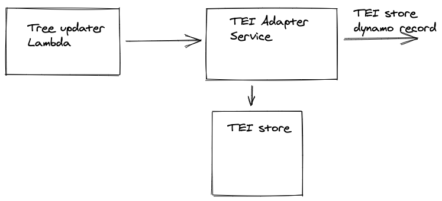

# TEI Adapter

## What is TEI

TEI is an XML standard to represent any source in any script or language. 
It's used at Wellcome to describe manuscripts in non-Latin languages.
The TEI files are in a [GitHUb Repository](https://github.com/wellcomecollection/wellcome-collection-tei). At the 
time of writing in April 2021 there are 622 TEI files, but the collection of manuscripts is much larger, around 10k.

Currently, all information stored in TEI files is not surfaced anywhere except the GitHub repository. 
Many of the TEI files have a Sierra record that they link to, but not all of them – and the record contains minimal information. 
## How we do it
### Do we need an adapter?

We need to be able to propagate updates to TEI files as they happen through to the API, and we also need to be able to
reindex when we make changes in the pipeline. 

GitHub is a relatively reliable and low latency source, so we could in theory just send the changes to a TEI transformer 
and do a reindex by cloning the repository and/or parsing the tree of the TEI files. 
There are some disadvantages to this approach:
- We need a "special" reindexer for TEI.
- We can't keep track of deleted files. If something is deleted, the change will go through the pipeline once, 
  but after that there's no way of "remembering" that the record ever existed.
- We need to assign versions to works resulting from TEI files in order to ensure subsequent updates are 
  processed correctly in the pipeline. This versioning logic would have to be added explicitly to the 
  TEI transformer whereas having an adapter and an intermediate store would allow us to use the already existing versioning
  logic in the versioned store library.
- Currently, we compare the number of record in the source table to the number of works in the transformer pipeline store
  to track the success of a reindex. We wouldn't be able to do that without a store.

For these reasons the proposal is to have a TEI adapter that listens to changes to TEI files and a TEI store.

However, since GitHub is a relatively reliable and low latency source, we  could only store the HTTP URLs
to the TEI files in a TEI store, and not the full XML. This has the advantage that we don't have to manage an 
ever-growing S3 bucket (we don't have a way of cleaning up old versions of a record), but it has some disadvantages:
- GitHub outages (which are rare but happen) might affect our reindexes.
- We might be throttled during a reindex
- We go to the public internet for every TEI file for every reindex as opposed to getting each file exactly once 
  per every change that affects it.
  
For these reasons, the proposal here is to store the whole TEI file in a full VHS.
### Store structure

Therefore, taking as an example
[WMS_Arabic_529](https://github.com/wellcomecollection/wellcome-collection-tei/blob/master/Arabic/WMS_Arabic_529.xml), 
the proposed store record would be:

| Id | Payload | deleted  | version |
| --- | ------- | -------| --------|
| manuscript_16172 | [pointer to location in s3] | false | 1 |

The id come from the `xml:id` attribute in the main `TEI` tag.

### Updates from github

There are two possible way to receive regular updates from GitHub that I can think of:

#### Use GitHub push notifications:
  
This means setting up a Webhook integration in the TEI repository that points to a URL of an API Gateway endpoint. 
API Gateway calls a Lambda that forwards the JSON form GitHub to the TEI adapter. The advantages of this approach are: 
- Usage of Webhooks in GitHub is very established 
- it's very simple to implement. 

The biggest disadvantage is that we don't have control or visibility if the Webhook call to our API Gateway endpoint
  fails or if there is an outage on GitHub. That may cause updates to not be propagated through in the pipeline
  without us knowing.

#### Pull the changes from GitHub at regular intervals:
  
This means regularly request changes from GitHub within certain time intervals. 
The big advantage of this approach is that we control what happens if one request fail, how we should be notified
and what action we should take.

The proposal in this RFC is to use a pull approach so that we can be confident that all updates have either gone through
successfully, or we are notified of any failure, and we can retry.

#### How to query GitHub

We can ask the GitHub API for commits that happened in a certain time window with a query like: 
``` 
GET https://api.github.com/repos/wellcomecollection/wellcome-collection-tei/commits?since=2021-01-20T10:00:00&until=2021-03-22T18:01:00&branch=master
```
This gives us all the commits that have happened in the time window passed. 
The problem with this approach is that if there is a feature branch merged into master, the commits 
coming from the merge will be shown at the time they were created in the feature branch. This means that a query for 
commits within a window can return different results depending on whether the query is made before or after a merge. 
To not loose changes coming from a merge, we would need to chase the commits coming from that branch when we see a merge commit, 
which in turn means keeping track of the commits we have already seen and effectively keeping track of the
history of the repo, which is very fiddly and error prone.

Another approach is to ask the GitHub API for trees. Trees are a representation of the file hierarchy in the repo at a 
certain commit. The following request gives us all the files in the repository at the latest commit in master:
```
https://api.github.com/repos/wellcomecollection/wellcome-collection-tei/git/trees/master?recursive=true
```

This is a small sample of the response:
```yaml
{
"sha": "d947db3638a7ae2aa069e2b19a7db73dfae7d653",
"url": "https://api.github.com/repos/wellcomecollection/wellcome-collection-tei/git/trees/d947db3638a7ae2aa069e2b19a7db73dfae7d653",
"tree": [
  {
    "path": ".DS_Store",
    "mode": "100644",
    "type": "blob",
    "sha": "ed307046335248d38c18cb8320d6ca9253e0d35b",
    "size": 22532,
    "url": "https://api.github.com/repos/wellcomecollection/wellcome-collection-tei/git/blobs/ed307046335248d38c18cb8320d6ca9253e0d35b"
  },
  {
    "path": ".gitattributes",
    "mode": "100644",
    "type": "blob",
    "sha": "bcb42237cafe6a22e80b9d720dcbf6395198d249",
    "size": 62,
    "url": "https://api.github.com/repos/wellcomecollection/wellcome-collection-tei/git/blobs/bcb42237cafe6a22e80b9d720dcbf6395198d249"
  },
  {
    "path": "Arabic",
    "mode": "040000",
    "type": "tree",
    "sha": "187c8c750739ee6a8f9f99ebf7420a46457670d5",
    "url": "https://api.github.com/repos/wellcomecollection/wellcome-collection-tei/git/trees/187c8c750739ee6a8f9f99ebf7420a46457670d5"
  },
  {
    "path": "Arabic/README.md",
    "mode": "100644",
    "type": "blob",
    "sha": "4bfe74311d86293447f173108190a4b4664d68ea",
    "size": 1753,
    "url": "https://api.github.com/repos/wellcomecollection/wellcome-collection-tei/git/blobs/4bfe74311d86293447f173108190a4b4664d68ea"
  },
  {
    "path": "Arabic/WMS_Arabic_1.xml",
    "mode": "100644",
    "type": "blob",
    "sha": "17f54c8c5ebccec643e23b54b3f4277f86204282",
    "size": 59802,
    "url": "https://api.github.com/repos/wellcomecollection/wellcome-collection-tei/git/blobs/17f54c8c5ebccec643e23b54b3f4277f86204282"
  },
...
  ]
}
```
Every entry in the `tree` can be either a `tree` or a `blob`. A `blob` is a file in the repo and has a hash associated to it. 
If the content of a file changes, the hash changes. 
This means that we can query for the tree in master at regular intervals and store the last version of the tree in S3. 
At every request, we can compare the old tree with the new one to know what changes have happened.
### TEI Adapter


The proposal is to have one Lambda that queries the GitHub API and a TEI adapter service that retrieves the files that 
have been modified and stores them in a VHS.
#### Tree updater Lambda 

This is a scheduled Lambda that:
  
- calls the GitHub API to get the latest tree.
- Retrieves the old tree from S3.
- Compares the two and for every change it sees in the tree sends a message.
- Replaces the old version of the tree with the new one in S3
This is a sample of the message sent by the Lambda:
```yaml
{
  "path": "Arabic/WMS_Arabic_1.xml",
  "url": "https://api.github.com/repos/wellcomecollection/wellcome-collection-tei/git/blobs/17f54c8c5ebccec643e23b54b3f4277f86204282",
  "deleted": false 
}
```

####  TEI Adapter service

It receives messages from the Tree updater Lambda and for each one:

- Decides if it's a relevant TEI file
- If it is, retrieves it from GitHub & stores it in the TEI store
- Send each record stored to the transformer

### Full reharvest

We don't need a separate reharvest process with this approach. The tree updater Lambda can deal 
with the case where it cannot find the old tree in S3 by sending everything in the current tree to the TEI Adapter service.
