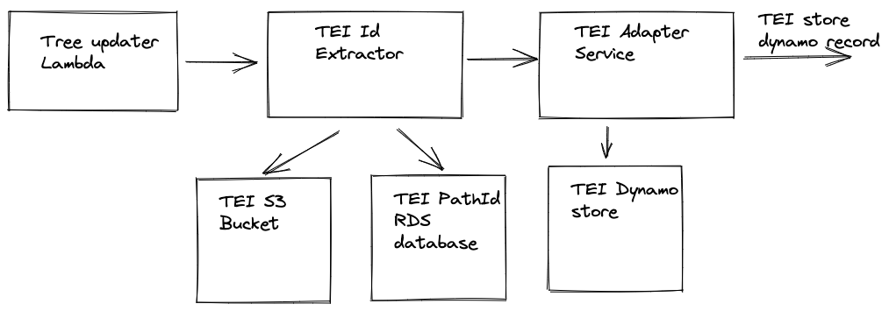

# TEI Adapter

## What is TEI

TEI is an XML standard to represent any source in any script or language. 
It's used at Wellcome to describe manuscripts in non latin languages.
The TEI files are in a [GitHUb Repository](https://github.com/wellcomecollection/wellcome-collection-tei). At the 
time of writing in April 2021 there are 622 TEI files, but the collection of manuscripts is much larger, around 10k.

Currently, all information stored in TEI files is not surfaced anywhere except the GitHub repository. 
Many of the TEI files have a dummy Sierra record that they link to, but not all
## How we do it
### Do we need an adapter?

We need to be able to propagate updates to TEI files as they happen through to the API, and we also need to be able to
reindex when we make changes in the pipeline. 

GitHub is a relatively reliable and low latency source, so we could in theory just send the changes to a TEI transformer 
and do a reindex by cloning the repository and/or parsing the tree of the TEI files. 
There are some disadvantages to this approach:
- We need a "special" reindexer for TEI.
- We can't keep track of deleted files. If something is deleted, the change will go through the pipeline once, 
  but there's no way of "remembering" it.
- We need to assign versions to works resulting from TEI files in order to ensure subsequent updates are 
  processed correctly in the pipeline. This versioning logic would have to be added explicitly to the 
  TEI transformer whereas having an adapter and an intermediate store would allow us to use the already existing versioning
  logic in the versioned store library.
- Currently, we compare the number of record in the source table to the number of works in the transformer pipeline store
  to track the success of a reindex. We wouldn't be able to do that without a store.

For these reasons the proposal is to have a TEI adapter that listens to changes to TEI files and a TEI store.

However, since GitHub is a relatively reliable and low latency source, we  could only store the HTTP URLs
to the TEI files in a TEI store, and not the full XML. This has the advantage that we don't have to manage an 
ever-growing S3 bucket (we don't have a way of cleaning up old versions of a record), but it has some disadvantages:
- GitHub outages (which are rare but happen) might affect our reindexes.
- We might be throttled during a reindex
- We go to the public internet for every TEI file for every reindex as opposed to getting each file exactly once 
  per every change that affects it.
  
For these reasons, the proposal here is to store the whole TEI file in a full VHS.
### Store structure

Therefore, taking as an example
[WMS_Arabic_529](https://github.com/wellcomecollection/wellcome-collection-tei/blob/master/Arabic/WMS_Arabic_529.xml), 
the proposed store record would be:

| Id | Payload | deleted  | version |
| --- | ------- | -------| --------|
| WMS_Arabic_529 | ... | false | 1 |

### Updates from github

There are two possible way to receive regular updates from GitHub that I can think of:

#### Use GitHub push notifications:
  
This means setting up a Webhook integration in the TEI repository that points to a URL of an API Gateway endpoint. 
API Gateway calls a Lambda that forwards the JSON form GitHub to the TEI adapter. The advantages of this approach are: 
- Usage of Webhooks in GitHub is very established 
- it's very simple to implement. 

The biggest disadvantage is that we don't have control or visibility if the Webhook call to our API Gateway endpoint
  fails or if there is an outage on GitHub. That may cause updates to not be propagated through in the pipeline
  without us knowing.

#### Pull the changes from GitHub at regular intervals:
  
This means having a Lambda that regularly requests changes from GitHub within subsequent time intervals. 
This is an approach we already use in the Sierra adapter and in the Calm adapter.
The big advantage of this approach is that we control what happens if one request fail, how we should be notified
and what action we should take.

The proposal in this RFC is to use a pull approach so that we can be confident that all updates have either gone through
successfully, or we are notified of any failure, and we can retry.

This is a diagram of the proposed architecture: 

The Lambda in the picture should generate windows and send them to the TEI adapter

### TEI Adapter

The proposal is to make the TEI adapter 2 services
#### GitHub Api service

It receives time windows from the lambda and for each one:
  
- It calls the GitHub API to get the commits within that window. 
  This is an example of a call to GitHub API and returns a list of commits within the time window passed in the query parameters:
``` 
GET https://api.github.com/repos/wellcomecollection/wellcome-collection-tei/commits?since=2021-01-20T10:00:00&until=2021-03-22T18:01:00&branch=master
```
- Call the GitHub API to get the files changed in each commit
- Send a message for each file


####  TEI Adapter service

It receives file URLs from the GitHub Api service and for each one:

- Decides if it's a relevant TEI file
- If it is, retrieves it from GitHub & stores it in the TEI store
- Send each record stored to the transformer

### Full reharvest

For the full reharvest we can get the tree of files from the repository and send the URL of each file 
to the TEI Adapter service, bypassing the GitHub Api service.

